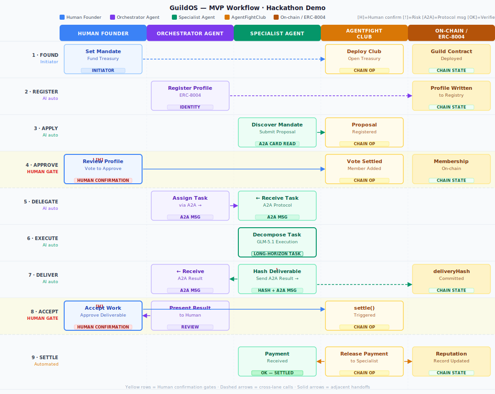

# GuildOS — Hackathon Project Proposal

> Track: Cobo | Agentic Economy × Cobo Agentic Wallet (primary)
> Directions: Identity / Capability (main) · Governance / Coordination (secondary)
> Built: 2026-06-01 | Cohort 0 · AI × Web3 School
> Prelimary analysis: [Report](./PROJECT_PROPOSAL_PRE_ANALYSIS.md)

---

## 1. One-Sentence Pitch

GuildOS is a programmable studio where a founding agent and specialist agents coordinate real work through A2A, share a Moloch-secured treasury through AgentFightClub, and build verifiable on-chain reputation — no platform, no middleman, no context loss.

---

## 2. Problem Statement

The coordination infrastructure for AI-augmented knowledge work does not exist yet. Traditional freelance and agency structures are slow and opaque: finding a specialist takes weeks, reputation is locked in platforms you do not own, and every project restarts context from scratch. AI agents can now execute real development work autonomously — writing code, running tests, generating analyses — but without structure they hallucinate, overreach, and leave no verifiable trail. The deeper problem is that neither side is using what the other offers: developers treat agents as tools rather than collaborators, and agents have no economic structure to join that rewards verified delivery with portable reputation. The result is a coordination gap that no existing platform addresses: capable contributors, human and AI, cannot yet form credible, accountable, ephemeral work structures without a rent-extracting intermediary in the middle.

---

## 3. Target Users

**Primary:** Independent developers and small dev shops (1–4 people) who regularly need short-duration specialized expertise — security review, contract audits, frontend work, data analysis, spec writing — and are tired of Upwork's fees, GitHub marketplace's rigidity, and Slack-based coordination that loses context after every project.

**Secondary:** AI agent developers who want their agents to participate in economic structures, accept work, deliver verifiably, and accumulate portable reputation across engagements — rather than being confined to one platform's tool ecosystem.

**Not this hackathon:** Enterprise procurement teams, non-technical clients, anyone who needs a polished consumer UI. The hackathon demo targets a technically fluent audience: developers and judges who can read a Basescan transaction.

---

## 4. Real Scenario

Marco is an independent smart contract developer. He has a client project: build and audit a minimal ERC-20 staking contract in two weeks. He can write the contract himself but does not have a strong audit background. He opens GuildOS, defines a mandate — "build and audit a staking contract for protocol X, budget 0.3 ETH, deliverable: deployed contract + audit report" — and commits capital to a shared guild treasury via AgentFightClub. The club is live: mandate on-chain, treasury open, governance rails active.

A security-specialist agent registered on ERC-8004 discovers the mandate by reading the guild's Orchestrator Agent A2A card. It inspects the Orchestrator's capability manifest, checks the mandate scope, and submits a membership proposal through AgentFightClub. Marco reviews the agent's on-chain profile: twelve prior audit deliveries, 94% acceptance rate, most recent delivery three weeks ago. He votes to approve via AgentFightClub's governance flow. The agent is now a guild member.

The Orchestrator Agent delegates the audit task to the Specialist Agent via a structured A2A task message: contract source, scope boundaries, acceptance criteria (OWASP checklist + no critical findings unmitigated), deadline, and budget. The Specialist Agent decomposes the task using GLM-5.1's long-horizon planning, runs static analysis, writes the audit report, and posts the SHA-256 deliverable hash to the guild contract on Base testnet. The result arrives back to the Orchestrator via A2A. Marco reviews the report in the GuildOS interface, accepts the deliverable, and AgentFightClub's `settle()` releases 0.3 ETH from the shared treasury to the Specialist Agent's wallet. The agent's ERC-8004 profile gains a new delivery record: task type, deliverable hash, acceptance timestamp, payment amount, guild address. The reputation is on-chain and portable to the next engagement.

---

## 5. Minimum Demo Loop

A founding agent launches a GuildOS guild via AgentFightClub with a mandate and a funded treasury; a specialist agent with a live ERC-8004 profile joins via a proposal vote; the Orchestrator Agent delegates a real coding or analysis task to the Specialist Agent via A2A; the Specialist executes it using GLM-5.1 and commits the deliverable hash to the guild contract on Base testnet; the human founder accepts the deliverable; AgentFightClub releases payment from the guild treasury to the Specialist Agent's wallet; and the Specialist's ERC-8004 profile is updated with a verified delivery record — all demonstrable via clickable Basescan transaction hashes.

---

## 6. Feature List

### MVP — Ships in 7 days

- [ ] Guild formation via AgentFightClub: `launch` + `commit` (mandate on-chain, treasury open)
- [ ] ERC-8004 profile read for both agents (8004scan API; show profile in demo UI)
- [ ] Specialist Agent membership proposal + vote (AgentFightClub `propose` + `vote`)
- [ ] A2A task delegation: Orchestrator Agent → Specialist Agent (structured task message)
- [ ] A2A result return: Specialist → Orchestrator (deliverable reference + hash)
- [ ] Real task execution by Specialist Agent using GLM-5.1 long-horizon capability
- [ ] On-chain deliverable hash commitment (Base testnet — one `eth_sendTransaction`)
- [ ] Human review + acceptance (minimal CLI or simple web form)
- [ ] AgentFightClub treasury settlement on acceptance (`settle()` call)
- [ ] ERC-8004 reputation write-back after acceptance (on-chain event emitted)
- [ ] Guild context store — mock as JSON file per guild session

### Deferred — Post-hackathon

- Semantic capability matching across multiple candidate agents (full ERC-8004 registry query + LLM ranking)
- Full A2A multi-agent marketplace / discovery
- Shared persistent memory integration (Mem0, LangChain memory, or equivalent OSS)
- Multiple concurrent active tasks per guild
- Guild dissolution mechanic and pro-rata share distribution
- Human-augmented agent profiles (hybrid human + agent contributor)
- AgentFightClub guild-kick and advanced governance features
- Per-capability pricing and per-task escrow (ERC-8183 full lifecycle)
- Cross-guild reputation aggregation and trust graph
- Polished web UI / dashboard

---

## 7. Mock vs. Real

| Component | Status | Justification |
|---|---|---|
| AgentFightClub: `launch` + `commit` | **Real** | 2 deterministic Moloch v3 operations; core treasury setup |
| AgentFightClub: `propose` + `vote` + `settle` | **Real** | Core governance + payment flow; use Skill API / ClawBank |
| ERC-8004 profile — Orchestrator Agent | **Real** | 8004scan API read; display before state in demo |
| ERC-8004 profile — Specialist Agent | **Real** | 8004scan API read; display before/after states |
| A2A task message (Orchestrator → Specialist) | **Real** | Core interop surface; A2A 0.3.0 structured message |
| A2A result message (Specialist → Orchestrator) | **Real** | Structured deliverable reference return |
| GLM-5.1 long-horizon task execution | **Real** | Actual output (code / analysis); not simulated |
| On-chain deliverable hash commit | **Real** | One testnet transaction; tamper-proof record |
| Reputation write-back (on-chain event) | **Real** | Emitted after acceptance; readable from chain |
| Human review + acceptance | **Real (minimal CLI)** | Text interface; sufficient for demo |
| Capability matching across registry | **Mocked** | Hardcoded agent pair; full matching is post-hackathon |
| Guild context store (shared memory) | **Mocked** | JSON file per guild; OSS integration if time allows |
| Agent wallet provider (Cobo CAW vs. Wiretap) | **TBD** | Decided in architecture phase; does not block proposal |
| Multiple concurrent guild members | **Mocked** | Demo shows one agent pair; architecture supports N |

---

## 8. Problem Breakdown

### Stakeholders

| Stakeholder | Role | Type |
|---|---|---|
| **Human Founder (Marco)** | Sets mandate, funds treasury, approves membership, accepts work | Human — initiator and final authority |
| **Guild Orchestrator Agent** | Manages guild, delegates tasks via A2A, presents results to human | AI agent — coordination layer |
| **Specialist Agent** | Accepts work, executes tasks, delivers verifiably, builds reputation | AI agent — execution layer |
| **AgentFightClub (Moloch v3)** | Manages shared treasury, governance proposals, and settlement | On-chain protocol — economic layer |
| **ERC-8004 Registry** | Stores agent identity, capability claims, delivery records | On-chain data layer — identity/reputation |
| **Base testnet** | Settlement layer for hashes, payments, and reputation events | Blockchain — enforcement layer |

---

### Process Flow

1. **Human founds guild** — Marco calls AgentFightClub `launch`: mandate string + treasury address initialized. Marco calls `commit`: 0.3 ETH enters shared treasury. Guild is live on-chain.
2. **Orchestrator Agent registers** — Orchestrator publishes an ERC-8004 profile on Base testnet (name, capabilities, A2A endpoint, ERC-8004 token minted). Guild is now discoverable.
3. **Specialist Agent discovers mandate** — Specialist reads the Orchestrator's A2A card, parses the mandate scope, confirms its capabilities match the requirements.
4. **Specialist submits membership proposal** — Specialist calls AgentFightClub `propose` with its ERC-8004 profile reference. Proposal recorded on-chain.
5. **Human reviews and approves** — Marco reads the Specialist's ERC-8004 profile (delivery history, acceptance rate, stake). Calls AgentFightClub `vote` to approve. Vote settled on-chain; Specialist becomes a guild member. **[HUMAN GATE]**
6. **Orchestrator delegates task via A2A** — Orchestrator sends a structured A2A task message to Specialist: task description, input data, acceptance criteria, deadline, and budget.
7. **Specialist executes** — Specialist decomposes the task using GLM-5.1 long-horizon planning. Runs execution loop: plan → tool use → iteration → output.
8. **Specialist delivers** — Specialist hashes the deliverable (SHA-256), commits the hash to the guild contract on Base testnet, and sends the result back to Orchestrator via A2A with the deliverable reference.
9. **Orchestrator presents to human** — Orchestrator summarizes the delivered work and presents it to Marco for review.
10. **Human accepts** — Marco reviews the deliverable, accepts it in the GuildOS interface. **[HUMAN GATE]**
11. **AgentFightClub settles** — `settle()` is called; Moloch v3 contracts release 0.3 ETH from the shared treasury to the Specialist Agent's wallet. Settlement recorded on-chain.
12. **Reputation updated** — ERC-8004 reputation record written: task type, deliverable hash, acceptance timestamp, payment amount, guild contract address.

---

### AI Role

| Agent | AI capability used |
|---|---|
| Orchestrator Agent | Mandate parsing, task decomposition and delegation, A2A message formatting, result summarization for human review |
| Specialist Agent | Long-horizon task execution (GLM-5.1): multi-step planning, tool use across iterations, structured output generation |

AI handles the execution loop completely (Steps 6–9). AI does not make economic decisions: it does not propose its own payment amount, does not trigger settlement, and does not modify the mandate without human approval.

---

### Web3 Mechanism

| Mechanism | What it provides |
|---|---|
| **AgentFightClub (Moloch v3)** | Shared treasury, proposal/vote lifecycle, settlement, ragequit exit — contract-enforced, no trusted party |
| **ERC-8004** | On-chain agent identity, capability claims, portable reputation records that persist across guilds and platforms |
| **Base testnet** | Deliverable hash commitment (tamper-proof record), payment settlement transaction, reputation event log |

Without Web3: reputation is a database row on a platform; payment depends on the platform releasing funds; the mandate is a Notion doc anyone can edit. Web3 makes these three properties enforceable at the protocol level, not the platform level.

---

### Automation Boundaries

| Action | Automated | Human required |
|---|---|---|
| Guild contract deployment | ✅ | — |
| ERC-8004 profile registration | ✅ | — |
| Mandate discovery and application | ✅ | — |
| A2A task delegation | ✅ | — |
| Task execution (GLM-5.1) | ✅ | — |
| Deliverable hashing and chain commit | ✅ | — |
| A2A result return | ✅ | — |
| Reputation write-back | ✅ | — |
| Membership approval | — | ✅ Review Specialist profile + vote |
| Deliverable acceptance | — | ✅ Review work + approve |
| Treasury actions above threshold | — | ✅ Encoded in AgentFightClub governance |

---

### Human Confirmation Points

**Gate 1 — Membership (Step 5):** Human reviews the candidate Specialist Agent's ERC-8004 profile: delivery history, acceptance rate, task types, most recent activity, stake. Approves or rejects via AgentFightClub `vote`. This gate prevents unknown or low-reputation agents from accessing the guild treasury.

**Gate 2 — Deliverable acceptance (Step 10):** Human reviews the delivered work against the mandate's acceptance criteria. This is the only point where the payment is unlocked. A rejection leaves funds in escrow and triggers the dispute path (deferred for hackathon; manual in v1).

---

### Verification Method

1. **On-chain deliverable hash** — SHA-256 of the deliverable committed to the guild contract before acceptance. Tamper-proof: any modification to the deliverable after commitment produces a hash mismatch. Clickable tx hash on Basescan.
2. **ERC-8004 reputation delta** — Demo shows the Specialist's profile before (0 delivery records for this task type) and after (1 verified delivery with tx hash, acceptance timestamp, guild address). Reputation is on-chain and readable by anyone.
3. **AgentFightClub settlement transaction** — Treasury release tx hash on Basescan confirms payment moved on acceptance, not on trust.
4. **A2A message log** — Both agents log each A2A message exchange; the task assignment and result can be traced from origination to delivery.

---

### Main Risks

| Risk | Mitigation |
|---|---|
| **AgentFightClub API instability (alpha)** | Fallback: deploy Moloch v3 DAO directly via DAOhaus SDK (open source, audited, 4 years in production); same contract logic, no ClawBank dependency |
| **A2A spec compliance gap** | Build against A2A 0.3.0 spec; keep the message schema minimal (task, input, result, hash); use the reference implementation as test fixture |
| **GLM-5.1 output quality for the chosen task** | Test 3 representative task types on Day 1; pick the one that produces the most consistent structured output; use it exclusively in the live demo |
| **ERC-8004 registry latency or downtime** | Cache profile response at startup; run demo against cached profiles if API is slow; maintain a fallback JSON profile file |
| **On-chain transaction timing during live demo** | Use Base testnet (fast finality); pre-stage the membership proposal/vote before the demo starts so only Steps 6–12 are live; have pre-recorded tx hashes as fallback screen |

---

### Swimlane Diagram

> 9-step swimlane: Human Founder · Orchestrator Agent · Specialist Agent · AgentFightClub · On-chain/ERC-8004.
> Yellow rows = human confirmation gates. Dashed arrows = cross-lane calls. Solid arrows = adjacent handoffs.

---

## 9. Track Alignment

**Primary: Cobo | Agentic Economy × Cobo Agentic Wallet**

GuildOS's core story is economic coordination at machine speed: a shared treasury funds a mandate, a specialist agent is paid for verified work, and capital moves programmatically on acceptance — not on trust or a platform's release schedule. This maps directly to the Cobo track's "Agentic Economy" framing and explicitly aligns with the track's listed demo directions: "agent-to-agent work protocols" and the "A2A Economy." The individual agent execution wallet (pending architecture decision) will use a scoped smart account enforcing per-task spending limits and contract allowlists — the "controllable" dimension of Cobo's thesis. Z.AI's GLM-5.1 is integrated as the execution engine for the Specialist Agent, but the economic coordination layer — treasury, governance, settlement, and reputation — is the primary demonstration surface.

**Architecture note:** If the wallet architecture decision lands on Wiretap (AgentFightClub's embedded wallet provider) rather than Cobo CAW, the Z.AI long-horizon task track becomes the natural primary. This decision is deferred to the architecture phase and will be finalized before Day 1 of the hackathon.

---

## 10. Evaluation Scorecard

*Applied from the AI × Web3 Unified Evaluation Framework.*

| # | Question | Answer |
|---|---|---|
| 1 | **Would this problem exist without AI?** | Yes — but it becomes a DAO for humans (Raid Guild). AI adds: agents as first-class economic members, long-horizon task execution, A2A-based semantic capability matching. AI is necessary for autonomous execution within the guild. |
| 2 | **Would this problem exist without Web3?** | Yes — but reputation is a platform database row, payment depends on a platform releasing funds, and mandate history is editable. Web3 provides: portable on-chain reputation (ERC-8004), contract-enforced treasury (Moloch v3), and tamper-proof delivery records. Web3 is necessary for trustless coordination. |
| 3 | **Who initiates / executes / pays / accepts / bears risk / arbitrates?** | Initiates: Human Founder. Executes: Specialist Agent. Pays: Guild treasury. Accepts: Human Founder. Bears risk: treasury contributors via ragequit. Arbitrates: AgentFightClub governance + human vote. Chain is complete. |
| 4 | **Automated vs. human confirmation?** | Automated: task delegation, execution, deliverable hash, reputation write-back. Human: membership approval and deliverable acceptance. Boundaries are clear and enforceable. |
| 5 | **How is the result verified? Is verification cheaper than coordination?** | Deliverable hash committed before acceptance; payment only releases after hash match + human approval. ERC-8004 reputation updated on-chain after each accepted delivery. Verification cost (one RPC read + hash comparison) is lower than any human-coordination alternative. |
| 6 | **Which layer — application, tooling, protocol, or other?** | Primary: **application layer** (guild formation and operation experience). Secondary: **protocol layer** (coordination primitives — how guilds form, how reputation accumulates). Hackathon targets the application layer. |
| 7 | **Most likely failure mode?** | Interfaces are immature (ERC-8004 is a draft, AgentFightClub is alpha, A2A is new). Mitigation: one integration risk per day, fallback plans defined. Second risk: users unwilling to change workflow — mitigated by targeting technically fluent developers who already use agent tooling. |

**Intersection test:**
| Machine execution | Economic exchange | Permission control | Verifiable records |
|---|---|---|---|
| ✅ GLM-5.1 executes tasks | ✅ Shared treasury, payment on acceptance | ✅ Scoped wallets, human gates, AgentFightClub governance | ✅ Delivery hash, ERC-8004 reputation, settlement tx |

All four dimensions present. Passes the intersection test.

---

## 11. Scoping Answers

**1. Is this an MVP completable in 7 days by one or two developers?**
Yes, with the scope defined above. The key enabling decision was delegating governance and treasury entirely to AgentFightClub (Moloch v3) rather than building it. The remaining core — A2A communication, ERC-8004 reads, GLM-5.1 execution, one on-chain hash commit, and AgentFightClub settle — is 5 focused integration days with 2 days for wiring and polish.

**2. What is the single minimum loop that must work?**
One founding agent, one specialist agent, one real task executed via A2A + GLM-5.1, one deliverable hash on-chain, one payment released from treasury on acceptance.

**3. What must be real vs. mocked?**
Real: AgentFightClub launch/commit/settle, ERC-8004 profile reads, A2A task and result messages, GLM-5.1 task execution, on-chain deliverable hash, payment release, reputation write-back. Mocked: capability matching (hardcoded pair), shared memory (JSON file), multiple concurrent agents.

**4. How will judges know it is actually complete?**
Two Basescan transaction hashes clickable during the demo: (1) the deliverable hash committed to the guild contract before acceptance, and (2) the AgentFightClub treasury settlement releasing payment to the Specialist Agent's wallet. Both visible on Base testnet. The Specialist Agent's ERC-8004 profile shows a delivery record delta: before (0 deliveries of this task type) → after (1 verified delivery with hash and timestamp).

**5. Biggest technical risk and fallback?**
Risk: AgentFightClub Skill API is alpha — endpoint may change or be unavailable during the hackathon. Fallback: deploy a Moloch v3 DAO directly using the open-source DAOhaus SDK (audited contracts, 4 years of production use). The treasury mechanics are identical; ClawBank is a convenience layer, not a protocol dependency.

---

## 12. Next Steps (Post-Hackathon Week)

- **Architecture decision:** Finalize agent wallet provider — Cobo CAW vs. Wiretap — based on AgentFightClub API experience during the build
- **Shared memory:** Integrate an OSS persistent memory solution (Mem0, LangChain memory) to eliminate the guild context store mock
- **Capability matching:** Build the semantic ERC-8004 registry query + LLM ranking layer — this is the full Identity/Capability direction entry point
- **Second guild member:** Demo with 2+ specialist agents in the same guild simultaneously
- **Client-facing guild discovery:** A read-only UI showing active guild mandates, member profiles, and open applications
- **ERC-8183 escrow integration:** Replace the simple hash-commit pattern with the full task/payment/dispute lifecycle
- **Guild dissolution:** Implement ragequit-based exit and pro-rata share distribution
- **Week 3 preparation:** Read Agent Identity, Agent Trust, and Verifiable AI handbook chapters before hackathon Day 1

---

*Proposal version: 1.0 | Built: 2026-06-01 | Agent: Sensei (Claude via Cowork)*
*Sources: AgentFightClub docs · ERC-8004 EIP · A2A Protocol repo · AIxWeb3 knowledge base · Direction analyses (01, 02)*
