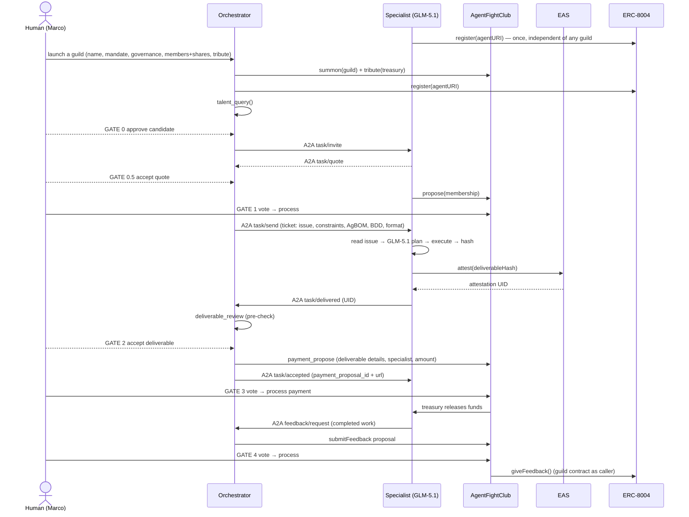
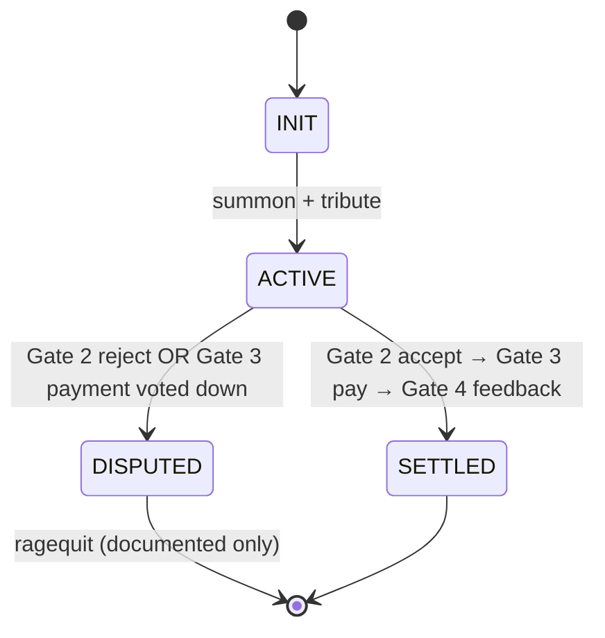

# 10 — Technical Design: Requirements, Schemas & Flow

> Provenance: `docs/MVP_FLOW.md`, `docs/TECH_STACK.md`, `docs/RISKS.md`,
> `docs/TRACK.md`, project `CLAUDE.md`, `hackathon/PROJECT_PROPOSAL.md` (§8 Process Flow),
> and — for §12 only — direct inspection of `src/` (the transport mechanics
> in §12 describe what the code does today, not a doc-to-doc transcription).

## TL;DR

GuildOS is a Python multi-service app: an **Orchestrator** (MCP server + A2A client) and a
**Specialist** (A2A server running GLM-5.1), coordinating over A2A while transacting on Base
mainnet against AgentFightClub (treasury/governance), EAS (deliverable attestation), and
ERC-8004 (identity/reputation). Work flows through a **15-step loop** punctuated by **6
human gates** (0, 0.5, 1, 2, 3, 4). Both the **payment** and the **reputation** write are
DAO-governed: each is raised as a proposal that a human votes and processes. State lives in
a single `guild_context.json` mock store. This file is the requirements contract; exact
signatures and versions are in [`20-api-contracts.md`](20-api-contracts.md). §§1–11 describe
*what* each integration does; §12 describes *how* the current code actually wires the
transport underneath — read it before extending any A2A, MCP, or AgentFightClub call site.

---

## 1. Component Map

Use these canonical names exactly — never invent parallel modules.

| Component | Location | Responsibility |
|-----------|----------|----------------|
| `OrchestratorServer` | `src/orchestrator/server.py` | MCP server entry point; registers all tools |
| `OrchestratorTools` | `src/orchestrator/tools.py` | The MCP tools (see §6) |
| `SpecialistAgent` | `src/specialist/agent.py` | A2A server; runs GLM-5.1 long-horizon tasks; responds to task messages |
| `A2AClient` | `src/shared/a2a.py` | Sends/receives A2A messages (invite, quote, send, delivered, accepted) |
| `EASClient` | `src/shared/eas.py` | `attest()` and `get_attestation()` — Specialist creates EAS delivery attestation |
| `ERC8004` | `src/shared/erc8004.py` | `register()` and `give_feedback()` — caller constraint: NOT the agent's own wallet |
| `AgentFightClub` | `src/shared/agentfightclub.py` | `launch`, `commit`, `propose`, `vote`, `settle` — wraps Moloch v3 (ClawBank API or DAOhaus SDK) |
| `WalletProvider` | `src/shared/wallet.py` | Provider-agnostic signing + Pact-scoping interface; Cobo CAW is the default implementation, swappable to ZeroDev / Turnkey (see §8 F4 and `scenarios/12_scoped_spending.feature`) |
| `NetworkConfig` | `src/shared/network_config.py` | Loads `config/networks.json` for the active `CHAIN_ID`; the only path to a contract address, RPC URL, or explorer link — no component reads these from `os.environ` or a literal |
| `GuildContext` | `src/shared/guild_context.py` | Read/write `guild_context.json`; the mock guild state store |
| `HumanGates` | `src/cli/gates.py` | Gates 0, 0.5, 1, 2, 3, 4 — CLI `y/N` prompts; always halt and wait |
| `CoordinationRunner` | `src/cli/runner.py` | Drives the full 15-step loop across the two agents |

### Orchestrator skills

The Orchestrator is an MCP server + A2A client whose tools are backed by agent **skills**:

| Skill | Backs | Notes |
|-------|-------|-------|
| `agentfightclub` | `guild_launch`, `payment_propose`, `settle`, `reputation_propose`, `reputation_write` | Wraps Moloch / AgentFightClub via **either path** — ClawBank API (primary) or DAOhaus SDK (fallback) — per the moloch-skills `AgentFightClub` skill |
| `guild_launch` | `guild_launch` | Collects founder inputs (guild name, mandate, governance settings, member list + shares/loot, treasury tribute) and spins up the club |
| `talent_pool` | `talent_query` | Points to a script that surfaces ERC-8004 / A2A-card candidates; list hardcoded for MVP |

> ASSUMPTION: `EASClient`, `WalletProvider`, and the Gate-3/Gate-4 paths are part of the
> **target** design; the spec deliberately ignores the current code state per the SDD decision.

---

## 2. The 15-Step Coordination Loop

Six human gates punctuate the loop. Every gate halts execution and waits for explicit `y`.
Both money (Gate 3) and reputation (Gate 4) move only through a DAO proposal the human votes
and processes.

| Steps | What happens | Scenario file |
|-------|-------------|---------------|
| 1–2 | Orchestrator collects founder inputs and launches the guild (summon + tribute); registers its own ERC-8004 profile | [01_guild_formation](scenarios/01_guild_formation.feature) |
| 2 (Specialist) | Specialist registers its own ERC-8004 profile — once, independent of any guild, before it is discoverable | [02_talent_discovery](scenarios/02_talent_discovery.feature) |
| 3 · **Gate 0** | Orchestrator hunts for talent; human selects candidate | [02_talent_discovery](scenarios/02_talent_discovery.feature) |
| 4 · **Gate 0.5** | Orchestrator invites Specialist; Specialist quotes; human accepts | [03_quoting_and_terms](scenarios/03_quoting_and_terms.feature) |
| 5 · **Gate 1** | Specialist submits membership proposal; human votes to approve | [04_membership](scenarios/04_membership.feature) |
| 6 | Orchestrator delegates ticket via A2A `task/send` (GitHub issue, constraints, AgBOM, BDD acceptance, deliverable format) | [05_task_delegation](scenarios/05_task_delegation.feature) |
| 7 | Specialist reads the issue, plans & executes with GLM-5.1, produces a hashable deliverable | [06_specialist_execution](scenarios/06_specialist_execution.feature) |
| 8–9 | Specialist EAS-attests the deliverable hash; sends `task/delivered` with the UID | [07_deliverable_attestation](scenarios/07_deliverable_attestation.feature) |
| 10 · **Gate 2** | Orchestrator runs automated pre-check; human accepts or rejects the deliverable | [08_deliverable_review](scenarios/08_deliverable_review.feature) |
| 11a · **Gate 3** · 11b–12 | Orchestrator raises a payment proposal; sends `task/accepted` with the proposal id+url; human votes & processes; processing releases treasury funds | [09_settlement](scenarios/09_settlement.feature) |
| 13a · **Gate 4** · 13b | Specialist requests feedback over A2A; Orchestrator submits executable `submitFeedback` proposal; human votes; on pass it executes `giveFeedback()` with `msg.sender = guild contract` | [10_reputation_feedback](scenarios/10_reputation_feedback.feature) |
| 14 | Guild context updated to SETTLED | — (covered by settlement + reputation scenarios) |
| 15 | Rejection path: DISPUTED state; funds locked; ragequit documented only | [11_dispute_path](scenarios/11_dispute_path.feature) |
| Cross-cutting | Provider-agnostic Pact: DAO-call allowlist (propose/vote/process) + tribute cap; no EOA fallback | [12_scoped_spending](scenarios/12_scoped_spending.feature) |

### Sequence diagram



---

## 3. Settlement & Reputation Are Both DAO-Governed Proposals

Neither money nor reputation is a unilateral agent write. Each is a proposal the human votes
and processes — the same propose → vote → process lifecycle, at two different gates.

### Settlement (Step 11, Gate 3)

- After Gate 2 acceptance, the Orchestrator raises a **payment proposal** through
  AgentFightClub carrying the deliverable details and the Specialist's address, to send funds
  **from the DAO-held treasury** (no agent wallet holds treasury funds).
- The Orchestrator then sends A2A `task/accepted` carrying the `payment_proposal_id` and its
  URL, and sets `guild_context.payment_proposal_id`.
- **Gate 3** halts for the human to vote and `process`. Processing releases the treasury funds
  to the Specialist; the settlement tx is saved as Basescan tx #2. A voted-down proposal moves
  no funds and sets `task_state = DISPUTED`.

### Reputation (Step 13, Gate 4)

- The **Specialist triggers** this stage by sending an A2A `feedback/request` for the
  completed work. The Orchestrator then submits an **executable `submitFeedback` proposal**
  whose on-chain action encodes `ERC-8004.giveFeedback()` with the 6 delivery fields (see
  [`20-api-contracts.md`](20-api-contracts.md) §4).
- **Gate 4** halts for the human to vote. On a passing vote and `process`, the proposal
  **executes** `giveFeedback()` on-chain — the **guild contract is `msg.sender`**, which
  satisfies the F2 caller constraint (the Specialist's own wallet can never call it).
- This refines the older "Orchestrator calls `giveFeedback()` after the vote" wording: the
  passing vote *is* what triggers the write, closing the off-chain trust gap.

> ASSUMPTION: AgentFightClub (Moloch v3) supports an executable/custom proposal whose
> processing performs an arbitrary contract call. If the executable path is unavailable,
> the fallback is a signal proposal + Orchestrator-initiated `giveFeedback()` from the
> guild contract (a human-operated `process`, never an agent EOA, never the Specialist wallet).

---

## 4. Guild State Machine

`guild_context.json` tracks a single guild session. `task_state` transitions:



### `guild_context.json` schema

Nests beyond 3 levels (per-member and per-task records), so the schema is expressed in YAML.

```yaml
guild_context:
  guild_name: string | null           # founder-provided club name
  guild_address: string | null        # AgentFightClub DAO contract
  treasury_address: string | null     # DAO treasury (returned at launch)
  mandate: string | null              # e.g. "Build GuildOS components"
  governance_settings:                # founder-provided at launch
    voting_period: string | null
    grace_period: string | null
    quorum: string | null
  treasury_wei: string                # numeric string (wei) — DAO-held tribute
  member_list:                        # initial members + distribution
    - address: string
      shares: int
      loot: int
  task_state: INIT | ACTIVE | SETTLED | DISPUTED
  proposal_id: string | null          # membership proposal
  a2a_task_id: string | null          # links to A2A trace log
  deliverable_hash: string | null     # "sha256:<hex>" (zip) or commit hash
  attestation_uid: string | null      # EAS UID (replaces any on_chain_tx)
  attestation_url: string | null      # https://base.easscan.org/attestation/<uid>
  payment_proposal_id: string | null  # Gate 3 payment proposal
  settlement_tx: string | null        # Basescan tx #2 (payment processed)
  reputation_proposal_id: string | null  # Gate 4 submitFeedback proposal
  reputation_tx: string | null        # Basescan tx #3 (giveFeedback)
```

State transitions must be written immediately after the corresponding on-chain event.

---

## 5. AgentFightClub Interface ↔ Moloch v3 Mapping

GuildOS exposes a simplified five-verb interface; each wraps underlying Moloch v3 /
moloch-agent operations.

| GuildOS verb | Wraps (Moloch v3 / moloch-agent) | Purpose |
|--------------|----------------------------------|---------|
| `launch` | `summon` | Deploy guild DAO + treasury with name, mandate, governance settings, and initial members + shares/loot |
| `commit` | `wrap-eth` + `approve-token` + `tribute` | Fund the shared treasury (the only agent call with a value cap) |
| `propose` | `mint-shares` (membership) / `payment` (settlement) / custom executable (feedback) | Submit a proposal |
| `vote` | `sponsor` + `vote` + `process` | Sponsor, vote, and process after grace period |
| `settle` | `process` the passed payment proposal | Release treasury funds to the Specialist on a passing Gate-3 vote |

---

## 6. MCP Tools (Orchestrator)

The Orchestrator exposes these tools; exact I/O shapes are in [`20-api-contracts.md`](20-api-contracts.md) §3.

| Tool | Purpose | On-chain? |
|------|---------|-----------|
| `guild_launch` | `launch` + `commit` — summon + fund guild from founder inputs | Yes |
| `talent_query` | Return ERC-8004 candidate shortlist (hardcoded for MVP) | No |
| `task_invite` | Send A2A `task/invite` | No |
| `task_delegate` | Send A2A `task/send` | No |
| `deliverable_review` | Pre-check: hash present, format valid, size > 0 | No |
| `payment_propose` | Raise the AgentFightClub payment proposal (Gate 3) | Yes |
| `settle` | `process` the passed payment proposal — release treasury funds | Yes |
| `reputation_propose` | Submit the executable `submitFeedback` proposal (Gate 4) | Yes |
| `reputation_write` | Execute/confirm `giveFeedback()` on the passing proposal | Yes |

---

## 7. Demo Boundaries — Real vs. Mocked

| Component | Status | Note |
|-----------|--------|------|
| AgentFightClub `launch` + `commit` + `settle` | **Real** | ClawBank API or DAOhaus fallback; `settle` = process the passed payment proposal |
| AgentFightClub `propose` + `vote` (membership + payment + feedback) | **Real** | Membership pre-staged before live demo; payment + feedback voted live at Gates 3/4 |
| ERC-8004 profile reads (before/after) | **Real** | 8004scan API; cached JSON fallback |
| ERC-8004 `giveFeedback()` write (via proposal) | **Real** | Guild contract as caller |
| A2A task flow (all 5 message events) | **Real** | A2A SDK 1.x |
| GLM-5.1 task execution (via Hermes) | **Real** | Locked task type; real code output |
| EAS deliverable attestation | **Real** | `EASClient.attest()` on Base mainnet; UID in A2A + context |
| CAW Pact scoping (DAO-call allowlist + tribute cap) | **Real** | TSS local node; propose/vote/process allowlisted; tribute capped; provider-agnostic via `WalletProvider` |
| Human review + acceptance | **Real (minimal CLI)** | Text gates; sufficient for demo |
| ERC-8004 talent query (capability matching) | **Mocked** | Hardcoded Specialist profile |
| Guild context store | **Mocked** | One JSON file per session |
| Multiple concurrent guild members | **Mocked** | One agent pair for demo |
| Third-party evaluator agent | **Mocked** | Orchestrator hash + format check only |
| Dispute ragequit on-chain | **Stub** | `DISPUTED` state in JSON; ragequit documented, not executed |

---

## 8. Fallback Requirements (Risk Register)

Fallbacks are pre-decided requirements, not runtime improvisation. Edge scenarios in
`scenarios/` assert the triggered behavior.

| ID | Risk | Required fallback |
|----|------|-------------------|
| F1 | AgentFightClub ClawBank API unavailable | Deploy Moloch v3 directly via DAOhaus SDK; do not debug > 2h before switching |
| F2 | `giveFeedback()` caller constraint | Caller MUST be the guild contract (via proposal execution) — never an agent EOA, never the Specialist wallet (reverts) |
| F3 | GLM-5.1 output inconsistent | Deterministic fallback prompt; switch only after 3 consecutive unusable outputs |
| F4 | Wallet provider unavailable mid-build | Restart the CAW TSS node, or switch the `WalletProvider` to another scoped provider (ZeroDev / Turnkey) preserving the same allowlist + tribute cap. **Never** fall back to raw EOA signing; halt the run until a scoped provider is restored |
| F5 | A2A metadata fields rejected | Carry GuildOS fields as a JSON string in the message `text` body |
| F6 | Base mainnet congestion in live demo | Pre-stage `propose`/`vote`; only `settle`, EAS attest, `giveFeedback` live; pre-recorded screenshots as last resort |
| F7 | EAS schema not registered | Register `DELIVERY_SCHEMA_UID` once before Step 8; if missing at runtime, fall back to raw `eth_sendTransaction` emitting `DeliverableCommitted(bytes32)` |

### Tier B — Minimum Viable Demo

Apply **only** if three or more components fail simultaneously with no resolution path by
EOD Day 11. Tier B drops: treasury via AgentFightClub, formal governance, automated
settlement, ERC-8004 reputation delta. It keeps: the A2A message log, an EAS attestation
(or the F7 raw-tx fallback), the GLM-5.1 execution trace, and design artifacts (Moloch v3
config, ERC-8004 schema, session-key policy) shown as code + diagrams.

---

## 9. Non-Functional Requirements

- **Logging:** every A2A message → `hackathon/notes/a2a_trace_{date}.json`; every GLM-5.1
  call (plan + tool calls + output) → `hackathon/notes/glm_trace_{date}.json`.
- **Human gates:** Gates 0, 0.5, 1, 2, 3, 4 must halt execution and wait for explicit `y`;
  use `HumanGates` (`src/cli/gates.py`) — never reimplement, never auto-proceed.
- **On-chain evidence:** every tx logs its hash, prints the Basescan URL
  (`https://basescan.org/tx/...`), and appends to `submissions/tx_hashes.md`. EAS
  attestations also record the easscan URL.
- **State coupling:** `guild_context.json` updates immediately after each on-chain event.

---

## 10. Constraints & Guardrails (Don't)

- Run any tx on Ethereum mainnet — **Base mainnet (8453) only**; Base Sepolia (84532)
  permitted *only* for isolated component testing where supported, never for evidence.
- Hardcode private keys, API keys, or seed phrases in source — `.env` only.
- Skip a human gate — every gate halts and waits.
- Move treasury funds outside a DAO proposal — treasury is DAO-held; payment flows only through the Gate-3 payment proposal.
- Fall back to a raw EOA for agent signing — agents sign only through a scoped `WalletProvider` (F4).
- Call `giveFeedback()` from the Specialist's wallet or any agent EOA — it reverts / breaks the trust model (F2).
- Build UI components — two terminal windows are the demo surface.
- Query the live ERC-8004 registry for talent matching — hardcoded profile is MVP.
- Implement ragequit on-chain — document the path only.
- Add features outside the 15-step loop.

### Scope-creep signals (stop if you catch yourself)

Building a second specialist path · integrating Mem0/LangChain memory · querying the live
ERC-8004 registry for real · building any frontend · implementing ragequit on-chain ·
deploying extra contracts · adding ERC-8183.

---

## 11. Track Evidence Requirements

| Track | Must produce |
|-------|--------------|
| Cobo | CAW Pact config shown live (TSS running); Pact allowlists the DAO `propose`/`vote`/`process` calls + caps tribute; provider-agnostic `WalletProvider` (CAW default, ZeroDev/Turnkey swappable); CAW address + anonymized Pact in README |
| Z.AI | `glm_trace_*.json` with ≥3-step plan execution; non-trivial code output; EAS attestation of the GLM-5.1 output hash on `base.easscan.org` |
| Both | Basescan settlement tx (processed payment proposal); EAS attestation UID; ERC-8004 before/after reputation delta |

---

## 12. Transport & Integration Mechanics

The sections above describe **what** each integration does — message
shapes, tool contracts, the standards adopted. This section describes
**how** the current codebase actually wires those standards together at the
transport level. It exists because the gap between the two is real: a
developer extending `src/` on the strength of §§1–11 alone would be missing
the protobuf/JSON-RPC/REST/stdio/subprocess reality underneath, and one
integration (AgentFightClub) is documented elsewhere as an API client when
it is, today, a CLI subprocess wrapper.

### A2A — protobuf over JSON-RPC/REST, not bare JSON

§3 and `specs/20-api-contracts.md` §3 describe A2A messages as JSON dicts
with a `type` field (`{"type": "task/invite", ...}`). That's the
**application-level envelope** — accurate, but not the wire format. The
actual transport, built on the `a2a-sdk` (`a2a.types.a2a_pb2`), is:

- Every message is a **protobuf** `a2a_pb2.Message`, with the JSON envelope
  serialized into a string and carried inside a `Part.text` field — i.e.
  the "carry GuildOS fields as a JSON string in the message text body"
  fallback described in `docs/RISKS.md` §F5 is, in the current
  implementation, **the only path that exists**, not a fallback from a
  metadata-extension-fields primary path.
- The Specialist's A2A server is built from `a2a.server.agent_execution.AgentExecutor`
  (`SpecialistExecutor.execute(context, event_queue)`), a `LegacyRequestHandler`,
  and an `InMemoryTaskStore`, mounted onto a `FastAPI` app via
  `add_a2a_routes_to_fastapi()` — which registers **both** JSON-RPC routes
  (`create_jsonrpc_routes`) and REST routes (`create_rest_routes`)
  simultaneously. A client can address either transport.
- The executor uses the **async Task lifecycle** (A2A spec §3.1.1): on entry
  it enqueues a `TaskStatusUpdateEvent(WORKING)`, performs the work, then
  enqueues a `TaskStatusUpdateEvent(COMPLETED)` whose `status.message`
  carries the GuildOS response payload (the same JSON dict, still inside a
  `Part.text`). This makes the `InMemoryTaskStore` functional — tasks are
  persisted and queryable via `tasks/get` / `tasks/list` — whereas the
  earlier immediate-`Message`-only path left the store empty. The client
  side (`_send_to_agent`) extracts the payload from either a bare `message`
  oneof (backward compat) or a `task` oneof (`task.status.message`).
- The client side (`src/shared/a2a.py`) uses `a2a.client.client_factory.ClientFactory`
  to resolve an agent's card and open a session — it does not construct raw
  HTTP requests by hand.

> ASSUMPTION: the dual JSON-RPC + REST mounting is the `a2a-sdk` v1.1.0
> default (`LegacyRequestHandler`); if a future SDK version changes this,
> update this section rather than letting it silently drift from the code.

### Agent discovery — the `.well-known/agent-card.json` convention

The Specialist publishes its Agent Card via `create_agent_card_routes(AGENT_CARD)`,
which serves a well-known-URI route (`/.well-known/agent-card.json`) — the
standard A2A discovery mechanism. The Orchestrator does **not** implement
this route (see §1's `OrchestratorServer` entry and the closed decision in
issue #29): its `agentURI`, registered on ERC-8004, points to a **static**
JSON file (GitHub raw URL or IPFS), not a live discovery endpoint, because
the Orchestrator never receives inbound A2A messages.

### MCP — stdio, not HTTP

`OrchestratorServer` (`src/orchestrator/server.py`) runs on
`mcp.server.stdio.stdio_server()` — the Model Context Protocol's stdio
transport, which is itself JSON-RPC 2.0 framed over stdin/stdout. There is
no HTTP server for the Orchestrator's MCP interface; "MCP server" in §1's
component table means a process Claude Code spawns and talks to over its
own stdin/stdout, not a network service. This matters for anyone trying to
reach the Orchestrator's tools from outside the harness that spawned it —
there is currently no such path.

### AgentFightClub — a CLI subprocess wrapper, not an API client

§6's "ClawBank API (primary) / DAOhaus SDK (fallback)" framing describes the
*intended* integration paths. The current implementation
(`src/shared/agentfightclub.py`) is neither: every verb (`launch`, `commit`,
`propose`, `vote`, `settle`) shells out via `subprocess.run()` to a
`moloch-agent` CLI binary, passing `PRIVATE_KEY` and an RPC URL through the
subprocess environment and parsing the CLI's stdout (JSON when available,
regex-extracted tx hashes / addresses otherwise — see `_run_cli()`). There
is no `httpx` client and no `web3.py` contract-ABI call anywhere in this
file. Anyone implementing the F1 fallback (DAOhaus SDK) is introducing the
project's *first* genuine API/SDK client for this integration, not
switching between two that already coexist.

### `web3.py`'s actual role today

§1 lists `web3.py` `7.16.0` as the universal RPC/ABI layer for ERC-8004 and
EAS. As of this writing, neither `erc8004.py` nor `eas.py` (the latter does
not exist yet — tracked in issue #28) imports `web3` — every ERC-8004
function is a `raise NotImplementedError` stub. The documented role is the
**target**, not the current state; treat any spec language that implies
`web3.py` calls are already working for these two integrations as
forward-looking, not descriptive.

### `NetworkConfig` — the seam between all of the above and `CHAIN_ID`

`src/shared/network_config.py` is the one module every transport above
should route through for anything network-specific (contract address, RPC
URL, explorer link, registered schema UID) — see `config/networks.json` and
`specs/20-api-contracts.md` §2/§6. It is plumbing, not a protocol in its own
right, but it's listed here because it's the mechanism that lets the same
A2A/MCP/AgentFightClub/web3.py code run unchanged against Base or Base
Sepolia: nothing above should ever branch on `CHAIN_ID` directly.
