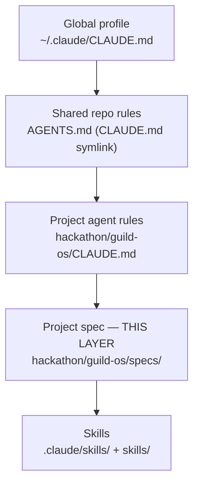

# GuildOS — Specification (North Star)

> ✅ **CANONICAL — finalized 2026-06-30.** This `specs/` tree is now the single source
> of truth for GuildOS. `hackathon/guild-os/docs/` is **deprecated** — each file there
> carries a banner pointing to its `specs/` successor and is kept only for historical
> provenance. Do not edit `docs/` going forward; update `specs/` instead. See
> **"docs/ → specs/ Migration Map"** below for the file-by-file mapping, and the
> (now-executed) Finalization Checklist at the bottom for what changed.

> Provenance: originally built from `docs/PROBLEM.md`, `docs/MVP_FLOW.md`,
> `docs/TECH_STACK.md`, `docs/RISKS.md`, `docs/VALIDATION_PLAN.md`, `docs/TRACK.md`,
> project `CLAUDE.md`, and `hackathon/PROJECT_PROPOSAL.md`. Those files are now
> deprecated in favor of this tree — treat `specs/` as authoritative even where it
> has since diverged from its original sources (network config, phase-gated issue
> tracking, the Transport & Integration Mechanics section, etc.).

---

## TL;DR

GuildOS is a programmable studio where a founding agent (acting on behalf of a dao/club) and specialist agents coordinate
real work through A2A, share a Moloch-secured treasury via AgentFightClub, and build
verifiable on-chain reputation. This spec is a **Spec-Driven Development** blueprint:
**the spec is the permanent source of truth; code is disposable.** Read it top-down —
each file discloses depth progressively so you get the contract before the detail.

---

## What This Spec Locks In

Before any code is generated, this spec fixes four things:

1. **Gherkin-based design** — behavior is described as a State → Action → Outcome loop in
   `scenarios/*.feature`, complemented (never replaced) by Mermaid diagrams.
2. **Hybrid Markdown + conditional-YAML authoring** — see the authoring protocol below.
3. **The layered control model** — global profile → shared `AGENTS.md` → project spec → skills.
4. **Progressive disclosure** — numbered files, TL;DR-first, shallow-to-deep, to dodge
   "Lost in the Middle" context rot.

---

## Reading Order (progressive disclosure)

Load context shallow-to-deep. Do not skip ahead — each file assumes the prior one.

| Order | File | What you get |
|-------|------|--------------|
| 1 | [`00-overview.md`](00-overview.md) | Vision + the "why" — problem, users, North Star scenario, track alignment, success criteria |
| 2 | [`10-technical-design.md`](10-technical-design.md) | Requirements, component map, the 15-step loop, state machine, schemas, fallbacks, guardrails |
| 3 | [`20-api-contracts.md`](20-api-contracts.md) | Pinned dependency versions, contract addresses, A2A message + MCP tool contracts, env contract |
| 4 | `scenarios/` — see table below | Executable behavior — one `.feature` per business concept, **3–5 scenarios** as default; stretch to 7 only when a concept's edges aren't worth splitting into a separate feature |

### Scenario Files (flow order)

| # | File | MVP steps covered | Concept |
|---|------|-------------------|---------|
| 01 | [`01_guild_formation.feature`](scenarios/01_guild_formation.feature) | Steps 1–2 | Guild launch + treasury funding; Orchestrator ERC-8004 registration |
| 02 | [`02_talent_discovery.feature`](scenarios/02_talent_discovery.feature) | Step 2 (Specialist) · Step 3 · Gate 0 | **Specialist's own ERC-8004 registration** (tracked, not fixture); talent-pool skill shortlist; human candidate approval |
| 03 | [`03_quoting_and_terms.feature`](scenarios/03_quoting_and_terms.feature) | Step 4 · Gate 0.5 | A2A invite + quote exchange; human quote acceptance |
| 04 | [`04_membership.feature`](scenarios/04_membership.feature) | Step 5 · Gate 1 | Specialist membership proposal + DAO vote |
| 05 | [`05_task_delegation.feature`](scenarios/05_task_delegation.feature) | Step 6 | A2A `task/send` contract — GitHub issue, constraints, AgBOM, BDD acceptance, deliverable format |
| 06 | [`06_specialist_execution.feature`](scenarios/06_specialist_execution.feature) | Step 7 | Read issue → GLM-5.1 long-horizon plan → hashable deliverable (dogfooding) |
| 07 | [`07_deliverable_attestation.feature`](scenarios/07_deliverable_attestation.feature) | Steps 8–9 | EAS `attest()` → UID; `task/delivered` embedding |
| 08 | [`08_deliverable_review.feature`](scenarios/08_deliverable_review.feature) | Step 10 · Gate 2 | Automated pre-check + human deliverable accept / reject |
| 09 | [`09_settlement.feature`](scenarios/09_settlement.feature) | Steps 11–12 · Gate 3 | Payment proposal → `task/accepted` (id+url) → human vote+process → settle |
| 10 | [`10_reputation_feedback.feature`](scenarios/10_reputation_feedback.feature) | Steps 13a · Gate 4 · 13b | Specialist `feedback/request` → executable `submitFeedback` proposal → guild-contract `giveFeedback()` |
| 11 | [`11_dispute_path.feature`](scenarios/11_dispute_path.feature) | Step 15 | Gate 2/3 rejection → DISPUTED; locked funds; ragequit (documented only) |
| 12 | [`12_scoped_spending.feature`](scenarios/12_scoped_spending.feature) | Cross-cutting | Provider-agnostic Pact: DAO-call allowlist + tribute cap; no EOA fallback |

---

## Authoring Protocol (enforced on every file)

Beats the "Reasoning Format Tax" — keep the model's attention where it matters.

- **Markdown** for all narrative, headers, tables, and reasoning.
- **YAML** *only* for structured schemas nested **deeper than 3 levels**; shallower
  structures stay as Markdown tables or inline.
- Every Gherkin scenario is **Given / When / Then** = **State → Action → Outcome**.
- **Mermaid** (flowchart or sequence) complements — never replaces — `.feature` files.
- **Mark every assumption explicitly** with a `> ASSUMPTION:` callout; never silently fill gaps.
- **No unpinned dependencies** — every library carries an exact version from `uv.lock`.
- Each file opens with a one-paragraph **TL;DR**, then discloses depth progressively.
- Each file carries a `> Provenance:` callout under its title naming its source docs.

---

## Layered Control Model

GuildOS instructions are layered, broadest to narrowest. Each layer constrains the next;
the spec sits between the project agent-rules and the skills.

| Layer | Location | Authority |
|-------|----------|-----------|
| Global profile | `~/.claude/CLAUDE.md` | Cross-project personal defaults (graphify, context7 rules) |
| Shared repo rules | `AGENTS.md` (repo root; `CLAUDE.md` symlinks to it) | Sensei role, learning path, repo structure, hackathon platform rules |
| Project agent rules | `hackathon/guild-os/CLAUDE.md` | Component naming, build/Don't rules, sprint gates |
| **Project spec** | **`hackathon/guild-os/specs/`** | **What to build and how it must behave (this layer)** |
| Skills | `.agents/skills`, `.claude/skills/`, `skills/` | Reusable procedures (context7-mcp, cobo-agentic-wallet-developer, wiki-builder, `skills/stylebook` etc.) |

---

## Hackathon Reference

| Field | Value |
|-------|-------|
| Event | [AI × Web3 Agentic Builders Hackathon](https://casualhackathon.com/hackathons/cmpsjubkg0003p80kxuzrdyjy) |
| Tracks | Cobo \| Agentic Economy × Cobo Agentic Wallet (primary) · Z.AI \| Web3 × Long-Horizon Task (secondary) |
| Submission deadline | 2026-06-13 12:00 UTC+8 (04:00 UTC) |
| Demo Day | 2026-06-14 |
| Prize pool | 7000 USDT (Cobo 3500 · Z.AI 3500) |
| Canonical network | Base mainnet (chain_id 8453) — only valid submission-evidence network |

---

## `docs/` → `specs/` Migration Map

Every deprecated `docs/` file's content now lives here. If you're looking for
something that used to be in `docs/`, this table says where it went.

| Deprecated file | Superseded by | Note |
|---|---|---|
| `docs/PROBLEM.md` | [`00-overview.md`](00-overview.md) §1–3 | Problem statement, target users, North Star scenario |
| `docs/MVP_FLOW.md` | [`10-technical-design.md`](10-technical-design.md) §2 + [`scenarios/`](scenarios/) | Loop table, sequence diagram, and the concrete Given/When/Then behavior per step |
| `docs/TECH_STACK.md` | [`20-api-contracts.md`](20-api-contracts.md) + [`10-technical-design.md`](10-technical-design.md) §1/§5 | Pinned versions, addresses, env contract, component map, naming conventions |
| `docs/RISKS.md` | [`10-technical-design.md`](10-technical-design.md) §8/§10 + [`00-overview.md`](00-overview.md) §9 | Fallback requirements (F1–F7), Tier B, scope-creep signals, decision log |
| `docs/TRACK.md` | [`00-overview.md`](00-overview.md) §7 + this file's Hackathon Reference table | Track alignment, evaluation scorecard, hackathon links |
| `docs/VALIDATION_PLAN.md` §1–10 | [`scenarios/*.feature`](scenarios/) Then-clauses | Per-integration definition-of-done, expressed as Gherkin assertions and — since 2026-07-16 — literally executed via pytest-bdd for scenarios with a `tests/step_defs/` counterpart; see `AGENTS.md`'s "Files — Read Before Coding" |
| `docs/VALIDATION_PLAN.md` §11 | **Not superseded — still authoritative** | The hackathon platform's submission-requirements checklist is operational tracking, not a spec; it stays in `docs/VALIDATION_PLAN.md` and issue [#17](https://github.com/santteegt/ai-web3-school-cohort-0/issues/17) still points at it directly |

---

## Finalization Checklist (draft → canonical) — ✅ executed 2026-06-30

1. ✅ DRAFT banner replaced with the CANONICAL banner above.
2. ✅ Deprecation banner added to each `docs/` file, pointing at its `specs/` successor
   per the Migration Map above (`docs/VALIDATION_PLAN.md` carries a partial banner —
   see the note in that row).
3. ✅ `guild-os/AGENTS.md` (`CLAUDE.md` symlink) "Files — Read Before Coding" rewired
   to `specs/` first; `docs/` demoted to a "deprecated, historical only" row.
4. ✅ `prompts/ISSUE_CODING_SESSION.md` and `prompts/HERMES_CODING.md` ground-truth
   reading lists updated to read `specs/` instead of `docs/`.
