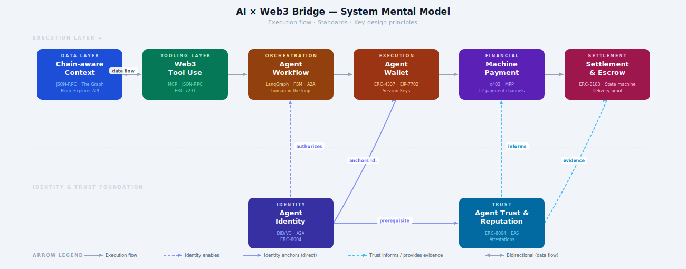

# AI × Web3 Bridge — System Mental Model

> Visual: [`aixweb3-bridge-mental-model.html`](./aixweb3-bridge-mental-model.html) · [`aixweb3-bridge-mental-model.svg`](./aixweb3-bridge-mental-model.svg)

---

## What the Diagram Shows

The diagram uses a **layered dependency flow** — a hybrid of architecture diagram and flowchart. The top row is the **execution spine**: the six modules an AI × Web3 agent activates in sequence when handling a task. The bottom row is the **identity and trust foundation**: two modules that don't execute inline but enable everything above them. Color-coding groups modules by domain (data, tooling, orchestration, execution, financial, settlement, identity, trust).

---

## The Two Layers

### Execution Spine (left → right)

The six top-row modules represent the runtime sequence of an AI × Web3 agent acting on a user intent:

**Chain-aware Context** is the input layer. Before the agent does anything, it must read the correct on-chain state — chain ID, balances, contract addresses, recent authorizations. Without this, every downstream decision is built on guesswork. Key standard: JSON-RPC, The Graph.

**Web3 Tool Use** is tightly coupled to context (the bidirectional arrow). Tools populate context, and context requirements determine which tools to call. The critical design constraint is read/write separation: reading balances and sending transactions must be different tools with different permission levels. Key protocol: MCP (Model Context Protocol).

**Agent Workflow** is the orchestration layer — the state machine that moves the agent from user goal to on-chain result. It calls tools, manages risk checkpoints, and decides which steps require human confirmation. A workflow is not just a prompt; it is a task graph with explicit states, retry logic, and stop conditions. Key framework: LangGraph. Key protocol: A2A.

**Agent Wallet** is where the agent's on-chain authority is defined. Agents never hold primary keys — they receive session keys or scoped delegations from ERC-4337 smart accounts. The wallet enforces what the agent can sign, how much, to which contracts, and for how long. Revocation must always be possible. Key standard: ERC-4337, Session Keys, EIP-7702.

**Machine Payment** covers how agents pay for services autonomously. Budget authorization comes first, then quoting, then payment intent, then settlement. The x402 protocol enables HTTP-level per-call payments. MPP (Machine Payments Protocol) covers discovery, quoting, authorization, and receipts. L2s make micropayment economics viable.

**Settlement & Escrow** closes the payment lifecycle. Funds move through explicit states (`pending → locked → delivered → accepted → released`). Delivery proof must be preservable (file hashes, API logs, on-chain events). Disputes need a pre-designed flow. Key draft standard: ERC-8183.

### Identity & Trust Foundation

These two modules sit below the execution spine because they don't execute in sequence — they enable the entire system.

**Agent Identity** answers: who is this agent, who controls it, what can it do, and where is its service endpoint? Identity is bound to a wallet address (on-chain anchor), a capability manifest (what it can do), and a registry entry (discoverable). Standards: DID/VC, A2A Protocol, ERC-8004. Critical: identity alone does not equal trust.

**Agent Trust & Reputation** aggregates verifiable behavioral evidence — task success rates, dispute rates, delivery records, attestations, stake. It feeds back into Machine Payment (payers check trust before auto-paying) and Settlement & Escrow (high-trust agents can skip manual acceptance steps). Standards: ERC-8004, Ethereum Attestation Service (EAS). Critical: reputation is task-type-specific.

---

## The Central Insight

Most AI × Web3 demos implement 2–3 of these modules in isolation. A production system needs all eight — and more importantly, it needs to design the **interfaces between them** explicitly:

- Who authorizes what at each workflow step?
- Which payment is automatically verifiable vs. requires human acceptance?
- When does the trust score of the counterparty determine whether a workflow can proceed autonomously?

The two most commonly skipped modules in demos are **Settlement & Escrow** (the "what happens after payment" problem) and **Agent Trust & Reputation** (the "why should I pay this agent" problem). Both are prerequisites for any real agentic commerce system.

---

## Standards Reference

| Module | Standards / Protocols |
|---|---|
| Chain-aware Context | JSON-RPC, Etherscan API, The Graph subgraphs |
| Web3 Tool Use | MCP, JSON-RPC, ERC-7231 |
| Agent Workflow | LangGraph, FSM patterns, A2A Protocol |
| Agent Wallet | ERC-4337, Session Keys, EIP-7702, Cobo Pact |
| Machine Payment | x402 (HTTP 402), MPP, L2 payment channels |
| Settlement & Escrow | ERC-8183 (draft), State machine, Delivery proof patterns |
| Agent Identity | DID/VC, A2A Protocol, ERC-8004 |
| Agent Trust & Reputation | ERC-8004, EAS (Ethereum Attestation Service), Attestations |

---

*Source: AI × Web3 School Handbook (Bridge chapters) | Built: 2026-05-27 | Knowledge base: `knowledge-base/AIxWeb3/wiki/`*
