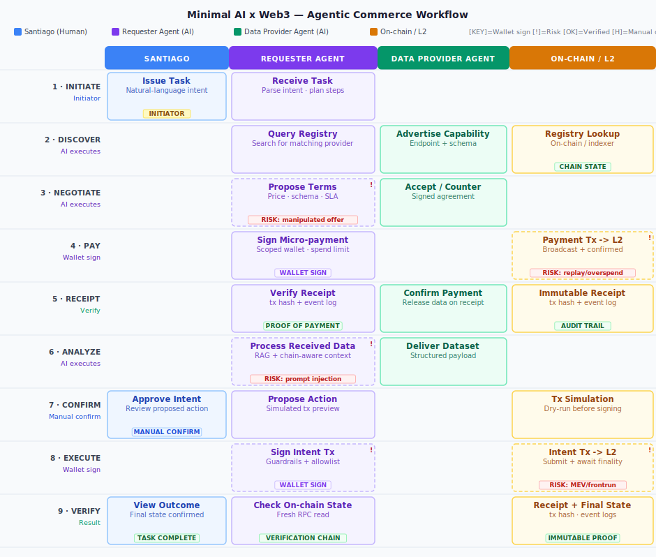

# Minimal AI × Web3 Agentic Commerce Workflow

> **Use case:** A Requester Agent needs external data to execute an on-chain intent. It discovers a Data Provider Agent, negotiates terms, pays via an on-chain micro-payment, verifies the receipt, analyzes the received data, and — after human confirmation — executes the final on-chain intent.  
> **Diagram files:** `agentic-commerce-workflow.svg` · `agentic-commerce-workflow.html`

---

> HTML version [`agentic-commerce-workflow.html`](./agentic-commerce-workflow.html)

## 1. What Problem This Workflow Solves

Autonomous AI agents operating in Web3 environments face a fundamental trust and safety gap: they can reason about tasks and call tools, but neither the agent's reasoning nor its payment or signing authority should be unconditionally trusted. This workflow solves two interrelated problems simultaneously. First, it enables **agent-to-agent commerce** — one AI agent can programmatically discover, negotiate with, and pay another AI agent for a service without any human micromanagement of each step. Second, it enforces a clear **AI/human boundary** at the one point where mistakes are irreversible: the on-chain intent execution in step 8 is gated by an explicit human confirmation in step 7, so the agent never autonomously commits a financially consequential transaction without a human sign-off on the simulated outcome.

---

## 2. Which Steps Are Assisted by AI / an Agent

Steps 1b through 6, and 7b through 8, are executed by one or both agents without human intervention:

- **Steps 1b–2 (Receive Task → Discover):** The Requester Agent parses the natural-language intent issued by Santiago and queries an on-chain or indexer-backed service registry to find a matching Data Provider Agent. This is pure AI orchestration — capability matching, schema parsing, and context-building from chain-aware state (live registry data via RPC or indexer).
- **Step 3 (Negotiate):** The Requester Agent and Data Provider Agent exchange capability descriptions, price quotes, and SLA terms autonomously using a structured agent-to-agent protocol. The Requester Agent applies guardrails to evaluate whether the offered terms are within acceptable bounds before proceeding.
- **Steps 4–5 (Pay → Receipt):** The Requester Agent autonomously signs a micro-payment transaction using its scoped agent wallet, submits it to an L2, and then reads the resulting on-chain receipt (transaction hash + ERC event log) to confirm proof of payment — triggering the Data Provider Agent to release the data.
- **Step 6 (Analyze):** The Requester Agent ingests the delivered dataset, combines it with fresh on-chain state fetched via RPC (balance, contract storage, oracle prices), and constructs the chain-aware context needed to reason about the proposed on-chain intent.
- **Steps 7b–8 (Propose Action → Execute):** After human confirmation, the Requester Agent re-verifies permissions against the agent wallet's contract allowlist, passes the transaction through guardrails (spend limit, allowed target contracts, time window), and signs and submits the final intent transaction.

---

## 3. Which Steps Must Be Manually Confirmed

Exactly one step requires explicit human confirmation: **Step 7 — Approve Intent**.

Before Step 7, the Requester Agent runs a dry-run simulation of the intent transaction against the L2 (via `eth_call` or a simulation API), producing a concrete preview of expected state changes, gas cost, and token movements. This simulation result, combined with the agent's reasoning about the analyzed data, is presented to Santiago for review. Only after Santiago explicitly approves does control pass to Step 8. This is a hard gate enforced in code — a guardrail, not a prompt instruction — meaning the agent cannot proceed to sign the intent transaction regardless of what the model outputs. Step 1 (issuing the task) is also human-initiated, but it is the entry point of the workflow rather than a confirmation of an AI-proposed action.

---

## 4. How the Final Result Is Verified

Verification is distributed across three layers, following the six-step **verification chain** pattern:

1. **Simulation before signing (Step 7c):** The intent transaction is dry-run on-chain before the human sees the confirmation prompt. This catches encoding errors, insufficient balance, and failed contract preconditions before any gas is spent.
2. **On-chain receipt after execution (Step 8b–9c):** Once the transaction is included in a block, the Requester Agent reads the transaction receipt (status code, gas used, emitted events) and the updated on-chain state via a fresh RPC call. Receipts are immutable — they provide cryptographic proof that the transaction executed with specific parameters at a specific block height.
3. **Agent state check (Step 9b):** The Requester Agent performs a final `eth_call` or indexer query to read the post-execution state (updated balances, new contract storage slots, ownership changes) and confirms it matches the expected outcome from the simulation. Any divergence between simulated and actual state is a flag for investigation.

Notably, cached context is explicitly insufficient here — any agent action based on chain-aware context must be **re-verified at execution time**, not just at context-building time, because on-chain state changes between reasoning and signing.

---

## 5. What the Main Risk Points Are

The workflow has five named risk points, grouped by category:

**Negotiation integrity (Step 3):** The Data Provider Agent is an external, untrusted counterparty. A malicious provider could present falsified capability schemas or bait-and-switch pricing, causing the Requester Agent to commit to a payment for data that does not match the expected format or quality. Mitigation: schema validation at Step 6 before incorporating data into context; on-chain reputation or stake-slashing mechanisms for providers.

**Payment exploits (Step 4b):** An overly broad agent wallet combined with a replay attack or a compromised agent could drain funds beyond the intended micro-payment. Mitigation: the agent wallet must be scoped with explicit per-transaction spending limits, contract allowlists, and time windows — implemented via Account Abstraction (ERC-4337 smart accounts) rather than raw EOA signing. Unbounded payment authority for an agent is the primary AI × Web3 security risk.

**Prompt injection via received data (Step 6):** The dataset delivered by the Data Provider Agent is untrusted input that flows directly into the Requester Agent's context window. A maliciously crafted payload could embed instruction-like content designed to override the agent's goals or manipulate the proposed on-chain action in Step 7b. Mitigation: input guardrails that sanitize and schema-validate the payload before it enters the reasoning context; treating provider data as a separate, lower-trust context layer.

**Irreversible intent execution (Step 8):** On-chain transactions cannot be undone. If the agent signs and submits an incorrectly parameterized transaction — due to a hallucination, stale context, or compromised tooling — the financial loss is permanent. Mitigation: the human confirmation gate in Step 7, combined with simulation (Step 7c) and execution-time guardrails (contract allowlist check, spend limit re-verification immediately before signing).

**MEV / frontrunning (Step 8b):** Transactions visible in the public mempool before block inclusion can be frontrun or sandwiched by MEV bots, altering the effective execution price or outcome of the intent. Mitigation: use private mempools (Flashbots Protect or equivalent), commit-reveal schemes, or slippage tolerance parameters encoded in the transaction itself.

---

## Sources (Wiki Knowledge Base)

All concepts referenced in this document are grounded in the following wiki pages from `knowledge-base/AIxWeb3/wiki/`:

| Concept | File | Applied in step(s) |
|---|---|---|
| Machine Payment | `machine-payment.md` | 4, 5 — autonomous micro-payment, on-chain receipt as proof |
| Agent Wallet | `agent-wallet.md` | 4, 8 — scoped delegated signing key, spend limits, contract allowlist, revocation |
| Agent Identity | `agent-identity.md` | 1b, 3, 4 — Requester Agent's on-chain identity anchors authorization and audit trail |
| Agent Workflow | `agent-workflow.md` | All steps — workflow design principle: who initiates, executes, pays, verifies, carries risk |
| Web3 Tool Use | `web3-tool-use.md` | 2, 4, 5, 8, 9 — RPC calls, wallet signing, contract calls, indexer queries as agent tools |
| Chain-aware Context | `chain-aware-context.md` | 6 — on-chain state (balances, oracle prices, contract storage) injected into reasoning context |
| Verification Chain | `verification-chain.md` | 7c, 8, 9 — simulation (step 5), human check (step 6), receipt confirmation (step 9) |
| Guardrails | `guardrails.md` | 4, 7, 8 — hard stops on spend limits, contract allowlist checks, execution-time re-verification |
| AI × Web3 Bridge Overview | `aixweb3-bridge-overview.md` | Framing — the core challenge of combining model reasoning with on-chain permission enforcement |
| AI Security | `ai-security.md` | 3, 6 — prompt injection via untrusted provider data; permission isolation |

---

*Generated: 2026-05-27 | Agent: Sensei (Claude via Cowork) | Task: AIxWeb3_WORKFLOW*

*Reviewed: 2026-05-27 | Santiago*
