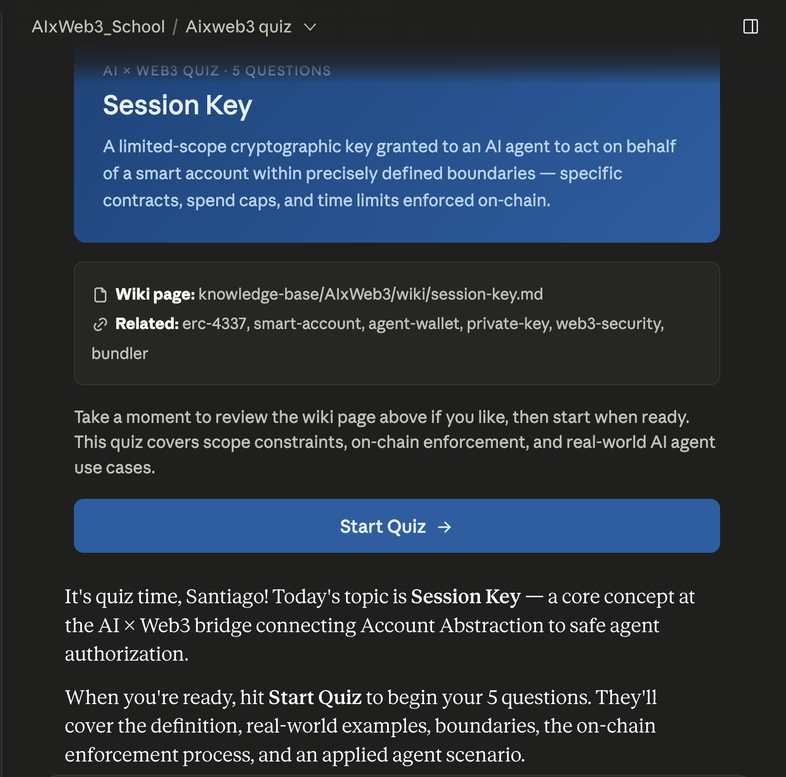
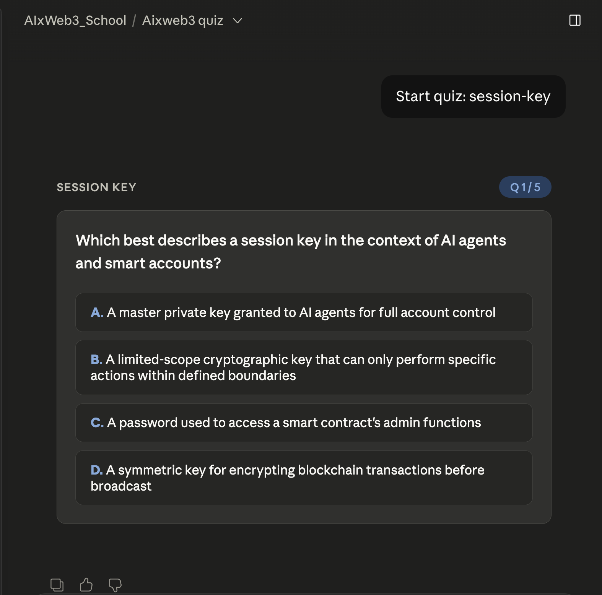
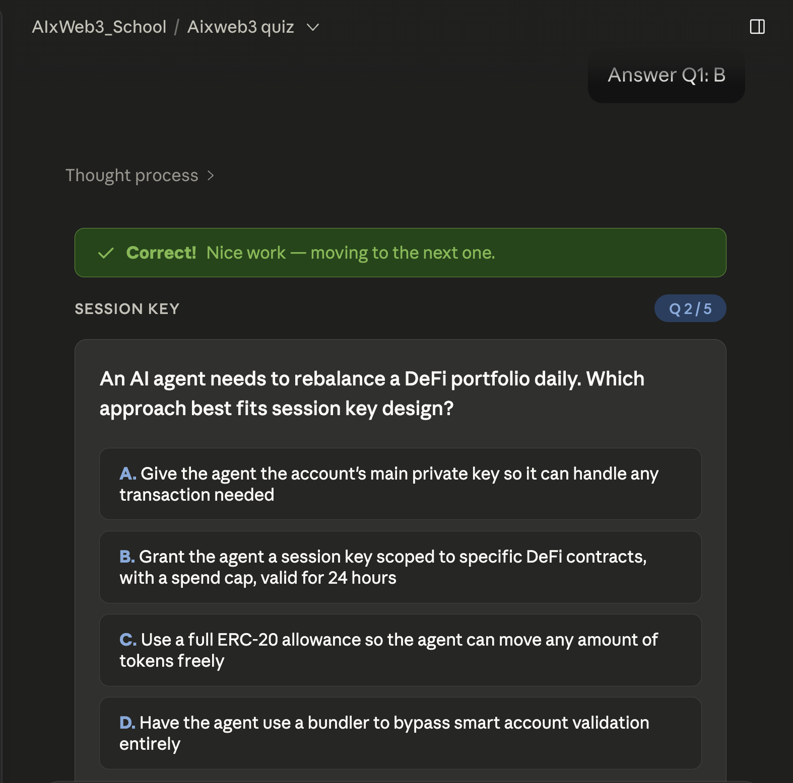
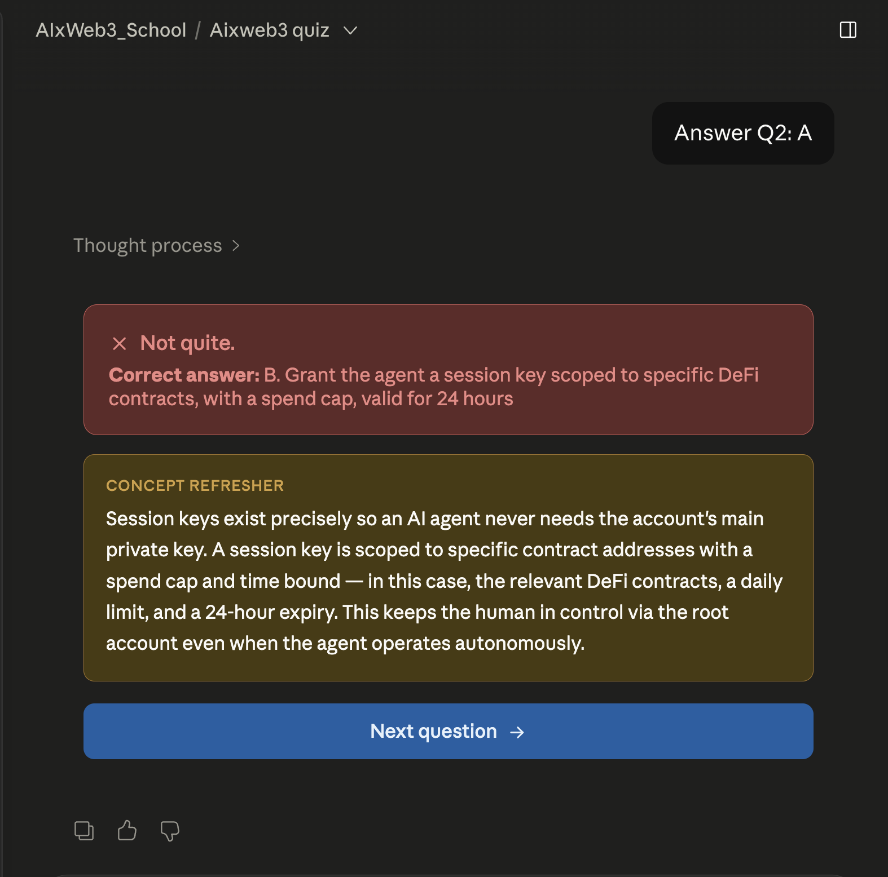
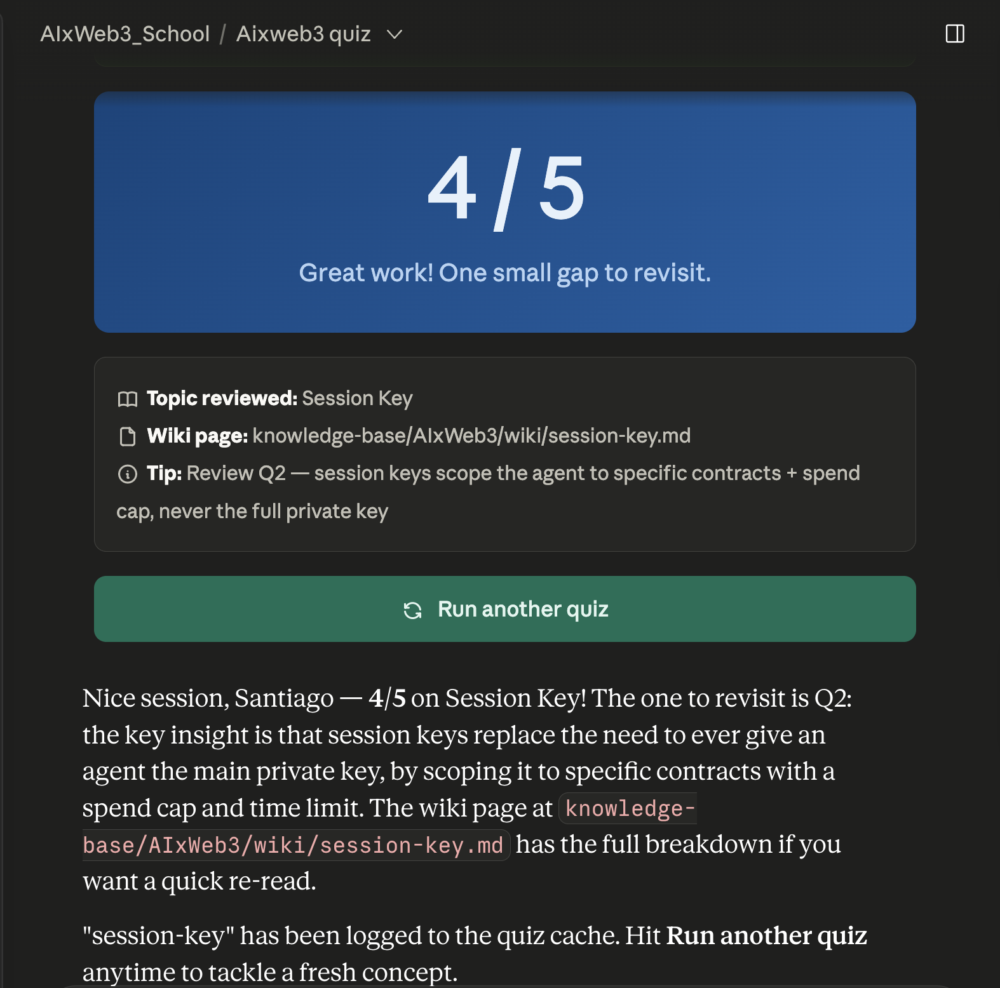

# Interactive learning artifact

I created a skill that builds an interactive quiz around a randomly picked topic from my wiki-like knowledge base. This skill is then executed according to a schedule (e.g. cron job or Claude co-work scheduled task).

## Prompt + Implementation details

See [INTERACTIVE_LEARNING_ARTIFACT.md](/prompts/INTERACTIVE_LEARNING_ARTIFACT.md)

## Skill

See [Quiz Skill](/skills/quiz/SKILL.md)

## Example quiz as scheduled task on Claude CoWork

- Every two hours, the agents picks a random topic and starts an interactive quiz

- Each question and answers are rendered as HTMLS UI components using `mcp__visualize__show_widget`

- Correct answer's response

- Wrong answer's response with a short explanation to refresh the user's knowledge

- Quiz session ends with final score and a final review on the topic

