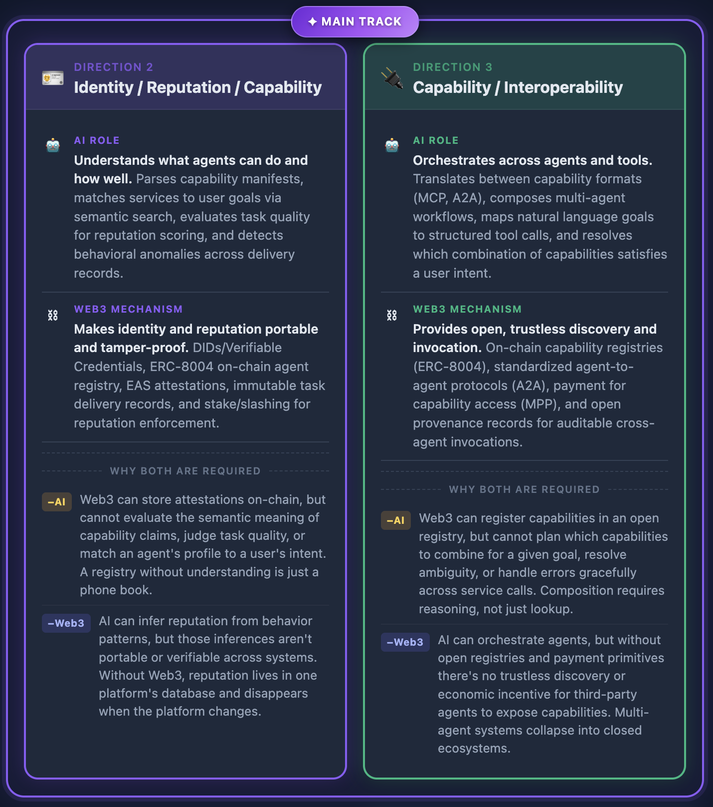
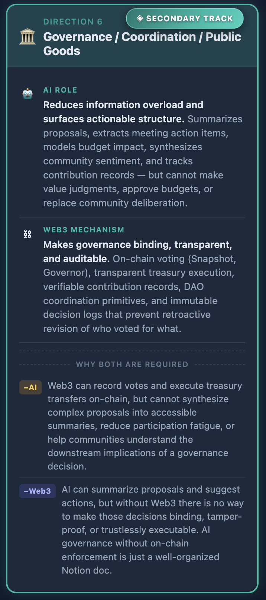

# AIxWeb3 - Problem Map and Main Direction Selection

Prior to deciding on the main direction I will choose to dive deep and build something, I asked my learning agent to help me draw a mental model around all the topics covered in the AIxWeb3 Bridge module of the handbook so I can fully understand how the 6 main modules interact with each other when an AI×Web3 agent acts on a user intent (See [report](/knowledge-base/AIxWeb3/concepts/aixweb3-bridge-mental-model.md)).

With this foundation and the help of the knowledge base I've been building during my learnind journey, I then asked the agent to map the AI×Web3 problem space by covers the core 5 foundational directions in this cross-domain scenario. That was useful to then describe the role that AI and Web3 mechanisms independently play in each direction and why both domains are required for building that direction. See the [HTML diagram](tasks/AIxWeb3-problem-map.html) and a [summary report](tasks/AIxWeb3-problem-map.md) for details.

with that in mind, I chose the following directions

## Identity / Reputation / Capability / Interoperability

I merged both directions into a **main track** as I see them very interrelated, not only in terms of standards and tooling but also as fields that need from each other in order to serve its purpose: capabilities cannot be discovered without identity, interoperability cannot be safely invoked without verifying reputation.

### Identity / Reputation

#### AI Role

> Understands what agents can do and how well. Parses capability manifests, matches services to user goals via semantic search, evaluates task quality for reputation scoring, and detects behavioral anomalies across delivery records.

#### Web3 Mechanism

> Makes identity and reputation portable and tamper-proof. DIDs/Verifiable Credentials, ERC-8004 on-chain agent registry, EAS attestations, immutable task delivery records, and stake/slashing for reputation enforcement.

#### Why both are required

> **AI** \
> Web3 can store attestations on-chain, but cannot evaluate the semantic meaning of capability claims, judge task quality, or match an agent's profile to a user's intent. A registry without understanding is just a phone book.

> **Web3** \
> AI can infer reputation from behavior patterns, but those inferences aren't portable or verifiable across systems. Without Web3, reputation lives in one platform's database and disappears when the platform changes.

### Capability / Interoperability

#### AI Role

> Orchestrates across agents and tools. Translates between capability formats (MCP, A2A), composes multi-agent workflows, maps natural language goals to structured tool calls, and resolves which combination of capabilities satisfies a user intent.

#### Web3 Mechanism

> Provides open, trustless discovery and invocation. On-chain capability registries (ERC-8004), standardized agent-to-agent protocols (A2A), payment for capability access (MPP), and open provenance records for auditable cross-agent invocations.

#### Why both are required

> **AI** \
> Web3 can register capabilities in an open registry, but cannot plan which capabilities to combine for a given goal, resolve ambiguity, or handle errors gracefully across service calls. Composition requires reasoning, not just lookup.

> **Web3** \
> AI can orchestrate agents, but without open registries and payment primitives there's no trustless discovery or economic incentive for third-party agents to expose capabilities. Multi-agent systems collapse into closed ecosystems.

## Governance / Coordination

On user-agent and agent-agent systems, coordination is crucial, and requires proper interoperability and agent identity to makes things work. I want to dig deeper into multi-agent and user-agent scenarios during the course, so I chose this as the secondary direction.

### Governance / Coordination

#### AI Role

> Reduces information overload and surfaces actionable structure. Summarizes proposals, extracts meeting action items, models budget impact, synthesizes community sentiment, and tracks contribution records — but cannot make value judgments, approve budgets, or replace community deliberation.

#### Web3 Mechanism

> Makes governance binding, transparent, and auditable. On-chain voting (Snapshot, Governor), transparent treasury execution, verifiable contribution records, DAO coordination primitives, and immutable decision logs that prevent retroactive revision of who voted for what.

#### Why both are required

> **AI** \
> Web3 can record votes and execute treasury transfers on-chain, but cannot synthesize complex proposals into accessible summaries, reduce participation fatigue, or help communities understand the downstream implications of a governance decision.

> **Web3** \
> AI can summarize proposals and suggest actions, but without Web3 there is no way to make those decisions binding, tamper-proof, or trustlessly executable. AI governance without on-chain enforcement is just a well-organized Notion doc.

---

## Side-by-side comparison

| | Identity / Capability (Main) | Governance (Secondary) |
|---|---|---|
| Real user | Agent developer/user composing multi-agent systems | DAO contributor (user or agent) managing information overload |
| AI necessity | Semantic matching — registries can't infer meaning | Synthesis at scale — humans can't read every thread |
| Web3 necessity | Portable, tamper-proof reputation + open registries | Binding, verifiable decisions + transparent execution |
| Build form | Developer tooling → product demo | Product demo |
| Minimal proof | Query a registry, rank agents by capability + trust score | Ingest Snapshot + forum, output structured governance brief |
| Hardest risk | Stale or gamed reputation data | AI output being mistaken for authoritative decision |

---