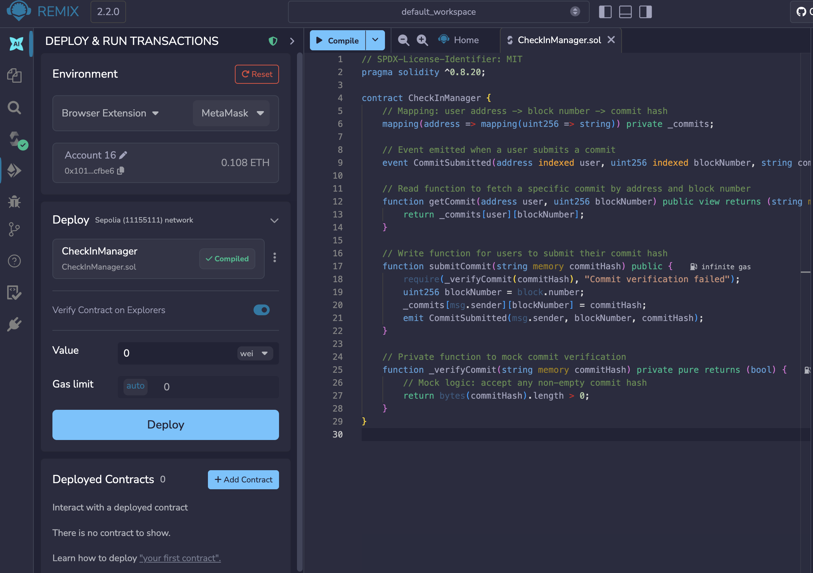
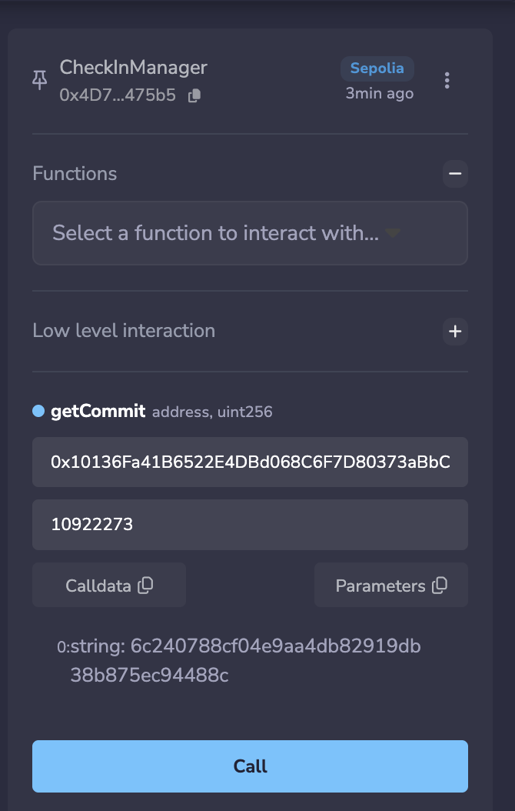
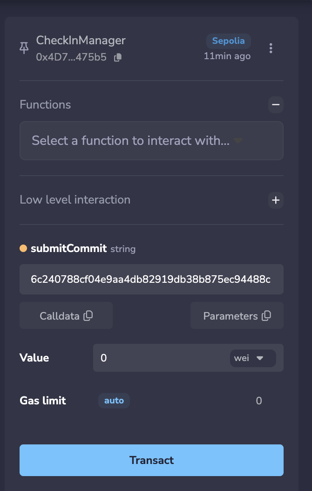

## Deploy or Call a Minimal Smart Contract

I used Remix to build a simple smart contract that tracks user's learning commits.

### Source code

[CheckInManager.sol](/experiments/CheckInManager.sol)

### Deployment tx

I used the same Remix interface to connect to my Metamask wallet and deploy the contract on Sepolia testnet

Contract Address: [0xedb9e134cf6865c044169b1deccece705c1d2932b8bdbc5b3113261da8e234fd](0xedb9e134cf6865c044169b1deccece705c1d2932b8bdbc5b3113261da8e234fd)

[View on Etherscan](https://sepolia.etherscan.io/tx/0xedb9e134cf6865c044169b1deccece705c1d2932b8bdbc5b3113261da8e234fd)

[Sourcify Contract code Verification](https://repo.sourcify.dev/11155111/0x4D76e3f498324Da200694b0865f5545E678475b5)

### Calling a write function

Using the same wallet connection on Remix, I submitted my commit hash to the smart contract on Sepolia. A wallet tx confirmation popped up to submit the tx

[View on Ethercan](https://sepolia.etherscan.io/tx/0xb44a06975ac79ab1079b9bbc1f1d0b63228f1455374b0a1627faee8c49b91492)

### Calling a read function

I verified my commit hash is registered on the blockchain by reading the smart contract function

