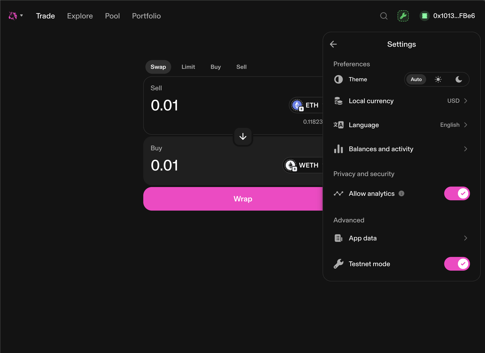
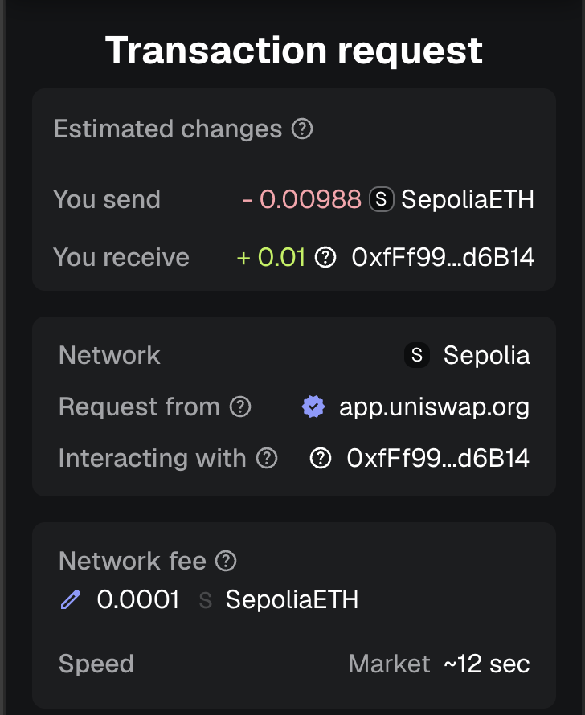
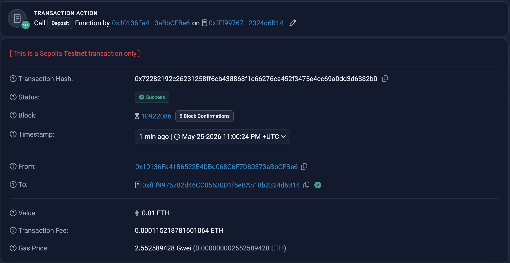
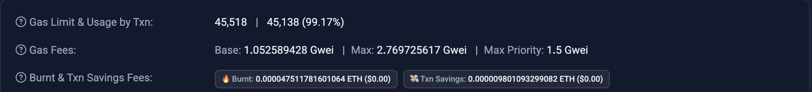

## Complete a Testnet Transaction

For this task, I used Metamask as a wallet app and connected to Ethereum Sepolia Testnet. I already have some testnet ETH so didn't have to request it via a faucet like https://sepolia-faucet.pk910.de/

### Where the transaction is initiated

I chose [Uniswap](https://app.uniswap.org/swap) as the dApp for executing a testnet transaction. Enabled `testnet mode` to wrap some ETH -> WETH

### Where the transaction is sent.

Transaction is sent to the [WETH Smart Contract (0xfFf99...d6B14)](https://sepolia.etherscan.io/address/0xfFf9976782d46CC05630D1f6eBAb18b2324d6B14) on the Sepolia Network

### What the transaction hash is.

Transacion hash is [0x72282192c26231258ff6cb438868f1c66276ca452f3475e4cc69a0dd3d6382b0](https://sepolia.etherscan.io/tx/0x72282192c26231258ff6cb438868f1c66276ca452f3475e4cc69a0dd3d6382b0)

### How a block explorer displays transaction status, gas, block height, and timestamp.

- A block explorer like Etherscan displays the `Success` in status, execution timestamp and the block number where the transaction was included.
- Also displays how many confirmation (post-tx blocks produced) have occurred since the transacion was executed

- In terms of gas costs, the explorer provided a detailed breakdown of total gas used againt the gas limit, base/priority gas price, how much was burnt via EIP-1559 and how much was saved.

### Which steps must be manually confirmed by you.

- When triggering a tx through a dApp interface, the wallet pop-up appards with the tx details. Then the wallet owner should accept or deny tx execution and gas costs before the action is propagated to the blockchain mempool
