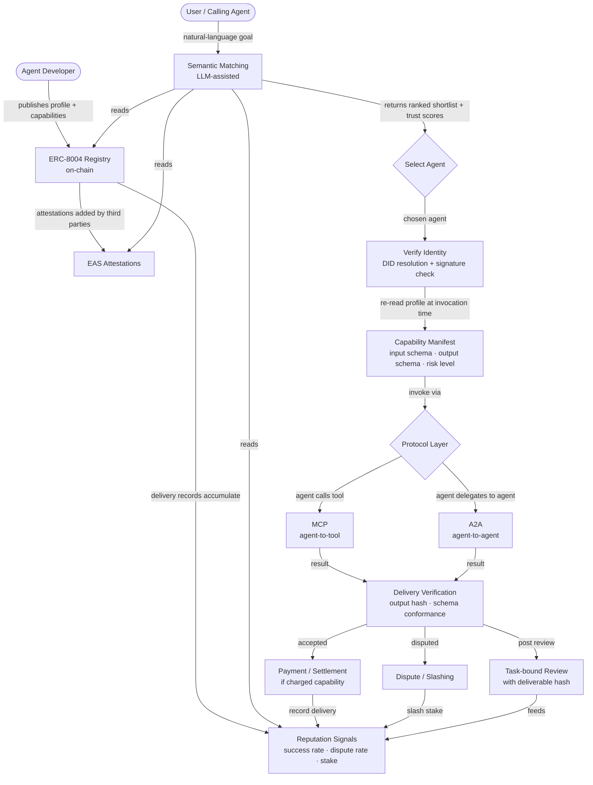

# Direction 1 — Identity / Reputation / Capability / Interoperability

> Deep-dive document | AI × Web3 School — Cohort 0 | Santiago  
> Built: 2026-05-31 | Source: Bridge Introduction + knowledge base wiki

---

## 1. Intro

This direction covers the full stack of questions that arise before any agent does useful work in a multi-agent ecosystem: How do other agents and users find me? How do they know what I can do? How do they verify that I have done it reliably before? And how do I talk to other agents, tools, and services without a bespoke adapter for every pair?

Identity, reputation, capability, and interoperability are not four separate topics that happen to share a handbook chapter. They form a dependency chain. Capability claims are meaningless without a stable identity to attach them to. Reputation cannot accumulate without that same identity persisting across tasks. Interoperability protocols (MCP, A2A) are how the capability layer is actually invoked once identity and trust are established. Remove any layer and the whole edifice collapses: a registry without reputation is a phone book; reputation without identity is hearsay; a communication protocol without trust context is a channel that can be hijacked.

For Santiago's profile — familiar with Web3 mechanisms, experienced with agent tooling — this direction maps cleanly onto existing knowledge. DIDs, on-chain registries, and attestations are straightforward Web3 extensions of familiar concepts. The genuinely new territory is: (a) how capability claims should be structured so they are machine-readable and semantically matchable, and (b) where MCP, A2A, ERC-8004, and MPP each sit in the stack and what problem each actually solves.

---

## 2. Aim

The concrete outcome of this document is a **draft agent profile and capability claim** for a real or realistic agent. By the end of working through this direction you will have produced:

1. A fully specified agent profile in structured form: who the agent is, who maintains it, what it can do (per capability), how it is invoked, how it charges, how it is verified, and how failures are handled.
2. A protocol comparison table and head-to-head analysis: MCP, A2A, ERC-8004, and MPP — what layer each addresses, what problem it is designed to solve, and which two are most relevant for the hackathon prototype.
3. A flowchart of the complete discovery-to-invocation-to-reputation cycle.

---

## 3. Core Problem

In a multi-agent ecosystem with heterogeneous agents from different providers, frameworks, and chains, a calling agent or user faces three compounding information problems:

1. **Discovery gap**: There is no standard, open way to find agents by capability. Current solutions default to closed marketplaces (centralized, operator-controlled) or hardcoded agent addresses (brittle, not composable).

2. **Trust gap**: Even if discovery works, there is no portable, tamper-proof record of past performance. An agent can self-declare any capability and any reputation. Without a verifiable history anchored to a stable identity, trust must be extended speculatively.

3. **Invocation gap**: Even if discovery and trust are solved, agents built on different stacks (MCP servers, A2A-native agents, REST APIs, on-chain contracts) cannot speak to each other without custom adapters for every pair — the N × M integration problem.

These three gaps together mean that composing a multi-agent workflow from third-party agents is currently only viable inside a single platform's closed ecosystem. The Identity / Capability direction's project is to make that composition possible across open ecosystems, with trustlessly verifiable records of past performance and standardized invocation interfaces.

The AI × Web3 framing sharpens why both domains are required:

- **AI alone**: Can infer reputation from behavioral patterns and match capability claims semantically, but those inferences are platform-specific and disappear when the platform changes. There is no portable proof.
- **Web3 alone**: Can anchor identity to a wallet address, store attestations on-chain, and make delivery records immutable. But an on-chain registry cannot evaluate the semantic meaning of a capability claim, match it to a user goal, or judge whether a task was completed well. It is a phone book nobody can query intelligently.

---

## 4. Typical Entry Point

The tractable entry point is the **interface layer above the standards**, not the standards themselves. You do not need to deploy ERC-8004 or write a new A2A implementation. The minimal starting point is:

1. Mock or read an on-chain agent registry using the ERC-8004 schema format.
2. Accept a natural-language user goal as input.
3. Use an LLM to match the goal semantically against registered capability manifests.
4. Return a ranked shortlist annotated with a simple trust score derived from available attestations (EAS) or mock delivery records.

This runs on Python or TypeScript, requires one LLM call and a few JSON-RPC reads, and can be built to a working state in a day. It does not require wallet signing, asset transfers, or deploying new contracts. The full agent profile design (section 7 below) is the paper-level precursor to that prototype.

A builder realistically starts here: they have a workflow where they need to route a sub-task to a third-party agent, they do not know which agent to call or whether to trust it, and they want to build a discoverable, trustworthy agent service themselves. The agent profile exercise grounds both problems simultaneously.

---

## 5. Suitable Learner Profile

This direction fits a learner who:

- Is comfortable with Web3 concepts (wallets, smart contracts, on-chain records) but wants to understand how AI changes discovery and trust.
- Has agent development experience (LLM tool calling, MCP servers, or similar) and wants to move from single-agent to multi-agent composition.
- Is interested in protocols and standards as design artifacts, not just as things to implement.
- Finds "build a discoverable, trustworthy agent service" more compelling than "build a payment flow" or "build a governance tool."

It is a less good fit for someone primarily interested in on-chain execution safety (Direction 3 — Wallet / Permission) or privacy-first systems (Direction 4).

### Recommended External Resources

From the source files read for this document:

- [MCP Official Documentation](https://modelcontextprotocol.io/docs/getting-started/intro) — tool context and agent-tool interfaces; the canonical reference for understanding what MCP does and does not do.
- [A2A Official Repository](https://github.com/a2aproject/A2A) — reference for agent-to-agent collaboration protocols; read the spec alongside the examples.
- [ERC-8004](https://eips.ethereum.org/EIPS/eip-8004) — the draft standard for agent identity, reputation, and verification registry; skim the EIP structure before designing your agent profile.
- [ERC-8183](https://eips.ethereum.org/EIPS/eip-8183) — the complementary EIP covering task/payment/escrow lifecycle; read alongside ERC-8004 to understand the boundary between identity/reputation and task execution.
- [MetaMask — Design Server Wallets for AI Agents with ERC-8004](https://docs.metamask.io/tutorials/design-server-wallets/) — a production architecture combining agent identity, backend signer, and wallet execution; useful for understanding how identity plugs into a real deployment.

---

## 6. Flowchart

The following diagram shows the complete cycle from agent registration through discovery, trust evaluation, invocation, delivery, and reputation update.

---

## 7. Typical Scenario

**Goal**: Route a governance proposal summarization task to a third-party agent in an open multi-agent system.

A developer is building a DAO coordination tool. One sub-task in their workflow is summarizing Snapshot governance proposals. Rather than building the summarizer themselves, they want to call a specialized third-party agent. Here is what the complete flow looks like when this direction's stack is in place:

**Step 1 — Goal formation.** The developer's orchestrator receives the sub-task: "Summarize proposal 0x4a2f... from Snapshot space uniswap.eth. Return: title, one-paragraph summary, key trade-offs, vote deadline."

**Step 2 — Registry query.** The orchestrator queries an ERC-8004-compatible registry for agents with a capability matching "governance-proposal-summarization." The capability manifest schema specifies input (Snapshot proposal ID or URL), output format (structured JSON: title, summary, arguments, deadline), risk level (read-only, no wallet permissions required), price (0.001 USDC per call), and maximum execution time (30 seconds).

**Step 3 — Trust evaluation.** The orchestrator reads each matching agent's reputation signals: success rate across governance-summarization tasks specifically (not a generic overall score), dispute rate, time since last model/endpoint update, and third-party attestations from EAS. It also checks stake amount — an agent with no stake and only self-attestations is ranked lower than one with third-party endorsements and posted collateral.

**Step 4 — Identity verification.** Before invoking the selected agent, the orchestrator re-reads its ERC-8004 profile to confirm the endpoint and capability manifest have not changed since the registry was last cached. It resolves the agent's DID and verifies the endpoint update is signed by the declared owner key. A stale or inconsistently signed profile is a hard stop.

**Step 5 — Invocation via A2A.** The orchestrator sends the task to the agent using the A2A protocol: task description, input payload (proposal ID), accepted output schema, payment intent reference, and session identifier. The A2A message also carries the orchestrator's own identity so the receiving agent can verify who is calling.

**Step 6 — Delivery and verification.** The summarizer agent returns the structured JSON output. The orchestrator verifies: (a) the output matches the declared capability manifest's output schema exactly, (b) the summary is not empty or truncated, (c) the response arrived within the declared maximum execution time. If all checks pass, payment is released.

**Step 7 — Reputation update.** The task result, a hash of the deliverable, the evaluator identity, and a pass/fail rating are written as a review record linked to the agent's identity. This record feeds the agent's future reputation scores for governance-summarization tasks specifically — not diluted into a generic overall score.

The key design choices this scenario illustrates: capability claims are task-specific (not "I can do anything"), trust evaluation is multi-signal and task-type-specific, identity is verified at invocation time not just at registration, and the A2A call carries full session context including payment intent.

---

## 8. Counterexample

**Scenario**: A developer builds an agent, assigns it a DID (decentralized identifier), and publishes its wallet address to a public registry as a way to "give it an identity."

This looks like the Identity / Capability direction but is missing almost everything that makes it valuable:

- There are no capability claims — no structured description of what the agent can do, what inputs it accepts, what outputs it produces, what its risk level is, or what it charges. The registry entry is a name and an address, not a capability manifest.
- There is no reputation infrastructure — no task delivery records linked to the identity, no attestations from third parties, no stake, no slashing condition. Anyone can read the registry and learn that the agent exists. They cannot learn whether to trust it.
- There is no invocation interface — the DID resolves to a wallet address, not a service endpoint. There is no MCP server definition, no A2A endpoint, no input schema. A calling agent that finds this registry entry has no standard way to invoke the agent.
- There is no failure handling — no declared refund policy, no dispute mechanism, no time-bounded capability commitment.

Issuing an NFT business card to an agent does not constitute identity in the sense this direction requires. Identity is the prerequisite for the system, not the system itself. The counterexample gets the branding right and skips every hard problem.

**What is missing that would make it real**: A complete capability manifest (at least one structured capability with input/output schema, risk level, price, and failure conditions), at least one invocation endpoint (MCP server or A2A endpoint), and a mechanism for reputation to accumulate over task delivery records rather than being self-declared at registration.

---

## 9. Key Risks

**Risk 1 — Reputation gaming via Sybil attacks.**
An agent operator creates multiple fake identities, generates fake delivery records, and self-attests favorable reviews to inflate a new agent's reputation. Without an economic cost to fake reputation, social reputation systems can be gamed at near-zero cost.
*Mitigation*: Stake/slashing is the required control — it makes fake reputation economically costly. Third-party attestations from independent evaluators (where the evaluator's own credibility is traceable on-chain) are the secondary layer. Self-attestation loops with no independent endorsers are a red flag signal, not just a policy concern.

**Risk 2 — False or stale capability claims.**
An agent registers a capability it cannot actually fulfill, or registers it accurately and later changes its model/endpoint/tool stack without updating the manifest. A calling agent that routes a task based on a stale capability claim gets an unexpected response — at best a format mismatch, at worst adversarial content injected into its context.
*Mitigation*: Re-read the agent's capability manifest at invocation time, not just at registration discovery. Verify output schema conformance after delivery. Behavioral cross-check: compare claimed capabilities against on-chain delivery records — an agent claiming 500 successful completions with zero on-chain delivery logs has unverified reputation.

**Risk 3 — Identity spoofing.**
A malicious actor impersonates a high-reputation agent by copying its DID format, using a similar wallet address, or claiming the same display name in a different registry.
*Mitigation*: DID resolution and signature verification are the hard controls, not registry lookup alone. Verify that the endpoint's ownership signature resolves to the same key declared in the DID document. A display name match is not sufficient.

**Risk 4 — Schema mismatch across protocol versions.**
Two agents using nominally compatible protocols (e.g., different MCP versions or A2A message formats) produce silently corrupted handoffs. The data passes schema validation on the sender's side but fails on the receiver's side, and because there is no hard error, the failure propagates downstream.
*Mitigation*: Interface conformance testing at every handoff boundary. Treat a schema mismatch at handoff as a failure point, not a recoverable error. Maintain explicit protocol version declarations in capability manifests.

**Risk 5 — Capability routing to adversarial agents.**
A malicious agent publishes a plausible-looking capability manifest and games the discovery layer to receive task invocations. Once invoked, it returns data that contains prompt injection payloads designed to manipulate the calling agent's downstream reasoning.
*Mitigation*: Treat all agent-returned data as lower-trust context. Sanitize provider output before passing it to the orchestrator's reasoning layer. This is the same prompt injection vector that applies to any external data source — the capability manifest does not change the attack surface.

---

## 10. Minimal Validation Plan

**One-week scope**: produce a working proof-of-concept that validates the core value proposition of the direction without requiring new standard deployment, wallet signing, or asset transfers.

**Day 1–2 — Agent profile design.**
Write a complete agent profile for a realistic agent (see Section 11 for the worked example). The profile must include: identity fields (name, owner, DID/wallet anchor, version, endpoint), at least two distinct capabilities (each with input schema, output schema, risk level, price, failure conditions, and a sample invocation), reputation fields (task count, success rate by capability type, stake, last validation date), and collaboration partners (which agents it typically delegates to or receives delegation from).

**Day 3 — Registry mock.**
Encode the agent profile as a JSON object following the ERC-8004 schema structure. Store it in a local JSON file or a simple SQLite database. Write a script that queries this mock registry by capability type and returns matching agents.

**Day 4 — Semantic matching.**
Wrap the registry query with an LLM call: accept a natural-language user goal as input, use the LLM to extract capability requirements, match against the mock registry, and return a ranked shortlist with a simple trust score (weight by success rate, stake, and number of independent attestations).

**Day 5 — Invocation and conformance check.**
Write a minimal test that invokes one of the mock agents (can be a stub returning a predefined JSON response), verifies that the response matches the declared output schema, and records a synthetic delivery event to the mock registry.

**Day 6–7 — Document and reflect.**
Write the protocol comparison table (MCP, A2A, ERC-8004, MPP — see Section 12). Identify the two most relevant protocols for the hackathon build. Write the head-to-head comparison. Draft at least one handbook-feedback entry based on a gap or unclear section encountered during the week.

**Validation criteria**: If you can take a user goal in natural language, query your mock registry, and return a ranked list of agents with a trust score that references actual (mock) on-chain delivery records — and if the output schema of the selected agent is verifiably matched after a test invocation — the direction is validated at the proof-of-concept level.

---

## 11. Analysis Process and Conclusion

### How This Analysis Was Reached

The analysis began by mapping the dependency structure between the four sub-concepts (identity, capability, reputation, interoperability) to confirm they belong in one direction rather than four. The dependency chain is unambiguous: capability claims require a stable identity to bind them to; reputation cannot accumulate without that identity persisting across tasks; interoperability protocols require both capability declarations and trust context to do anything useful. Separating them would produce four directions each missing its prerequisite layer.

The protocol comparison (MCP, A2A, ERC-8004, MPP) was grounded strictly in what the source files describe. The key finding is that these four are not competing alternatives — they operate at different layers (tool interface, agent communication, identity registry, payment protocol) and can all be present in a single system simultaneously. The confusion in most early-stage agent projects comes from treating them as substitutes rather than as complementary stack layers.

The counterexample was chosen specifically to capture the most common failure mode in this direction: DID-as-avatar — the idea that giving an agent a name and a wallet address constitutes "agent identity." The source material is explicit that this misses the point. The real work is capability declaration, invocation interface, and reputation infrastructure; identity is only the anchor for all three.

The risk analysis prioritized risks that are specific to this direction (Sybil attacks on reputation, stale capability claims, schema mismatch) over general AI risks (hallucination, latency) that apply equally to every direction.

### Conclusion

The Identity / Capability direction is the most infrastructurally foundational of the six AI × Web3 directions. Every other direction — payment flows, wallet permissions, governance coordination, privacy auditing — assumes that the calling system already knows which agent to call and whether to trust it. This direction is where those assumptions are built.

For a hackathon prototype, the actionable scope is the interface layer above ERC-8004: a tool that takes a user goal, queries an open registry, performs semantic capability matching, and returns a ranked shortlist with an evidence-based trust score. This is buildable in a week, does not require new contract deployment or wallet signing in its initial form, and demonstrates both the AI role (semantic matching) and the Web3 role (portable, tamper-proof identity and delivery records) in a single coherent flow. The agent profile designed in this document is both the planning artifact and the data structure the prototype will consume.

---

## 12. Reference Projects and Standards

Each entry below is described only on the basis of what appears in the source files read for this document.

### ERC-8004 — Agent Identity, Reputation, and Verification Registry

ERC-8004 is a draft standard for agent identity, reputation, and verification registry. Its design principle is to break down identity, reputation, and validation into composable registries so that different applications can discover and evaluate agents using the same format. It provides a public carrying layer for identity, feedback, and verification signals while leaving filtering and ranking rules to the applications built on top.

What it lets you evaluate or implement in a hackathon project: ERC-8004 is the primary on-chain data structure for the agent profile. A prototype that reads (or mocks) ERC-8004-structured records can demonstrate: how capability claims are stored and queried, how reputation signals are accumulated per task type, and how different applications can apply different scoring rules to the same underlying records. The standard explicitly notes that it does not guarantee claimed capabilities are real — capabilities must still be supported by validation and trust models. This is the design gap a hackathon prototype can directly address.

Companion standard: ERC-8183 covers the task/payment/escrow lifecycle; ERC-8004 covers identity and reputation. Reading both together clarifies the boundary between "who is this agent and what has it done" and "how does this specific task get authorized and settled."

Source: `knowledge-base/AIxWeb3/wiki/erc-8004.md`, `knowledge-base/AIxWeb3/raw/AIxWeb3 Bridge - Introduction.md`

### A2A Protocol — Agent-to-Agent Communication

A2A is a communication layer protocol that handles how agents discover each other, communicate, negotiate tasks, and exchange results. The source files describe it as the collaboration protocol layer that complements the identity layer: identity says "who I am talking to," A2A handles "how to collaborate."

Key properties from the source: A2A goes beyond wallet addresses — agents need to know what protocols the other supports, how to authenticate, how task status is synchronized, and how results are returned. In payment scenarios, A2A messages should be associated with Payment Intent, Receipt, and Escrow states, otherwise dialogue and settlement split into irreconcilable systems. A2A is explicitly distinguished from MCP: A2A is for agent-to-agent; MCP is for agent-to-tool.

What it lets you evaluate or implement: A2A is the invocation layer for agent-to-agent task delegation. A prototype that implements even a minimal A2A-style message format (caller identity, task description, input payload, expected output schema, payment intent reference) demonstrates what structured agent collaboration looks like. It also surfaces the gap that most current multi-agent frameworks paper over: task status synchronization and result exchange are not the same as tool calling.

Source: `knowledge-base/AIxWeb3/wiki/a2a-protocol.md`, [A2A Official Repository](https://github.com/a2aproject/A2A)

### MCP — Model Context Protocol

MCP is a unified connectivity protocol that standardizes how LLMs connect to external tools, data sources, and services. The source files describe it as addressing the "N × M integration problem": before MCP, each model needed custom adapters for each tool; MCP defines a single standard interface. Key properties: tool auto-discovery (agents can dynamically enumerate available tools and their schemas), client/server architecture, tool schemas as machine-readable capability descriptions.

The most important boundary the source files draw: MCP specifies how tools are called, not who is authorized. Real authorization, audit, and isolation must be implemented by the application layer. In AI × Web3, MCP serves as the interface layer for agents connecting to on-chain tools; the Web3 account system handles final permission and execution boundaries. MCP is not a wallet-security solution.

What it lets you evaluate or implement: MCP is the right protocol for the agent-to-tool invocation layer. If your hackathon agent calls an on-chain data tool, a blockchain RPC, or an external API, MCP is the interface standard that makes those calls discoverable and schema-validated. The hackathon value is demonstrating MCP and A2A in the same workflow: MCP for the agent-to-tool calls within a single agent, A2A for the agent-to-agent handoffs between agents.

Source: `knowledge-base/AIxWeb3/wiki/mcp.md`, [MCP Official Documentation](https://modelcontextprotocol.io/docs/getting-started/intro)

### MPP — Machine Payments Protocol

MPP (Machine Payments Protocol) is referenced in the source files as a payment layer standard relevant to the capability invocation flow. The source files describe it as addressing discovery, quote, authorization, and receipt in machine-to-machine payment contexts. In the capability/interoperability direction specifically, MPP provides a payment layer for third-party capability access.

The source files note that MCP, A2A, ERC-8004, and MPP are not the same kind of thing — they sit at different layers and address different problems. MPP addresses the payment confirmation step in the invocation chain: when a calling agent invokes a paid capability, MPP structures the payment intent, authorization, and receipt in a way that can be associated with the A2A message carrying the task.

What it lets you evaluate or implement: MPP is relevant if the hackathon prototype includes a paid capability — an agent that charges per call. A prototype that combines A2A task delegation with MPP payment intent records demonstrates the full invocation loop: discovery → identity verification → task handoff (A2A) → payment authorization (MPP) → delivery → reputation update.

Source: `knowledge-base/AIxWeb3/raw/AIxWeb3 Bridge - Introduction.md`, `knowledge-base/AIxWeb3/wiki/a2a-protocol.md`, [MPP introduction](https://stripe.com/blog/machine-payments-protocol)

### EAS — Ethereum Attestation Service

EAS is referenced in the source files as the mechanism for verifiable third-party attestations in the reputation layer. Attestations in this context are verifiable claims with an issuer, subject, claim content, evidence, expiration, and revocation flag. The source files note that evaluations must be bound to tasks — generic five-star ratings are less useful than specific task records — and that evaluator trustworthiness must itself be traceable on-chain.

What it lets you evaluate or implement: EAS is the attestation infrastructure that gives reputation economic and social weight beyond what an agent can claim about itself. A prototype that reads EAS attestations for a given agent address and incorporates them into a trust score demonstrates the difference between self-declared reputation and verified reputation. The key design decision is how to weight attestations: an attestation from an attester with no independent endorsers is a weaker signal than one from an attester that has itself been attested by multiple independent parties.

Source: `knowledge-base/AIxWeb3/wiki/agent-trust-and-reputation.md`, `tasks/AIxWeb3-problem-map.md`

### Protocol Comparison Table

| Protocol / Standard | Layer | Problem it solves | Agent-to-tool or agent-to-agent? | Payment-aware? |
|---|---|---|---|---|
| **MCP** | Tool interface | N × M tool integration; schema-validated tool calling | Agent-to-tool | No |
| **A2A** | Agent communication | Discovery, task negotiation, result exchange between agents | Agent-to-agent | Yes (requires payment intent association) |
| **ERC-8004** | Identity / reputation registry | Portable, on-chain agent identity + capability claims + reputation signals | Neither — it is the data layer both read | No |
| **MPP** | Payment protocol | Machine-to-machine payment: discovery → quote → authorization → receipt | Either (payment context) | Yes (this is what it is for) |

### Head-to-Head: MCP vs. A2A (the two most relevant for the hackathon prototype)

Both MCP and A2A will be present in a realistic multi-agent prototype. The question is which one to focus on as the primary design artifact for the hackathon.

**MCP** is the right choice if the core demonstration is an agent using on-chain tools: calling a blockchain RPC, reading contract state, querying an indexer. MCP's auto-discovery and tool schema properties mean you can add or swap tools without changing the agent's calling logic. The risk model question (who is authorized to call which tool) is where MCP reaches its boundary: it does not enforce authorization. That boundary is exactly what makes MCP interesting to demonstrate in a Web3 context — you can show where MCP ends and the Web3 account system begins.

**A2A** is the right choice if the core demonstration is two agents composing a task: one agent receiving a user goal and delegating a sub-task to a specialized agent. A2A's task negotiation and result exchange properties are what enable open, standards-based agent composition as opposed to platform-specific agent orchestration. The payment intent association makes it directly relevant to paid capability access.

**For this direction's hackathon aim**, A2A is the more central protocol because the prototype is about agent-to-agent capability discovery and invocation, not tool calling. MCP is the right protocol for the tool calls that happen inside each individual agent. A realistic implementation uses both: A2A for the agent-to-agent handoff carrying the task and payment intent; MCP for the tool calls the specialized agent makes to gather data. The ERC-8004 registry and EAS attestations are the data structures both agents read when evaluating identity and trust before the A2A message is sent.

---

*Last updated: 2026-05-31 | Built for: AI × Web3 School Cohort 0 | Santiago | Direction: Identity / Capability (Main Deep-Dive)*
