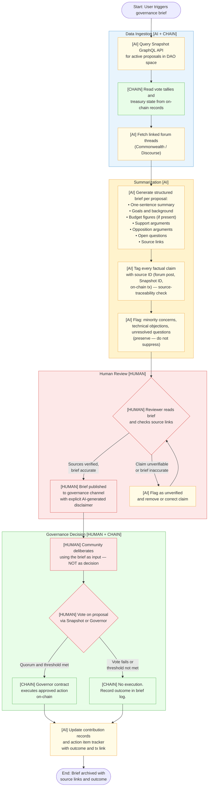

# Direction 2 — Governance / Coordination / Public Goods

> **Type:** Secondary deep-dive  
> **Source map:** [AIxWeb3-problem-map.md](../AIxWeb3-problem-map.md) · [PROBLEM_MAP_&_MAIN_DIRECTION_SELECTION.md](../PROBLEM_MAP_&_MAIN_DIRECTION_SELECTION.md)  
> **Knowledge base:** `knowledge-base/AIxWeb3/wiki/governance-coordination-public-goods.md`, `governance-ai.md`, `agent-identity.md`, `agent-trust-and-reputation.md`

---

## 1. Intro

DAOs and public goods communities produce a continuous stream of governance signals: forum threads, snapshot proposals, budget requests, contributor logs, meeting recordings, treasury transactions. The volume of these signals is the problem. Participation fatigue — the failure mode where abstention becomes the path of least resistance because reading every proposal is impractical — is a structural and chronic issue, not a market-cycle artifact. It has been observed across major protocols since 2021 and shows no sign of self-correcting through UI improvements alone.

This direction is about placing AI where it can genuinely help — reducing information overload, synthesizing structure, surfacing minority concerns, and turning raw community activity into actionable governance context — while keeping the things that define governance in human hands: value judgments, budget approvals, votes, and the initiation of irreversible on-chain actions.

Web3 is not incidental to this direction. Snapshot spaces, OpenZeppelin Governor contracts, and transparent treasury addresses provide public, verifiable records that an AI can read and link to, rather than summarize from a closed proprietary database. The combination is what makes governance briefs trustworthy enough to act on: AI reduces the reading load, Web3 provides the ground truth.

---

## 2. Aim

This document produces a **governance and coordination workflow sketch** for the use case of a DAO governance brief agent. It maps exactly which workflow steps AI can assist, which steps require human confirmation, and which steps must be completed by the governance process itself. One concrete sub-workflow — a **proposal summarizer** — is developed in detail, including a Mermaid flowchart, a step-by-step scenario, a counterexample, risk inventory, and a one-week validation plan.

---

## 3. Core Problem

The core problem is **information asymmetry in public decision-making at scale**.

A DAO governance proposal contains a goal, background context, budget figures, implementation plan, references to prior proposals, and a set of trade-offs. Understanding it well enough to vote meaningfully may require reading three forum threads, two prior proposals, one technical specification, and a treasury report. Most participants do not do this, not because they are disengaged, but because the cost is genuinely high. The result: governance captures a small, engaged subset of token holders rather than the informed community it nominally represents.

AI can reduce reading costs dramatically — summarizing proposals, extracting key figures, listing the strongest arguments on each side, and flagging open questions. Web3 makes this trustworthy: every claim in the brief can be traced to a forum post ID, a Snapshot proposal ID, or an on-chain transaction. Neither technology alone solves the problem. AI without on-chain ground truth produces summaries that participants cannot verify; Web3 without AI produces raw records that participants cannot absorb.

The boundary condition that makes this direction technically interesting: the AI agent must be architecturally read-only with respect to governance actions. It surfaces, it summarizes, it flags — it never votes, never proposes, and never initiates treasury movements.

---

## 4. Typical Entry Point

The realistic starting point for a learner or builder is a single DAO's Snapshot space. Snapshot provides a public GraphQL API that requires no authentication to read proposals, votes, and spaces. The minimal first build is:

1. Pick a live DAO with active Snapshot proposals (Gitcoin, ENS, Uniswap — all have public Snapshot spaces).
2. Query the Snapshot API for the most recent active proposals.
3. Feed each proposal's title, body, and discussion link into a structured LLM prompt.
4. Output a brief with: one-sentence summary, key trade-offs, support/opposition arguments, budget figures (if present), vote deadline, and a direct link to the Snapshot proposal.

No smart contract deployment is required. No wallet integration is needed at this stage. The prototype runs entirely on LLM + Snapshot GraphQL + a structured output template. This is the lowest-barrier working demo of any direction in the problem map.

The second iteration adds source linkback: every factual claim in the brief is tagged with the exact forum post or on-chain record it came from. That addition is what moves the prototype from a convenience tool to a governance-grade tool.

---

## 5. Suitable Learner Profile

**This direction fits learners who:**
- Are interested in community collaboration, DAO operations, or public goods funding
- Want to build tools with immediate user value and a clear human/AI division of labor
- Prefer working with existing public APIs rather than deploying new on-chain infrastructure
- Find the governance and coordination layer of Web3 more compelling than the financial settlement layer

**It is less suitable for learners who:**
- Want to build financial primitives, payment flows, or agent economy infrastructure
- Are primarily interested in smart contract security or cryptographic primitives
- Need to work at the protocol or standards design layer

**Recommended external resources (as cited in the source files read for this document):**

| Resource | What it provides |
|---|---|
| [Ethereum Governance Basics](https://ethereum.org/governance/) | Foundational mental model for on-chain governance |
| [Decentralized Autonomous Organizations (DAOs)](https://ethereum.org/dao/) | DAO structures, mechanisms, and governance primitives |
| [Snapshot Documentation](https://docs.snapshot.box/) | Off-chain voting, proposals, spaces, strategies, the primary data source for a governance brief agent |
| [OpenZeppelin Governor Documentation](https://docs.openzeppelin.com/contracts/5.x/api/governance) | On-chain execution-oriented governance contracts and patterns |
| [Gitcoin Funding Mechanisms](https://gitcoin.co/mechanisms) | Public goods funding mechanisms, including quadratic funding |

---

## 6. Flowchart

The flowchart below maps the full governance brief workflow from data ingestion to human-confirmed action. Steps marked `[AI]` are performed by the AI agent; steps marked `[HUMAN]` require explicit human or governance confirmation; steps marked `[CHAIN]` read directly from on-chain state.

**Legend:**
- Yellow background — AI-assisted step
- Red/pink background — human confirmation required
- Green background — on-chain state, no AI interpretation

---

## 7. Typical Scenario

**DAO:** A mid-size public goods DAO (e.g., Gitcoin-style) with weekly governance proposals and a Snapshot space.

**Trigger:** A new governance proposal is submitted to allocate 50,000 USDC from the community treasury for a grants round focused on developer tooling. The proposal has a 72-hour voting window. Fourteen community members have commented in the forum; three have raised technical objections.

**Step-by-step walkthrough:**

1. **[AI] Ingest.** The agent queries the Snapshot GraphQL API and retrieves the proposal body, current vote tally (1.2M tokens for, 340K tokens against, 900K tokens abstained), and the linked Commonwealth discussion thread.

2. **[CHAIN] Ground truth check.** The agent reads the DAO's treasury contract directly to verify the current balance and confirm that 50,000 USDC is available. It also reads the previous grants round execution transaction to establish a funding history baseline.

3. **[AI] Summarize.** The agent generates a structured brief:
   - **Summary:** Proposal to fund a 50,000 USDC developer tooling grants round managed by a 3-of-5 multisig, disbursed over 8 weeks.
   - **For arguments:** Community-surfaced need for better dev tooling; prior round produced 4 shipped tools; budget is consistent with precedent.
   - **Against arguments:** Two forum members question the multisig composition (no independent auditor seat); one member flags that the milestone definitions are vague and lack verifiable completion criteria.
   - **Open questions:** Who audits milestone completion? What happens to undisbursed funds at the end of 8 weeks?
   - **Source links:** [Forum thread post #3] [Forum thread post #11] [Forum thread post #14] [Snapshot proposal ID] [Previous round on-chain tx]

4. **[AI] Source tagging.** Every claim in the brief is tagged with its originating source ID. The three technical objections are explicitly preserved in the "Against arguments" section — they are not summarized away.

5. **[HUMAN] Review.** The brief is sent to a designated reviewer (a DAO contributor, not the proposal author). The reviewer spot-checks two source links, confirms the vote tally matches the Snapshot UI, and approves the brief for publication.

6. **[HUMAN] Publication.** The brief is posted to the DAO's governance channel with a visible header: "AI-generated summary — not an official DAO position. Verify sources before voting."

7. **[HUMAN] Deliberation and vote.** Community members use the brief as a reading aid. The vote runs for 72 hours. Quorum is reached.

8. **[CHAIN] Execution.** The Governor contract registers the vote outcome. If the proposal passes threshold, treasury execution is triggered on-chain. The AI agent records the transaction hash in the action item tracker alongside the brief.

**What the AI did:** Reduced 14 forum posts + one on-chain treasury query to a 400-word structured brief with full source attribution. Preserved minority objections. Flagged two open questions the proposer had not addressed.

**What the AI did not do:** Vote. Propose. Recommend a position. Approve or disapprove the budget. Execute or schedule any on-chain transaction.

---

## 8. Counterexample

**What looks like this direction but is not:**

A team builds a "DAO AI agent" that reads governance forums and Snapshot proposals, generates summaries, and then — to demonstrate efficiency — also automatically creates counter-proposals when it detects weak proposals, schedules its own Snapshot votes, and queues treasury transfers based on its assessment of community sentiment.

**Why this is not Governance / Coordination:**

This agent has crossed the hard boundary. The core constraint of this direction is that AI is architecturally read-only with respect to governance actions. The moment the agent initiates proposals, schedules votes, or queues treasury movements, it is not assisting governance — it is replacing it.

The source material is explicit: "An AI governance assistant that auto-generates and passes budget proposals without human confirmation and public discussion is a governance risk, not an efficiency improvement." (*governance-coordination-public-goods.md*)

**What is missing:** Human confirmation at every write step. Source attribution on every factual claim. The explicit architectural constraint preventing the agent from initiating irreversible governance actions.

**What this actually is:** A governance automation agent with excessive agency — a pattern explicitly flagged as a risk in the AI × Web3 Bridge Introduction source file. The failure mode is that governance power shifts to whoever controls the AI, removing the community deliberation that justifies on-chain execution in the first place.

---

## 9. Key Risks

### Risk 1: Authoritative misrepresentation

**What can go wrong:** Community members treat the AI-generated brief as the official DAO position and vote based on it without reading the source proposals. Over time the brief becomes more influential than the underlying deliberation.

**Grounding:** Identified in the problem map as the "primary risk" for this direction: "an AI-generated brief mistaken for an official community decision or recommendation can distort governance outcomes without any single actor being responsible." (*AIxWeb3-problem-map.md*)

**Mitigation:** Every brief carries an explicit disclaimer that it is an AI-generated input to deliberation, not a substitute for it. Source links are mandatory and visible, not buried. Briefs are never published under a governance identity that implies official status.

---

### Risk 2: Selective summarization suppressing minority views

**What can go wrong:** The AI summary captures the majority argument clearly but compresses or omits technical objections, minority positions, or dissenting views that are numerically small but substantively important.

**Grounding:** "Structured output formats that require capturing both sides of every proposal are the mitigation." (*AIxWeb3-problem-map.md*); "Separation required: facts vs. inferences vs. opinions vs. suggestions must not be lumped together." (*governance-ai.md*)

**Mitigation:** The output schema explicitly requires an "Opposition arguments" section and an "Open questions" section. Minority concerns are preserved as labeled sub-items, not folded into the main narrative. Human review step spot-checks against the original thread specifically for omitted objections.

---

### Risk 3: Stale governance data

**What can go wrong:** A proposal is amended after the brief is generated. The brief now describes a proposal that no longer exists in its summarized form. Voters act on outdated information.

**Grounding:** "Governance proposals update continuously; the brief must carry an explicit timestamp and link to the live source, and briefs older than a defined threshold should be invalidated automatically." (*AIxWeb3-problem-map.md*)

**Mitigation:** Every brief carries a generated-at timestamp and a direct link to the live Snapshot proposal. Briefs are auto-invalidated after a configurable time window (e.g., 12 hours for active proposals). Any amendment to the source proposal triggers a re-generation flag.

---

### Risk 4: AI-initiated governance actions

**What can go wrong:** The agent is given write access — to post proposals, schedule votes, or sign governance transactions — and uses it autonomously, bypassing community deliberation.

**Grounding:** "The agent must be architecturally read-only — it surfaces and summarizes, never proposes, votes, or executes treasury actions; this constraint should be enforced in code, not just by instruction." (*AIxWeb3-problem-map.md*)

**Mitigation:** The agent's API credentials for all governance platforms are read-only tokens. There is no signing key in the agent's environment. Any action that would produce a write (posting, voting, executing) requires an explicit human trigger outside the agent's control surface.

---

### Risk 5: Identity attribution — AI content published under a human identity

**What can go wrong:** AI-generated governance content is published or forwarded under a specific contributor's on-chain identity without their explicit review, creating the impression of an authoritative human position where none exists.

**Grounding:** "If AI-generated governance content is published under a specific on-chain identity without that identity holder's explicit consent, it constitutes a form of impersonation with on-chain consequences." (*AIxWeb3-problem-map.md*)

**Mitigation:** AI-generated briefs are attributed explicitly as AI-generated, not signed by any individual's wallet. Human review and explicit publication approval are required before any brief is associated with a named contributor or DAO role.

---

## 10. Minimal Validation Plan (One Week)

**Goal:** Produce a working governance brief agent that demonstrates both AI and Web3 roles in a single flow, is verifiable by any DAO participant, and enforces the read-only architectural constraint.

**Day 1–2: Setup and data ingestion**
- Choose a live DAO with an active Snapshot space (Gitcoin or ENS are public and well-documented).
- Write a Snapshot GraphQL query that retrieves the three most recently active proposals: title, body, vote tallies, discussion URL, end date.
- Verify the query returns accurate data by comparing to the Snapshot UI manually.

**Day 3–4: Structured summarization**
- Write a structured LLM prompt that takes a proposal body and outputs: summary (1–2 sentences), goals, budget figures (if present), for arguments (bulleted), against arguments (bulleted), open questions (bulleted).
- Add a source-tagging pass: for each factual claim, append a bracketed reference to the source text span or linked forum post.
- Test on at least two real proposals. Manually compare the brief against the original forum threads to check for omitted objections or misrepresented figures.

**Day 5: On-chain ground truth integration**
- Add a step that reads vote tally and treasury state directly from chain (Snapshot GraphQL provides on-chain vote data; treasury balance can be read via a simple JSON-RPC `eth_call`).
- Verify that the brief's quoted vote tallies match the on-chain read, not just the Snapshot UI.

**Day 6–7: Output, disclaimer, and staleness control**
- Format the output as a structured brief with: explicit "AI-generated summary" header, per-claim source tags, generated-at timestamp, direct link to live Snapshot proposal.
- Add a staleness check: if the proposal end date has passed, the brief is marked stale and re-generation is triggered.
- Run the full flow on a fresh proposal and share the output with one DAO participant who can judge accuracy.

**Validation criteria:**
- [ ] Every factual claim in the brief traces to a specific source ID (forum post, Snapshot ID, on-chain tx).
- [ ] At least one minority objection from the original forum thread appears in the brief's "Against" section.
- [ ] Vote tallies in the brief match the on-chain record within rounding.
- [ ] The brief carries a generated-at timestamp and a live source link.
- [ ] The agent has no write access to any governance platform; all credentials are read-only.

**What this produces:** A working prototype, a verifiable output, and the architectural constraint enforced in practice — sufficient to validate the direction and form the basis of a Hackathon proposal.

---

## 11. Analysis Process & Conclusion

**How the conclusions were reached:**

This document is grounded in six source files read in full before any writing began. The AI × Web3 Bridge Introduction established the six-direction landscape and explicitly named the governance direction's learning materials, use case framing, and the boundary that AI must not cross (initiating irreversible actions). The two wiki pages — `governance-coordination-public-goods.md` and `governance-ai.md` — provided the sub-concept vocabulary (proposal-summary, meeting-action, contribution-graph, budget-check, source-traceability, deep-funding, plurality) and the hard architectural constraints that define the direction. The `agent-identity.md` and `agent-trust-and-reputation.md` pages established why the identity and reputation layer from the main direction track is a natural prerequisite for any multi-agent governance scenario: an agent participating in governance on behalf of a user needs a verifiable identity that community participants can inspect before accepting its summaries. The `AIxWeb3-problem-map.md` and `PROBLEM_MAP_&_MAIN_DIRECTION_SELECTION.md` provided the evaluation framework, the risk inventory, the verification method, and the rationale for selecting this as a secondary direction rather than a primary one.

**Conclusions:**

Governance / Coordination / Public Goods is a genuine AI × Web3 direction that passes the two-part test: removing AI leaves governance running on raw on-chain records that most participants cannot absorb; removing Web3 leaves AI summaries with no verifiable ground truth. The direction has a very low barrier to entry (Snapshot GraphQL requires no authentication, no contracts need to be deployed, no wallet integration is needed at the prototype stage) and a self-evident demo output that any DAO participant can validate against primary sources. The hard constraint — AI is architecturally read-only with respect to governance actions — is also the clearest design specification of any direction in the problem map: it practically writes the risk boundaries and the system architecture in one rule. As a secondary direction, it integrates naturally with the main Identity / Reputation track: agent identity and reputation are prerequisites for multi-agent governance coordination, making the two directions complementary rather than competing. The minimal validation plan is achievable in one week and produces an artifact that can be extended into a Hackathon proposal with clear AI role, Web3 mechanism, and enforced human-in-the-loop constraints.

---

## 12. Reference Projects and Standards

The following projects, standards, and tools are drawn directly from the source files read for this document. Each entry notes specifically what it lets a learner evaluate or implement when building a Hackathon project in this direction.

---

### Snapshot

**Source:** Cited in the AI × Web3 Bridge Introduction under Governance / Coordination recommended learning materials; referenced in `governance-coordination-public-goods.md` and in the problem map.

**What it is (from source files):** Off-chain voting infrastructure for DAOs. Provides proposals, spaces, strategies, and common DAO governance tooling. Has a public GraphQL API.

**What it lets you evaluate or implement:**
- The primary data source for a governance brief agent — proposals, vote tallies, discussion links, vote deadlines are all queryable without authentication.
- Strategy logic: Snapshot supports weighted voting, token-gated access, and delegation strategies — a learner can evaluate how AI summarization needs to adapt for different voting structures.
- Off-chain vs. on-chain boundary: Snapshot votes are off-chain signals; understanding when and how they trigger on-chain execution (via a Governor contract) is a key design question.

**Docs:** [https://docs.snapshot.box/](https://docs.snapshot.box/)

---

### OpenZeppelin Governor

**Source:** Cited in the AI × Web3 Bridge Introduction under Governance / Coordination recommended learning materials; referenced in `governance-coordination-public-goods.md` and in the problem map.

**What it is (from source files):** On-chain execution-oriented governance contracts and patterns. Provides the mechanism by which a passed governance vote actually executes a treasury action on-chain.

**What it lets you evaluate or implement:**
- The enforcement layer that makes AI-assisted governance meaningful: a brief that helps a community pass a well-understood vote is only actionable if the resulting decision executes trustlessly on-chain via Governor.
- Proposal lifecycle state machine: understanding how a proposal moves through `Pending → Active → Succeeded/Defeated → Queued → Executed` is essential for a staleness-aware brief agent that tracks proposal status.
- Human confirmation gate: the Governor timelock pattern explicitly enforces a delay between vote success and execution, which is the on-chain equivalent of the human confirmation gate the AI agent must respect architecturally.

**Docs:** [https://docs.openzeppelin.com/contracts/5.x/api/governance](https://docs.openzeppelin.com/contracts/5.x/api/governance)

---

### Gitcoin Funding Mechanisms

**Source:** Cited in the AI × Web3 Bridge Introduction under Governance / Coordination recommended learning materials; referenced in `governance-coordination-public-goods.md` and in the governance-ai wiki page (as `deep-funding` sub-concept).

**What it is (from source files):** Public goods funding mechanisms. The `governance-ai.md` wiki page references `deep-funding` as a sub-concept: "evidence packages for complex public goods impact allocation with diverse reviews."

**What it lets you evaluate or implement:**
- Contribution records as a governance primitive: Gitcoin's on-chain funding history creates verifiable records of which projects received public goods funding and from how many unique contributors — exactly the kind of Web3 ground truth a governance brief agent can read and link to.
- Quadratic funding mechanics: a learner can evaluate how AI can assist donors in understanding impact allocation decisions and how Web3 enforces the quadratic formula on-chain.
- `deep-funding` as an advanced sub-concept: evidence packages for complex impact allocation represent a more demanding summarization challenge where AI must preserve review diversity and avoid collapsing heterogeneous evaluations into a single score.

**Docs:** [https://gitcoin.co/mechanisms](https://gitcoin.co/mechanisms)

---

### Plurality (sub-concept from governance-ai.md)

**Source:** Referenced in both `governance-ai.md` (as a sub-concept) and `governance-coordination-public-goods.md` (as a related concept).

**What it is (from source files):** "Preserve minority concerns, stakeholder differences, support negotiation over consensus." (governance-ai.md)

**What it lets you evaluate or implement:**
- A design principle, not a deployed contract: Plurality shapes how the structured output schema for a governance brief must be built. Any brief format that collapses deliberation into a single majority view violates the plurality principle.
- Concrete implementation target: a learner can build and validate a brief output schema that requires explicitly labeled minority positions, technical objections, and unresolved stakeholder disagreements as mandatory fields — not optional.
- Connects to the counterexample in this document: selective summarization that only captures majority views fails the Plurality test and is a governance failure mode, not an efficiency improvement.

**Reference:** `knowledge-base/AIxWeb3/wiki/governance-ai.md` (sub-concept: plurality)

---

### Source Traceability (sub-concept from governance-ai.md)

**Source:** Referenced in `governance-ai.md` as a sub-concept: "every key summary linked back to proposals, forums, on-chain records."

**What it is (from source files):** A design requirement for AI governance outputs — every factual claim in a summary must trace to a specific source: a proposal ID, a forum post, or an on-chain transaction.

**What it lets you evaluate or implement:**
- The verification method for this direction: the "source linkback audit" is the primary test of whether a governance brief is trustworthy. A brief where claims cannot be traced to sources is unverifiable and governance-unsafe.
- Concrete implementation: a learner can implement source traceability as a post-processing pass over the LLM output — each claim is tagged with a bracketed reference to its originating document and verified against the source before publication.
- Distinction from citation in academic contexts: governance source traceability requires live links to publicly queryable records (Snapshot proposal IDs, on-chain transaction hashes) so any reader can independently verify the claim at the time of reading — static citations are insufficient.

**Reference:** `knowledge-base/AIxWeb3/wiki/governance-ai.md` (sub-concept: source-traceability)

---

### ERC-8004 (agent identity and reputation registry)

**Source:** Referenced in `agent-trust-and-reputation.md` as "draft standard for agent identity, reputation, and verification registry"; referenced in the problem map as a key standard for the Identity / Reputation direction.

**What it is (from source files):** A draft ERC standard providing an on-chain agent registry with capability claims, reputation records, and identity anchoring. Described in `agent-trust-and-reputation.md` as the standard for "agent identity, reputation, and verification registry."

**What it lets you evaluate or implement in the governance direction:**
- As the Governance direction matures beyond a single-agent brief tool into multi-agent governance coordination, the agents participating in governance need verifiable identities that community participants can inspect.
- A learner can evaluate whether the governance brief agent should register itself as an ERC-8004 agent: declaring its capabilities (read-only summarization), its owner, and its reputation record (accuracy scores, source attribution quality) so DAO participants can assess whether to trust its briefs.
- Natural integration point between the secondary (Governance) and main (Identity / Reputation) tracks: an agent that participates in governance needs a trust-verifiable identity, and ERC-8004 is the emerging standard for that.

**EIP reference:** [https://eips.ethereum.org/EIPS/eip-8004](https://eips.ethereum.org/EIPS/eip-8004) (cited in Bridge Introduction source file)

---

*Last updated: 2026-05-31 | Agent: Sensei | Source: AI × Web3 School Handbook — Bridge Introduction, governance-coordination-public-goods wiki, governance-ai wiki, agent-identity wiki, agent-trust-and-reputation wiki, AIxWeb3-problem-map*
