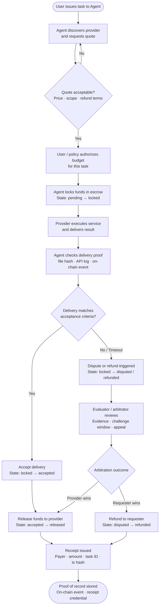

# Direction 3 — Payment / Commerce / Settlement

> **Series:** AI × Web3 School — Direction Overview Documents  
> **Author:** Sensei (Claude via Cowork)  
> **Date:** 2026-05-31  
> **Sources:** `knowledge-base/AIxWeb3/wiki/` · `tasks/AIxWeb3-problem-map.md` · `tasks/AIxWeb3_WORKFLOW.md` · `knowledge-base/AIxWeb3/raw/AIxWeb3 Bridge - Introduction.md`

---

## 1. Intro

The Payment / Commerce / Settlement direction asks: when a machine buys or sells a service, how does the whole transaction close safely?

This is not simply about moving tokens. Agent economic activity requires quoting, budget authorization, delivery, acceptance, escrow, dispute handling, and receipts — all connected into a controllable, verifiable loop. An on-chain transfer is one segment of that loop, not the full answer.

The direction matters because autonomous agents that can pay for APIs, data, and compute without per-step human approval are a prerequisite for any real AI × Web3 product. Without a payment loop that both parties can trust, every agent-to-agent service relationship collapses back into manual settlement or centralized intermediaries.

---

## 2. Aim

The concrete outcome of this document is a minimal payment-and-commerce flow breakdown applied to a specific scenario: an agent that helps a user complete a research task, pays for an external data service, and receives verified delivery in return. The breakdown covers every stage of the transaction — from initial quote through final proof of record — and maps the key protocols (x402, MPP, ERC-8004, ERC-8183) to the segment of the flow each one addresses.

---

## 3. Core Problem

The real difficulty is not whether money can be transferred. The real difficulty is that payment is only one segment of a commercial transaction. Commerce also includes:

- **Service discovery** — the agent must find a suitable provider
- **Quoting** — the provider must offer a price, currency, validity period, service scope, and refund conditions that the agent can evaluate and compare
- **Budget control** — without budget boundaries, there is no safe automatic payment; budget precedes execution
- **Escrow** — funds must be locked in a defined state until delivery is confirmed, not released on trust alone
- **Delivery proof** — the agent must be able to verify that what was delivered matches what was quoted (file hashes, API logs, on-chain events, TEE attestations)
- **Acceptance** — the payer or an automated rule system must confirm delivery meets requirements before funds are released
- **Dispute handling** — when delivery fails or is contested, the flow must have a defined challenge path, evidence format, and arbitration mechanism
- **Settlement and receipts** — after acceptance, funds are released and a verifiable receipt is produced

On-chain records provide receipts and state, but cannot automatically resolve service quality, arbitration, or trust issues. A valid AI × Web3 payment direction requires all eight elements — not just clicking a payment button.

---

## 4. Typical Entry Point

A builder in this direction usually starts with one of two triggers:

1. **Payment first:** they try to let an agent pay for an API call using x402 or a direct on-chain transfer, and immediately find that delivery, acceptance, and receipts are unresolved. The single payment succeeds; the commerce loop does not close.
2. **Escrow first:** they deploy a smart contract escrow and discover that without a delivery oracle or evaluator, the escrow has no way to determine when to release funds. The contract is enforced; the acceptance condition is not.

Both entry points converge on the same missing layer: the binding between task definition, delivery proof, acceptance criteria, and fund release. That binding is what this direction is about.

A realistic first week starts with x402 (HTTP-level payment) on a testnet, adds a minimal escrow contract, and defines acceptance criteria for one concrete service type.

---

## 5. Suitable Learner Profile

**This direction fits learners who:**
- Are developers or product builders interested in agent-to-agent commerce
- Want to understand commercial loops, payment standards, and settlement protocols
- Have some Web3 background (ERC standards, smart contracts, L2s) — or are willing to build it
- Are comfortable with async flows and state machines
- Want to work toward a concrete product demo rather than a research artifact

**This direction is less suited for:**
- Learners focused primarily on agent identity and reputation (Direction 2)
- Learners focused on wallet permission control and authorization scoping (Direction 4)
- Learners who want to avoid smart contract work entirely

**Recommended external resources (cited in source files):**

| Resource | What it covers |
|---|---|
| [x402 Docs](https://docs.x402.org/introduction) | Open payment entry points and machine payment framing |
| [MPP Official Documentation](https://docs.stripe.com/payments/machine/mpp) | Machine Payments Protocol: discovery, quote, auth, settlement, receipt |
| [MPP introduction (Stripe blog)](https://stripe.com/blog/machine-payments-protocol) | Problem background for MPP |
| [ERC-8183](https://eips.ethereum.org/EIPS/eip-8183) | Draft standard for agent commerce task lifecycle |
| [ERC-8004](https://eips.ethereum.org/EIPS/eip-8004) | Agent identity and reputation (complements ERC-8183) |
| [Olas](https://olas.network/) | Reference for agent economy / autonomous services direction |
| [Ethereum Developer Documentation](https://ethereum.org/developers/docs/) | Foundational Web3 mechanisms |

---

## 6. Flowchart

The full payment lifecycle, from initial quote to proof of record:

**Fund state machine:**  
`pending → locked → delivered → accepted/disputed → released/refunded`

---

## 7. Typical Scenario

**Setup:** Santiago is building a DeFi research tool. His Requester Agent needs a fresh on-chain risk analysis report from an external Data Provider Agent before it can propose a trade. The whole flow must run without per-step human approval, except one gate before the final on-chain action.

**Step-by-step walkthrough:**

1. **Quote.** Santiago issues a task: "Analyze wallet X's exposure to protocol Y." The Requester Agent queries a service registry, finds a Data Provider Agent offering a risk analysis service, and receives a structured quote: price (0.10 USDC), currency (stablecoin), validity period (5 minutes), service scope (wallet address + protocol slug), and refund condition (no delivery within 60 seconds = full refund).

2. **Budget authorization.** The Requester Agent checks the quote against Santiago's pre-authorized task budget (maximum 0.50 USDC per research query). The quote is within bounds. The agent proceeds — no human input required at this step because the budget policy was set in advance.

3. **Execution.** The Requester Agent locks 0.10 USDC in a minimal escrow contract. State transitions to `locked`. The Data Provider Agent receives a payment trigger and begins generating the report.

4. **Delivery.** The Data Provider Agent posts the report and submits a delivery proof: a SHA-256 hash of the report file linked to the escrow's task ID, plus a signed API log entry confirming which inputs were used. State transitions to `delivered`.

5. **Acceptance.** The Requester Agent verifies the delivery hash against the hash committed at quote time. The schema of the delivered payload matches the quoted service scope. Acceptance criteria are met. State transitions to `accepted`.

6. **Payment.** The escrow contract releases 0.10 USDC to the Data Provider Agent. State transitions to `released`. A receipt is issued: payer address, amount, task ID, acceptance status, and transaction hash.

7. **Proof of record.** The receipt is written as an on-chain event. The Requester Agent now has a verifiable record that funds moved for a specific task, with a matched delivery hash. This record is usable as evidence in any future dispute.

8. **Human gate.** The Requester Agent uses the verified report to construct an on-chain trade proposal. Before signing, it runs a simulation and presents the result to Santiago for explicit approval. This is the single human confirmation point in the workflow.

**What makes this genuinely AI × Web3:**
- Remove AI: the escrow contract can lock and release funds, but it cannot evaluate whether the report content meets acceptance criteria, detect schema mismatches, or decide whether a dispute is warranted. A dumb escrow with no delivery oracle is just locked money.
- Remove Web3: the agent can evaluate report quality, but it cannot trustlessly move funds, enforce the budget limit cryptographically, or produce a tamper-proof receipt that either party can independently verify. Without Web3, settlement still depends on a trusted intermediary.

---

## 8. Counterexample

**An agent that just clicks a payment button is not this direction.**

Consider an agent that helps Santiago pay a SaaS invoice: it reads the invoice email, opens the payment page, fills in card details, and clicks "Pay." This flow involves an AI and a monetary transfer, but it is not the Payment / Commerce / Settlement direction.

Why not:

- There is no machine-to-machine economic loop. The agent is a browser automation layer over a human payment UI — it is replacing a human's mouse click, not enabling a new class of commerce.
- There is no structured quote with programmatic acceptance conditions.
- There is no escrow, delivery proof, or dispute mechanism. The payment is unconditional.
- Web3 is not present and is not needed. Removing Web3 does not break the flow — it was already running without it.
- The AI role (form-filling, UI navigation) is something AI can do fine in a purely Web2 context. Adding Web3 cosmetically (e.g., logging the payment hash to a contract) does not change what the system actually solves.

The distinguishing test: does the flow require both machine reasoning over delivery quality and on-chain enforcement of payment conditions to function? If either component can be removed without breaking the core problem, it is not this direction.

---

## 9. Key Risks

Each stage of the payment lifecycle carries specific risks. Mitigations are drawn from the workflow risk analysis in `tasks/AIxWeb3_WORKFLOW.md` and `tasks/AIxWeb3-problem-map.md`.

| Stage | Risk | Mitigation |
|---|---|---|
| **Quote / negotiation** | Malicious provider presents falsified capability schema or bait-and-switch pricing | Schema validation of delivered payload against quoted spec before acceptance; on-chain reputation or stake-slashing for providers |
| **Budget authorization** | Agent wallet with no spend limits can be drained beyond intended task scope | ERC-4337 session keys with explicit per-transaction spend limits, contract allowlists, and time windows — not optional |
| **Payment / escrow lock** | Replay attack or compromised agent drains funds via overly broad wallet authority | Scoped agent wallet (smart account, not raw EOA); per-transaction limits enforced at contract level |
| **Delivery** | Provider delivers a maliciously crafted payload embedding adversarial instructions that manipulate the agent's context | Input guardrails that sanitize and schema-validate the payload before it enters the reasoning context; treat provider data as a lower-trust context layer |
| **Acceptance** | Automated evaluator approves incorrect or incomplete delivery | Define acceptance criteria before deployment — not after failure; combine automated checks + challenge windows + human review for high-value tasks |
| **Dispute / arbitration** | No dispute flow designed; contested delivery leaves funds locked indefinitely | Dispute flows must be designed upfront; define challenge cost, evidence format, arbitrator selection, and appeal mechanism before contract deployment |
| **Settlement / release** | On-chain transaction irreversible if parameterized incorrectly | Simulation before signing; human gate before any irreversible fund movement exceeding a defined threshold |
| **Micropayment economics** | Per-call L1 settlement fees exceed service value | Use L2s, payment channels, or batch settlement; not every service needs per-call on-chain settlement |

**Primary financial risk:** An overly broad agent wallet is the dominant risk. ERC-4337 session keys with per-transaction spend limits and contract allowlists are the required mitigation across payment, execution, and settlement stages.

---

## 10. Minimal Validation Plan (One Week)

**Goal:** demonstrate a working end-to-end payment loop — quote, escrow, delivery, acceptance, receipt — on a testnet, for one concrete service type.

**Day 1–2: Payment entry point**
- Run through the x402 quickstart on testnet using the [x402 docs](https://docs.x402.org/introduction)
- Confirm an HTTP 402 → payment → resource-access cycle works end-to-end
- Deliverable: one working per-use API payment with a logged transaction hash

**Day 3–4: Minimal escrow + acceptance**
- Write or deploy a minimal escrow contract with the state machine: `pending → locked → delivered → accepted → released`
- Define acceptance criteria for one service (e.g., a signed JSON payload matching a declared schema)
- Wire an agent to lock funds, receive delivery, check the hash, and trigger release
- Deliverable: one closed escrow cycle with verifiable delivery proof

**Day 5: Dispute path + receipt**
- Add a timeout-based refund path (if delivery is not posted within N blocks, release refund)
- Emit an on-chain event as receipt (payer, task ID, amount, acceptance status, tx hash)
- Deliverable: receipt event readable from the chain; refund path tested with a timed-out delivery

**Day 6–7: End-to-end scenario + write-up**
- Connect the x402 entry point and the escrow contract into one agent workflow matching the scenario in Section 7
- Document what each protocol (x402, MPP concept, ERC-8183 concept) handled and where the gaps were
- Deliverable: working demo + one-page gap analysis

**Success criterion:** a closed payment loop where funds are escrowed, delivery proof is verified, funds are released, and a receipt is readable on-chain — without any manual settlement step.

---

## 11. Analysis Process and Conclusion

### Protocol Comparison: x402, MPP, ERC-8004, ERC-8183

Before concluding, it is worth locating each protocol in the payment lifecycle:

| Protocol | Segment addressed | Source |
|---|---|---|
| **x402** | Payment entry point — HTTP 402 flow for per-use API or content payments; "open payment entry points and machine payment framing" | Bridge Introduction; machine-payment wiki |
| **MPP (Machine Payments Protocol)** | Full payment transaction layer — discovery, quote, authorization, settlement, receipt; documented at [Stripe MPP docs](https://docs.stripe.com/payments/machine/mpp) | Bridge Introduction; machine-payment wiki |
| **ERC-8004** | Agent identity and reputation — on-chain agent registry with capability claims; complements ERC-8183 but addresses a different problem | settlement-and-escrow wiki; erc-8183 wiki |
| **ERC-8183** | Task lifecycle as a state machine — tasks, states, escrow, delivery proof, settlement, and disputes as a unified system-understandable model; "agent commerce from just sending some money to a structured transaction model" | erc-8183 wiki; settlement-and-escrow wiki |

**Two most relevant for this direction: x402 and ERC-8183**

x402 addresses the payment entry point — how an agent initiates a per-use payment at the HTTP layer without human intervention. It solves the "how does the agent pay for the API call" problem. ERC-8183 addresses the complete task lifecycle around that payment — how the task is defined, how funds are escrowed and released, what delivery proof looks like, and how disputes are structured. Together they cover the entry point and the state machine that wraps it.

MPP is broader than x402 and covers discovery through receipt, making it relevant to the full commerce loop, but it is a protocol specification rather than a deployed standard the learner can run today; x402 is the more concrete starting point. ERC-8004 is important for agent identity but is a prerequisite for the Identity / Reputation direction (Direction 2) rather than the core payment-and-settlement problem here.

### Conclusion

Payment / Commerce / Settlement is one of the most concrete AI × Web3 directions to build in because the two roles are non-interchangeable: AI is needed to evaluate delivery quality and reason about acceptance criteria; Web3 is needed to enforce budget limits, lock funds in escrow, and produce tamper-proof receipts. Neither works without the other.

The main trap in this direction is treating payment as the whole problem. A single x402 transaction is a starting point, not a closed commerce loop. The full loop — quote, budget authorization, escrow, delivery proof, acceptance, dispute path, settlement, and receipt — is the actual scope. Builders who design the dispute path and evaluator before writing payment code consistently produce more robust systems than those who add dispute handling as an afterthought. The minimal validation plan above is designed to force that ordering: acceptance criteria and dispute paths are defined in days 3–5, before the end-to-end demo in days 6–7.

---

*Last updated: 2026-05-31 | Agent: Sensei (Claude via Cowork) | Part of the AI × Web3 School Direction Series*
