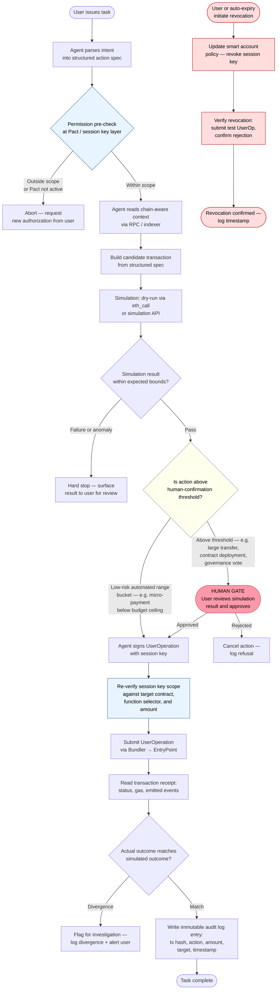

# Direction 4 — Wallet / Permission / Safe Execution

> **AI × Web3 School — Direction Overview**  
> Status: Draft | Built: 2026-05-31 | Agent: Sensei

---

## 1. Intro

When an AI agent participates in on-chain actions, the most important question is not "how to call a signing API." It is how permissions are granted, limited, revoked, audited, and recovered across the full authorization lifecycle.

This direction covers the permission layer between an AI agent and the blockchain: what the agent is allowed to sign, how those boundaries are enforced at the cryptographic layer, when a human must step in, and what happens when something goes wrong. It sits at the intersection of account abstraction infrastructure (ERC-4337, ERC-7702), on-chain policy enforcement (session keys, guard/policy mechanisms, Safe), and task-level authorization design (Cobo CAW Pact model).

The direction matters because automation without enforceable limits is dangerous, and limits without revocation are fragile. Neither AI reasoning alone nor smart contract rules alone solve the problem — both are required together.

---

## 2. Aim

The concrete outcome of this direction document is a permission strategy for an agent-wallet scenario. By the end of working through this direction you should be able to:

- Draw the execution flow of an agent-initiated on-chain action, marking which steps can be automated and which require human confirmation
- Design a permission specification covering budget, callable contracts, executable actions, human-confirmation thresholds, revocation method, logging, and failure handling
- Explain why ERC-4337, Safe, and guard/policy mechanisms each matter and which risk category each addresses

---

## 3. Core Problem

An AI agent is given a task that requires an on-chain action — swapping tokens, paying for a service, submitting a governance vote. The user wants the agent to execute autonomously within some range, but not outside it. The hard problem is:

> **How do you give an agent enough authority to be useful, but not enough to be dangerous — and enforce that boundary cryptographically, not just by instruction?**

Two failure modes define the edges:

- **Too restrictive:** The agent can only suggest, never execute. Every action requires a manual transaction. Automation collapses to a fancy chatbot.
- **Too permissive:** The agent holds a full private key or an open approval. The blast radius of a compromised or hallucinating agent is the entire wallet.

The resolution is not a single setting. Authorization is a combination of budget, scope, time, operation type, and failure handling — not a one-time decision. Account abstraction, smart accounts, guard/policy mechanisms, and task-scoped Pact models exist specifically to express and enforce these combinations at the protocol level.

---

## 4. Typical Entry Point

A developer builds an agent that needs to interact with on-chain contracts — a DeFi rebalancer, an automated payment agent, a DAO action runner. They initially give the agent a private key or a full ERC-20 approval. Within the first test cycle they recognize:

1. There is no way to revoke a private key grant without rekeying the wallet
2. The agent can sign anything within the approved token amount, not just the intended operation
3. There is no audit trail of what the agent signed, only raw on-chain transactions
4. If the agent hallucinates or is manipulated, the damage is permanent

The typical entry point is this recognition — plus the question "what infrastructure actually solves this?" The answer leads into ERC-4337 smart accounts, session keys, and task-scoped authorization patterns.

---

## 5. Suitable Learner Profile

**Strong fit:**
- Developers integrating agent execution into DeFi, payment, or governance products
- Builders who have already worked with account abstraction or Safe and want to connect them to agent workflows
- Security engineers defining threat models for AI × Web3 systems

**Required background:** Familiarity with Ethereum, wallets, smart contracts, and basic agent concepts. ERC-4337 is prerequisite knowledge — understand UserOperations, EntryPoint, and bundlers before going deep on session keys.

**Recommended external resources** (from the source knowledge base):

| Resource | Purpose |
|---|---|
| [ERC-4337 Documentation](https://docs.erc4337.io/) | Foundations of account abstraction and smart accounts |
| [Ethereum Account Abstraction](https://ethereum.org/roadmap/account-abstraction/) | Background on the account abstraction roadmap |
| [What Is Safe](https://docs.safe.global/home/what-is-safe) / [Safe Smart Account Guards](https://docs.safe.global/advanced/smart-account-guards) | Multisigs, smart accounts, and guard/policy mechanisms |
| [ERC-4337 Official EIP](https://eips.ethereum.org/EIPS/eip-4337) | The base protocol for account abstraction |
| [ERC-7702 Official EIP](https://eips.ethereum.org/EIPS/eip-7702) | How EOAs can temporarily gain smart-account capabilities |
| [Cobo Agentic Wallet Developer Assistant](https://www.cobo.com/products/agentic-wallet/manual/developer/quickstart-overview) | How to integrate a native agent wallet |
| [MetaMask — Design Server Wallets for AI Agents with ERC-8004](https://docs.metamask.io/tutorials/design-server-wallets/) | Production architecture combining agent identity, backend signer, and wallet execution |
| [Coinbase Policy Engine](https://help.coinbase.com/en/prime/onchain-wallet/onchain-policy-engine) | Example of configurable transaction policies |

---

## 6. Flowchart

The diagram below shows one complete agent-initiated on-chain action. Labels distinguish automated steps, human confirmation gates, permission pre-checks, and the revocation path.

**Legend:**
- Blue nodes (C, K) — permission pre-checks (automated)
- Yellow node (H) — risk threshold decision (automated, rule-driven)
- Pink node (I) — human confirmation gate (mandatory for above-threshold actions)
- Red nodes (U–X) — revocation path (user-initiated or auto-expiry)
- Gray R-nodes — abort/hard-stop branches

---

## 7. Typical Scenario

**Scenario:** DeFi rebalancing agent with a Pact authorization model.

Santiago wants to maintain a portfolio target: 60% ETH / 40% USDC. He authorizes an agent to rebalance once per day when the ratio drifts more than 5%.

### Authorization setup (once, by Santiago)

Santiago confirms a Pact that specifies:

| Field | Value |
|---|---|
| Task intent | Rebalance ETH/USDC to 60/40 target on Uniswap v3 |
| Budget ceiling | $500 USDC per execution |
| Callable contracts | Uniswap v3 SwapRouter only (specific address) |
| Allowed function selectors | `exactInputSingle`, `exactOutputSingle` |
| Human-confirmation threshold | Any single swap above $200 USDC |
| Time window | Once per 24h, expires in 30 days |
| Failure handling | Halt and notify; do not retry without new confirmation |
| Revocation | Santiago can revoke session key at any time via smart account policy update |
| Logging | Every signed UserOperation logged on-chain; emitted events indexed by agent |

This Pact follows the Cobo CAW model: instead of a long-term open permission, the agent receives a temporary, task-scoped authorization that expires when the task window closes.

### Execution (automated within scope)

1. Agent reads on-chain balances via RPC. Drift is 7% — rebalance triggered.
2. Agent builds a swap transaction: sell $180 USDC worth of ETH on the SwapRouter address.
3. Permission pre-check: $180 is below the $500 budget ceiling and the $200 human-confirmation threshold, and the target is the authorized contract. Check passes.
4. Dry-run simulation via `eth_call` produces expected output: 0.045 ETH received, gas estimate within bounds, no reverts.
5. Agent re-verifies session key scope immediately before signing.
6. Agent signs the UserOperation with the session key. Bundler submits to EntryPoint.
7. Transaction receipt confirms: status success, emitted `Swap` event matches expected parameters.
8. Audit log entry written.

### Execution (above threshold — human gate triggered)

Same scenario, but drift is 22% and the required rebalance is $350 USDC.

- $350 exceeds the $200 human-confirmation threshold.
- Agent surfaces the simulation result: expected swap, estimated price impact, gas cost.
- Santiago reviews and approves.
- Only then does the agent sign and submit.

### Revocation

When the 30-day window expires, the session key auto-expires (time-bounded, no manual action needed). Santiago can also revoke at any time by updating the smart account's policy — the change takes effect immediately and any subsequent UserOperation signed with the old session key will fail the `validateUserOp` check at the EntryPoint.

---

## 8. Counterexample

**Setup:** An agent is given the account's root private key and a full ERC-20 `approve(agent_address, type(uint256).max)` for all tokens in the wallet. No policy, no guard, no session key, no budget ceiling.

**What goes wrong:**

1. **No scope enforcement.** The agent can sign any transaction from any contract for any amount. A hallucination, a misread instruction, or a manipulated prompt can result in the agent signing a drain transaction. There is no on-chain layer that says "no."

2. **No revocation path.** Revoking access requires the user to either revoke the ERC-20 approval on-chain (only prevents token transfers, not other actions) or rekey the entire wallet (destructive, loses address history). Neither is a clean revocation.

3. **No audit trail.** Raw on-chain transactions show what was signed, but not which agent action caused them, what the intended scope was, or whether the action was within the expected range. Post-incident investigation has no anchor.

4. **No human gate.** The agent can execute irreversible transfers without any user review. If the agent is fed adversarial input via a data payload or prompt injection, it proceeds directly to signing.

5. **Zombie risk.** If the agent is decommissioned but the private key is not rotated and the ERC-20 approval is not revoked, the permission persists silently. Any future compromise of the key or approval target still has full access.

The two failure modes from the core problem are collapsed into one here: "permissions too broad, risks unacceptable." The agent is technically useful but one mistake away from draining the wallet.

---

## 9. Key Risks

### Unscoped authority

An agent wallet without explicit per-transaction spend limits and contract allowlists can be used for any on-chain action the account controls. This is the primary financial risk. ERC-4337 session keys with explicit allowlists are the required mitigation — the agent's session key is encoded to only pass the `validateUserOp` check for specific target contracts and function selectors.

### Zombie permissions

Session keys or approvals that were issued and never revoked accumulate silently. A permission that has outlived its task is an open attack surface with no associated human intention. Time-bounded keys with mandatory expiry (as in the Cobo Pact model) are the mitigation — the permission expires at task completion without requiring manual action.

### Shadow operations

Agent wallet actions that are not reflected in any user-visible interface allow abuse to go undetected. On-chain execution logs are immutable and cannot be deleted after the fact, but they are only useful if the user has a way to see and interpret them. An audit trail that requires reading raw contract events is not a usable interface. The control is: on-chain log plus user-facing alert for every signed UserOperation.

### Prompt injection into permission specifications

If the agent generates permission scopes from free-form LLM output — for example, by asking a model to "describe what permissions the agent needs" and then passing that output directly into the authorization flow — an adversarial input can cause over-broad permissions to be requested. The Pact model mitigates this: permission specs are confirmed by the user from structured templates with bounded fields, not generated from arbitrary model output and auto-approved.

### Irreversible execution

On-chain transactions cannot be undone. Any write action that moves funds or changes ownership is a one-way door. The human confirmation gate (Step I in the flowchart) is the mandatory control at the boundary between reasoning and signing. Simulation before the gate catches encoding errors; the gate itself prevents adversarially manipulated or hallucinated transactions from reaching the chain without human review.

---

## 10. Minimal Validation Plan (One Week)

| Day | Output |
|---|---|
| 1 | Write a permission specification document for a concrete agent scenario (e.g., DeFi rebalancer or payment agent). Cover all seven fields: budget, callable contracts, executable actions, human-confirmation thresholds, revocation method, logging, failure handling. |
| 2 | Read ERC-4337 docs. Deploy a minimal ERC-4337 smart account on a testnet. Confirm you can send a UserOperation through the EntryPoint. |
| 3 | Issue a session key to a second address. Verify the session key is scoped to one contract and one function selector. Attempt to use the session key to call an out-of-scope contract — confirm rejection. |
| 4 | Add a simulation step (`eth_call`) before any signed UserOperation. Log the expected vs. actual outcome for three test transactions. |
| 5 | Implement revocation: update the smart account's session key policy and verify that a subsequent UserOperation with the old session key is rejected. |
| 6 | Build a minimal audit log: on each successful UserOperation, write an entry with tx hash, action type, amount, target, and timestamp. |
| 7 | Run the counterexample from Section 8 as a test: give a test address a full approval with no policy and attempt to call an out-of-scope function — confirm there is no enforcement layer. Document the contrast with your scoped session key. |

**Deliverable:** A testnet demo where an agent executes a scoped on-chain action, a human gate is triggered for an above-threshold action, a revocation test passes, and the audit log is readable.

---

## 11. Analysis Process and Conclusion

The process of writing this direction document was structured around a single question from the source material: the core problem is not "how to call a signing API" but how the entire authorization lifecycle is controlled. Every section was derived from that framing. The flowchart was built from the agent-wallet pipeline described in the wiki — "user provides goals → agent reads context → system converts to restricted transactions → guards + simulation check → user confirms → smart account executes → logs record" — expanded to show the permission pre-check, the risk-threshold decision, the revocation path, and the abort branches that make the pipeline actually safe. The Pact scenario in Section 7 was built directly from the Cobo CAW model: task intent, budget ceiling, allowed operations, time window, failure handling, and auto-expiry are its defining components. Nothing in the scenario was invented; all fields trace to the source material.

The direction is genuinely AI × Web3 by the two-part test from the problem map: remove AI, and a smart account with session keys enforces permissions but cannot assess the semantic risk of a transaction, convert a natural-language task into a structured authorization scope, or detect when an agent's context has been manipulated before a UserOperation is formed. Remove Web3, and an AI can reason about risk and generate permission specs in natural language, but cannot cryptographically enforce them — "I only intended to authorize X" is not a technical constraint on an EOA. The value appears at the intersection: AI classifies risk, translates intent into structured permission specs, and detects anomalies; the smart account enforces those specs at the protocol layer and provides an immutable audit trail. A builder working in this direction needs to be comfortable with both sides — and comfortable with the fact that the human confirmation gate in the middle is not a UX compromise but the hard architectural boundary that makes the whole system trustworthy.

---

*Source knowledge base: `wiki/wallet-permission-safe-execution.md`, `wiki/erc-4337.md`, `wiki/session-key.md`, `wiki/aa-wallet.md`, `wiki/erc-7702.md`, `wiki/agent-wallet.md`, `wiki/cobo-pact.md`, `raw/AIxWeb3 Bridge - Introduction.md`, `tasks/AIxWeb3-problem-map.md`, `tasks/AIxWeb3_WORKFLOW.md`*
