# Task — Governance: Governance and Coordination Workflow Sketch
> Direction: Governance / Coordination (SECONDARY)
> Aim: Governance and Coordination Workflow Sketch
> Chosen process: Gitcoin Grants Round — community proposal review and funding allocation

---

## Section 1 — Chosen DAO/Community Process

### Gitcoin Grants Round — What It Is

A **Gitcoin Grants round** is a time-boxed public goods funding event in which community members submit project proposals requesting funding from a matching pool, and donors signal support by contributing small amounts of ETH or stablecoins. The round applies **quadratic funding (QF)**: matching funds are allocated not in proportion to total dollars donated, but in proportion to the square root of the number of unique contributors — which gives small, broadly-supported projects a structural advantage over projects with a few large donors.

A typical round runs for 2–3 weeks, involves dozens to hundreds of grant applications, and distributes hundreds of thousands of dollars in matching funds from a curated pool. The Gitcoin Alpha rounds (2023–2024) and the GG20 (2024) round collectively processed over 4,000 unique grant applications across climate, open source, Ethereum infrastructure, community growth, and developer tooling categories.

**Who participates:**

| Role | What they do |
|---|---|
| Grant applicants | Submit a project description, budget request, milestones, and team info via the Grants Stack UI |
| Community donors | Browse grants, donate (even $1 counts toward QF weighting), signal support |
| Round operators | Define eligibility criteria, review applications, manage the matching pool |
| Gitcoin Stewards | Long-term token holders who participate in governance of the grants program itself |
| Community reviewers | Volunteer evaluators who flag spam, assess eligibility, post public reviews |

**What decisions get made:**

1. Which proposals are eligible for the round (eligibility review)
2. How the matching pool is allocated across eligible projects (driven by donor behavior + QF formula)
3. Whether sybil-flagged addresses are excluded from weighting
4. How much the overall matching pool is for the round (DAO governance vote prior to round launch)
5. Whether to extend, pause, or cancel the round mid-stream

**Current pain points (directly grounded in the direction doc and governance-ai wiki):**

- **Too many proposals to read.** GG20 had 1,200+ applications across all categories. No individual reviewer can meaningfully evaluate every submission. Donors and reviewers rely on social signals (Twitter, Telegram) rather than structured analysis.
- **Participation fatigue.** With each round, the pool of active reviewers shrinks while the number of applications grows. Volunteer reviewers who burn out in one round do not return.
- **Opaque contribution records.** A project team may have extensive on-chain contribution history (prior grants received, contracts deployed, Gitcoin Passport score, GitHub commits) that is not surfaced in the UI. Donors evaluate based on narrative pitch alone.
- **Sybil detection burden.** Human reviewers must manually flag suspicious patterns (wallet clustering, coordinated donation bursts) — a task well-suited to automated pattern analysis but currently done inconsistently.
- **No structured brief format.** Each grant application is free-form text. There is no standardized section for "problem statement," "requested amount," "key trade-offs," or "open questions," making comparisons across 1,200 applications practically impossible.

This combination — scale, free-form submissions, and an under-resourced review process — is the structural mismatch that AI assistance is designed to address. The Gitcoin Grants round is also ideal for this workflow because all relevant data is public: proposal text is accessible via the Grants Stack API, donor activity is on-chain, and prior round outcomes are fully verifiable.

---

## Section 2 — Process Breakdown: AI-assisted vs Human-confirmed Steps

The full Gitcoin Grants round lifecycle, from pool funding to disbursement, broken down by step. Each step carries one of three markers:

- 🤖 **AI-assisted** — AI executes automatically; output feeds into the next step without requiring a human gate
- 👤 **Human confirmation required** — a human or governance vote must explicitly approve before the step completes or its output is acted upon
- ⛓ **On-chain record** — the step reads from or writes to a publicly verifiable on-chain artifact; AI may read but never write

---

**Phase 0: Round Initialization**

1. 👤 **Governance vote on matching pool size.** Gitcoin DAO token holders vote to approve the total matching pool allocation (e.g., 500,000 USDC for GG21 Core Round). Cannot be delegated to AI — this is a value and budget judgment made by token holders via Snapshot.

2. ⛓ **Matching pool deposited to escrow contract.** Approved funds are transferred on-chain to a Allo Protocol round contract. This is an on-chain write triggered by human action post-vote; AI reads this to confirm available pool size.

3. 👤 **Round operators define eligibility criteria.** Human editors write the eligibility rules: e.g., "Open source software with a public repo, built primarily for Ethereum ecosystem users." This requires a policy judgment that AI cannot make.

---

**Phase 1: Application Ingestion**

4. 🤖 **Ingest all submitted applications.** AI fetches all application records from the Grants Stack API: title, description, requested amount, team profile, links, and timestamps. No human gate — this is pure data retrieval.

5. ⛓ **Read on-chain history per applicant.** For each applying team, AI reads on-chain signals: prior Gitcoin Grants received (from previous round contracts), Gitcoin Passport score (anti-sybil credential score), wallet age, and any deployed contracts. These are verifiable records; AI reads them and attaches them to each application record.

6. 🤖 **Structure and normalize each application.** AI converts each free-form application into a normalized record: title, one-line summary, problem statement, requested amount, stated milestones, team background, external links. Fully automatable; the AI is not making judgments, only parsing and structuring.

7. 🤖 **Sybil pattern pre-screening.** AI flags applications with signals that match known sybil patterns: newly created wallets, no on-chain history, identical description blocks across multiple applications, or Gitcoin Passport score below threshold. This is a flag — not a disqualification. AI marks applications as "review-required" with the specific signal noted.

---

**Phase 2: Application Review**

8. 👤 **Human eligibility review.** Round operators and volunteer reviewers read the structured briefs (produced in step 6) and the sybil flags (step 7). They make the eligibility decision — approve, reject, or request more information. AI never makes this decision; the structured brief is input to the review, not the decision itself.

9. 🤖 **Generate proposal brief for each approved application.** For every application that passes eligibility review, AI generates a full structured brief (see Section 3). Automated; the brief template is fixed and the AI populates it from the normalized record plus on-chain data.

10. 👤 **Human spot-check of AI briefs.** A reviewer checks a random sample (~10%) of generated briefs against the original application text to verify that the AI has not misrepresented the proposal, suppressed objections, or hallucinated figures. Must be a human check — AI cannot self-audit for distortion.

11. ⛓ **Publish approved application list on-chain.** The list of eligible applications is written to the Allo Protocol round contract by the round operator. On-chain write — requires human key signing.

---

**Phase 3: Community Donation Period**

12. ⛓ **Donors contribute on-chain.** Community members send contributions (ETH or ERC-20 tokens) directly to the round contract per project. Each donation is an on-chain transaction; AI reads these in real time for pattern analysis but does not initiate them.

13. 🤖 **Real-time donation pattern monitoring.** AI watches the donation stream for anomalous patterns: coordinated burst donations, wallet clusters contributing to the same project within seconds, newly-funded wallets making high-value donations to obscure projects. Generates a live sybil-activity report for round operators.

14. 👤 **Round operator reviews sybil activity report.** A human decides whether flagged activity constitutes a violation, warrants wallet exclusion from QF weighting, or is a false positive. Only the operator can exclude a wallet — AI can flag, not exclude.

15. 🤖 **Track and display funding progress.** AI aggregates donation totals and estimated matching amounts per project. This is a computation and display task; fully automatable.

---

**Phase 4: Round Close and Allocation**

16. ⛓ **Round closes at defined block/timestamp.** The Allo Protocol contract closes the donation window at the pre-defined end block. On-chain event — not AI-controlled.

17. 🤖 **Compute preliminary QF matching allocation.** AI applies the quadratic funding formula to the final donation dataset (using the post-sybil-exclusion wallet list). This produces a preliminary allocation table: project name, total contributions, number of unique donors, estimated match.

18. 👤 **Human review and approval of final allocation.** Round operators verify the QF calculation, review any remaining sybil exclusion disputes, and confirm the allocation table. Requires human sign-off before disbursement — a budget decision that cannot be delegated to AI.

19. ⛓ **Matching funds disbursed on-chain.** The approved allocation is executed via the Allo Protocol contract, transferring matching funds to each project's designated address. On-chain write — signed by the multisig operators after human approval.

---

**Phase 5: Post-Round Records**

20. 🤖 **Generate round outcomes report.** AI produces a structured post-round summary: total funds distributed, top-funded projects by category, participation statistics, sybil exclusion summary, notable trends. Fully automatable from on-chain data.

21. 🤖 **Update contribution graph.** AI writes updated on-chain contribution records (projects funded, amounts, round IDs) to a structured data store for use in future round eligibility assessments and donor reputation tracking.

22. 👤 **Stewards publish official round retrospective.** Human Gitcoin stewards write and publish the official round retrospective on the governance forum. AI-generated reports are input material, not the final publication. Requires human authorship and identity.

---

## Section 3 — Proposal Summarizer Workflow Sketch

### Mermaid Flowchart

```mermaid
flowchart TD
    A([Raw application submitted\nvia Grants Stack UI]) --> B

    subgraph Ingest["Ingestion — AI + On-Chain Read"]
        B["🤖 Fetch application record\nfrom Grants Stack API\n(title, description, requested amount,\nmilestones, team, links)"]
        B --> C["⛓ Read on-chain history\nfor applicant wallet:\n• Prior Gitcoin Grants received\n• Gitcoin Passport score\n• Wallet age + contract deployments\n• Previous round funding amounts"]
        C --> D["🤖 Fetch linked external sources:\n• GitHub repo (stars, commits, contributors)\n• Prior forum discussion threads\n• Previous grant applications (if any)"]
    end

    D --> E

    subgraph Normalize["Normalization — AI"]
        E["🤖 Parse free-form description\ninto structured fields:\ntitle · problem · solution · milestones\nrequested amount · team · links"]
        E --> F["🤖 Sybil pre-screen:\ncheck wallet age, Passport score,\nduplicate description patterns.\nOutput: flag or clean"]
        F --> G{"Sybil flag raised?"}
        G -- "Yes" --> H["🤖 Append sybil-risk note\nto brief with specific signals.\nDo NOT disqualify."]
        G -- "No" --> I["🤖 Proceed with standard brief generation"]
        H --> I
    end

    I --> J

    subgraph Summarize["Summarization — AI"]
        J["🤖 Generate structured brief\nusing fixed output schema\n(see template below)"]
        J --> K["🤖 Source-tag every factual claim:\n• Description claims → application text span\n• On-chain figures → tx hash or contract read\n• GitHub stats → repo URL + timestamp"]
        K --> L["🤖 Identify and preserve\nopen questions and gaps:\n• Missing milestones\n• Unverified team claims\n• Vague success criteria\n• Requested amount vs. stated scope mismatch"]
    end

    L --> M

    subgraph Review["Human Gate — Required"]
        M{"👤 Human reviewer:\nSpot-check source tags,\nverify on-chain figures,\ncheck for suppressed objections"}
        M -- "Brief accurate,\nsources verified" --> N["👤 Mark brief as reviewer-approved.\nAppend reviewer handle and timestamp."]
        M -- "Claim unverifiable\nor figure incorrect" --> O["🤖 Flag specific claim as unverified.\nRemove or annotate — do not silently correct."]
        O --> M
    end

    N --> P

    subgraph Publish["Publication — Human-confirmed"]
        P["👤 Reviewer publishes brief\nto grants round review channel\nwith mandatory AI disclaimer header"]
        P --> Q["⛓ On-chain record link appended:\nAllo Protocol round contract address +\nproject application ID on-chain"]
    end

    Q --> R([Structured brief available\nto donors and reviewers])

    style Ingest fill:#e8f4fd,stroke:#5ba3d9
    style Normalize fill:#fff3cd,stroke:#f0ad4e
    style Summarize fill:#fffbe6,stroke:#f0ad4e
    style Review fill:#fde8e8,stroke:#d9534f
    style Publish fill:#e8fde8,stroke:#5cb85c

    classDef aiNode fill:#fffbe6,stroke:#f0ad4e
    classDef humanNode fill:#fde8e8,stroke:#d9534f
    classDef chainNode fill:#e8fde8,stroke:#5cb85c

    class B,D,E,F,I,J,K,L,O aiNode
    class M,N,P humanNode
    class C,Q chainNode
```



**Legend:**
- Blue background (Ingestion) — mixed AI + on-chain reads
- Yellow background (Normalization / Summarization) — AI-only steps
- Red/pink background (Review) — human gate; nothing proceeds without explicit approval
- Green background (Publication) — human-confirmed; includes on-chain record attachment

---

### Structured Brief Template

```
═══════════════════════════════════════════════════════════════════
⚠ AI-GENERATED SUMMARY — Not an official round operator position.
  Verify all source links before making funding or eligibility decisions.
  Generated: {ISO-8601 timestamp} | Round: {round_name} | Model: {model_id}
═══════════════════════════════════════════════════════════════════

TITLE
  {Full project name as submitted}

ONE-LINE SUMMARY
  {One sentence: what the project does and for whom, in plain language}

PROBLEM STATEMENT
  {2–3 sentences: the problem the project claims to address, grounded in
  the application text. Source tag: [App §1]}

PROPOSED SOLUTION
  {2–3 sentences: what the team proposes to build or deliver.
  Source tag: [App §2]}

REQUESTED AMOUNT
  {Amount in USD or token} over {duration}
  Prior funding received (on-chain): {prior_gitcoin_rounds} rounds,
  total {prior_funding_usd} USD [Source: Allo Protocol round contracts —
  tx: {tx_hash}]

MILESTONES
  {Numbered list of stated milestones with stated deadlines.
  If milestones are vague, mark: [VAGUE — no measurable completion criteria]}
  Source tag: [App §3]

KEY TRADE-OFFS

  FOR (arguments in favor of funding):
  • {Argument 1} [Source: App §{N} or Forum post #{ID}]
  • {Argument 2} [Source: ...]
  • {Argument 3} [Source: ...]

  AGAINST (objections, concerns, limitations):
  • {Objection 1} [Source: Community review by {handle}, posted {date}]
  • {Objection 2} [Source: ...]

  NOTE: If no public objections were found, this section reads:
  "No public objections identified in available sources as of {timestamp}."
  Absence of listed objections does NOT indicate community endorsement.

OPEN QUESTIONS
  • {Question 1 — e.g., milestone verification mechanism not specified}
  • {Question 2 — e.g., requested amount exceeds comparable prior grants by 3×}
  • {Question 3 — e.g., team wallet created 14 days before application}

SYBIL / ELIGIBILITY FLAGS
  Gitcoin Passport Score: {score} / 100 [Source: Passport contract on-chain]
  Wallet age: {N} days [Source: on-chain]
  Duplicate detection: {clean / flag — if flagged, describe pattern}
  Eligibility status: {Pending review / Approved / Requires clarification}

VOTE / DECISION DEADLINE
  Donation window closes: {date and time UTC}
  Round contract address: {0x…} [Allo Protocol — Etherscan link]
  Application on-chain ID: {application_id}

ON-CHAIN RECORD LINK
  {Direct Etherscan or block explorer link to the application record
  in the Allo Protocol round contract}

REVIEWER SIGN-OFF
  Reviewed by: {reviewer handle or "PENDING"}
  Review timestamp: {ISO-8601 or "PENDING"}
  Status: {APPROVED FOR PUBLICATION / PENDING / FLAGGED FOR CORRECTION}

AI CONFIDENCE NOTE
  High confidence: structured fields extracted directly from application text.
  Medium confidence: FOR/AGAINST arguments synthesized from limited community
  review data ({N} reviews available as of generation time).
  Low confidence: team background claims — no independent verification performed.

DISCLAIMER
  This brief was generated automatically from publicly available application
  text and on-chain records. It is a reading aid, not an eligibility decision
  or funding recommendation. All figures should be verified against primary
  sources before any governance or funding action is taken.
═══════════════════════════════════════════════════════════════════
```

---

### Filled-In Example

```
═══════════════════════════════════════════════════════════════════
⚠ AI-GENERATED SUMMARY — Not an official round operator position.
  Verify all source links before making funding or eligibility decisions.
  Generated: 2026-04-14T09:32:11Z | Round: GG21 Dev Tooling | Model: claude-sonnet-4-6
═══════════════════════════════════════════════════════════════════

TITLE
  OpenChain Analytics — Open Source DeFi Analytics Dashboard

ONE-LINE SUMMARY
  A fully open-source, self-hostable analytics dashboard for DeFi protocols
  on Ethereum mainnet and L2s, targeting independent developers who cannot
  afford Dune Pro or Nansen subscriptions.

PROBLEM STATEMENT
  Independent DeFi developers and DAO treasury managers need on-chain
  analytics (TVL, wallet activity, protocol usage) but the dominant tools
  (Dune Analytics Pro, Nansen, Arkham) charge $200–$600/month. This pricing
  excludes solo contributors and small DAOs. [App §1]

PROPOSED SOLUTION
  OpenChain Analytics will deliver a self-hostable web application (Next.js
  + Postgres) with pre-built dashboards for Uniswap v3, Aave v3, and
  Compound v3, deployable from a single Docker Compose file. All dashboard
  queries will be published as open-source SQL. [App §2]

REQUESTED AMOUNT
  5,000 DAI over 10 weeks
  Prior funding received (on-chain): 1 prior Gitcoin round (GG18),
  total 1,200 USD [Source: Allo Protocol GG18 round contract —
  tx: 0x3a9c…f44b]

MILESTONES
  1. Week 3 — Docker Compose deployment working, Uniswap v3 dashboard live
     [App §3 — measurable: public GitHub repo + demo URL]
  2. Week 6 — Aave v3 and Compound v3 dashboards added; 10 beta users
     onboarded [App §3 — measurable: GitHub issues + beta signup list]
  3. Week 10 — Documentation complete; 3 community-contributed dashboard
     templates merged [App §3 — VAGUE on "community contribution" —
     no process for accepting contributions defined]

KEY TRADE-OFFS

  FOR (arguments in favor of funding):
  • Addresses a well-documented access gap: free DeFi analytics tools are
    limited to basic Etherscan views; Dune free tier has 24h query delays.
    [App §1]
  • Applicant has a prior GG18 grant with delivered output: the GG18-funded
    work (a Solidity audit helper script) was shipped and has 214 GitHub stars.
    [Source: github.com/openchain-dev/audit-helper — verified 2026-04-14]
  • Requested amount (5,000 DAI) is within the median for comparable
    developer tooling grants in GG19 and GG20 (median: 4,800 DAI).
    [Source: GG19/GG20 Allo Protocol round contracts — aggregate query]
  • Self-hosted model avoids data centralization concerns raised by
    prior analytics tools. [App §4]

  AGAINST (objections, concerns, limitations):
  • Milestone 3 ("3 community-contributed templates merged") has no defined
    contribution process — the repo has no CONTRIBUTING.md or issue templates
    as of application date. Success criteria is reviewer-dependent.
    [Source: github.com/openchain-dev/openchain-analytics — verified 2026-04-14]
  • No stated plan for long-term maintenance after the 10-week grant window.
    Self-hosted tools with no maintenance path tend to fall out of use within
    6 months. [Source: Community review by 0xReviewer42, posted 2026-04-12]
  • Docker Compose deployment requirement may exclude non-technical DAO
    treasury managers who are part of the stated target audience. [App §2 vs §1
    — internal inconsistency noted by AI; no community source]

OPEN QUESTIONS
  • How will the project handle dashboard accuracy if Uniswap v3 or Aave v3
    modify their contract event schemas? (No oracle or schema-versioning
    strategy stated.)
  • What is the sustainability model after the 10-week window? No DAO,
    subscription tier, or maintenance fund is mentioned.
  • Milestone 3 completion criteria needs clarification from applicant before
    eligibility decision.

SYBIL / ELIGIBILITY FLAGS
  Gitcoin Passport Score: 82 / 100 [Source: Passport contract on-chain —
  0x4a6…9b2c verified 2026-04-14T09:30:00Z]
  Wallet age: 847 days [Source: on-chain — first tx 2023-11-20]
  Duplicate detection: clean — no matching description blocks across
  applications in this round
  Eligibility status: Approved (pending human reviewer confirmation of
  Milestone 3 open question)

VOTE / DECISION DEADLINE
  Donation window closes: 2026-05-01T23:59:00Z
  Round contract address: 0x7f3e…c112 [Allo Protocol GG21 Dev Tooling —
  Etherscan: etherscan.io/address/0x7f3e…c112]
  Application on-chain ID: 0x89a4…1d07

ON-CHAIN RECORD LINK
  https://etherscan.io/tx/0xd841…7703
  (Application registration tx in GG21 Dev Tooling round contract)

REVIEWER SIGN-OFF
  Reviewed by: PENDING
  Review timestamp: PENDING
  Status: PENDING HUMAN REVIEW — 1 open question requires applicant
  clarification before eligibility can be confirmed

AI CONFIDENCE NOTE
  High confidence: structured fields, requested amount, wallet age, Passport
  score — extracted directly from application text and on-chain reads.
  Medium confidence: FOR/AGAINST synthesis — only 1 community review was
  available at generation time (0xReviewer42); additional reviews may change
  the balance.
  Low confidence: long-term maintenance concern is an AI-inferred risk
  (no external source); labeled as such.

DISCLAIMER
  This brief was generated automatically from publicly available application
  text and on-chain records. It is a reading aid, not an eligibility decision
  or funding recommendation. All figures should be verified against primary
  sources before any governance or funding action is taken.
═══════════════════════════════════════════════════════════════════
```

---

## Section 4 — AI Summaries vs Governance Approvals — Boundary Map

The table below defines the hard boundary for the Gitcoin Grants round AI assistant. The left column describes tasks AI executes autonomously; the right column describes tasks that require explicit human or governance confirmation. This boundary is enforced in two ways, noted per row:

- **(code)** — enforced architecturally: the AI agent has read-only API credentials; no write path exists in the codebase
- **(policy)** — enforced by process rule: the workflow design requires a human to take an explicit action before the step completes

| AI can do (autonomously) | Requires human confirmation / governance approval |
|---|---|
| Fetch all grant applications from the Grants Stack API and return a structured JSON record per application, including title, description, requested amount, milestones, and team links. *(code — read-only API key)* | Decide which applications are eligible for the round based on the eligibility criteria. Eligibility is a policy judgment that involves interpreting ambiguous cases, discretionary calls, and accountability — not delegatable to AI. *(policy + code: no write path to eligibility field)* |
| Read on-chain history for each applicant wallet: prior Gitcoin Grants received (from Allo Protocol round contracts), Gitcoin Passport score, wallet age, and previously deployed contracts. *(code — JSON-RPC read-only calls)* | Exclude a specific wallet from quadratic funding weighting due to sybil activity. Exclusion is an irreversible governance action with direct financial consequences for the excluded party. *(policy + code: wallet exclusion requires operator multisig signing)* |
| Generate a structured brief for each eligible application using a fixed output schema: title, one-line summary, problem statement, requested amount, milestones, for/against arguments, open questions, sybil flags, and on-chain record link. *(code — LLM call with structured output schema)* | Approve a generated brief for publication to the grants review channel. A human reviewer must spot-check source tags and on-chain figure accuracy before any brief is shown to donors. *(policy — explicit reviewer sign-off field required before publish step executes)* |
| Tag every factual claim in the brief with a source reference: application text span, GitHub URL + timestamp, on-chain transaction hash, or forum post ID. *(code — post-processing pass over LLM output)* | Publish any brief under a named contributor's identity or wallet address. AI briefs must be attributed as AI-generated; no human identity is attached without that person's explicit confirmation. *(policy + code: publication identity is a separate human-signed step)* |
| Flag applications that match sybil-risk patterns: wallet age under 30 days, Gitcoin Passport score below 25, description blocks matching more than one application in the round, coordinated donation bursts within a 60-second window. *(code — deterministic pattern checks on on-chain data)* | Approve the total matching pool allocation for the round. This is a DAO governance vote (Snapshot proposal or on-chain Governor) by GTC token holders. AI has no role in this step. *(code — no API credential for Snapshot write; no signing key in agent environment)* |
| Compute the preliminary QF matching allocation using the quadratic funding formula applied to the final eligible donor set after sybil exclusions. Output is a table: project name, total contributions, unique donor count, estimated match. *(code — deterministic calculation from on-chain data)* | Confirm and execute the final QF matching disbursement. Round operators must review the preliminary QF table, resolve any remaining disputes, and sign the multisig transaction to disburse funds via the Allo Protocol contract. *(code — disbursement requires multisig signing; AI has no signing key)* |
| Monitor the live donation stream during the round and produce a real-time sybil-activity report: wallet clusters contributing to the same project, newly-funded wallets with high donation values, unusual timing patterns. *(code — event-stream subscription to the Allo round contract; read-only)* | Vote on any governance proposal related to the grants program (round design, eligibility rule changes, matching pool amendments). Voting is a human right; AI can brief but never cast a vote on behalf of any participant. *(code — no Snapshot write credential; no signing key for on-chain Governor)* |
| Generate the post-round outcomes report: total funds distributed, top projects by category, participation statistics, sybil exclusion counts, and trend comparisons with prior rounds. All figures sourced directly from on-chain records. *(code — read-only computation from finalized contract state)* | Publish the official round retrospective on the Gitcoin governance forum. The retrospective is an authored, accountable document that represents the program; it requires human authorship and is signed by a named steward or operator role. *(policy — AI-generated reports are input material; the steward submits the final authored version)* |

---

**Enforcement note:** The hard boundary is maintained by two mechanisms working together. The code enforcement layer (read-only API credentials, no signing key in the agent's environment, no write paths in the codebase) makes it architecturally impossible for the AI to initiate on-chain writes, cast votes, or disburse funds — even if instructed to do so. The policy enforcement layer (explicit reviewer sign-off fields, multi-step publication workflow, human-in-the-loop required for every action that produces a record visible to donors) ensures that AI-generated content does not reach participants without a human having taken responsibility for it. Both layers are required: policy alone fails when the AI agent gains write credentials; code alone fails when the policy around human review is skipped under time pressure. The architecture assumes both will be violated independently and is designed to fail safe in either case.

---

*Last updated: 2026-05-31 | Agent: Sensei | Direction: Governance / Coordination (Secondary) | Task: governance-coordination-workflow-sketch*
