# Task — Payment / Commerce: Minimal Payment and Commerce Flow Breakdown
> Direction: Payment / Commerce / Settlement
> Aim: Minimal Payment and Commerce Flow Breakdown
> Chosen scenario: Requester Agent purchasing on-chain market data from a Data Provider Agent to execute a DeFi yield strategy

---

## Section 1 — Scenario Description

**Parties:**

- **Santiago (user)** — issues a high-level intent: "Find the best yield deposit opportunity for 500 USDC across protocol Y and deploy if the APY exceeds 8%."
- **Requester Agent** — an autonomous AI agent acting on Santiago's behalf. It holds a scoped agent wallet (ERC-4337 smart account) with a pre-authorized task budget of up to 0.50 USDC per data query.
- **Data Provider Agent** — an external service agent registered in an on-chain service registry. It offers a DeFi market data service: fresh yield rates, TVL, and smart contract state snapshots for a set of on-chain protocols, delivered as a signed JSON payload.

**What is being purchased:**
A single-use on-chain DeFi market data report covering current APY rates, TVL health indicators, and pool contract storage state for protocol Y — priced at 0.10 USDC, valid for 5 minutes, scoped to one protocol slug and one block range.

**What the task is:**
The Requester Agent must acquire, verify, and ingest the market data report in order to decide whether the APY condition (>8%) is met. If it is, it constructs a yield deposit intent transaction, presents a simulation to Santiago for approval, and — after confirmation — signs and submits the deposit on an L2.

**What "successful delivery" means:**
The Data Provider Agent posts a signed JSON payload whose SHA-256 hash matches the hash committed at quote time, the payload schema matches the declared service scope, and the report was delivered within the 60-second SLA window. The Requester Agent's automated acceptance check passes all three criteria. Funds are released from escrow to the Data Provider Agent, and a verifiable on-chain receipt event is emitted.

---

## Section 2 — Full Process Breakdown

**Who places the order?**
The Requester Agent places the order, acting on behalf of Santiago. Santiago issued the original intent; the Requester Agent autonomously discovered the Data Provider Agent in the service registry, evaluated the quote against Santiago's pre-authorized policy, and submitted the escrow lock transaction using its scoped agent wallet. No per-step human approval is required during this phase because Santiago pre-authorized the budget policy.

**Who executes the service?**
The Data Provider Agent executes the service. Upon receiving a confirmed payment trigger (escrow state transitions to `locked`), it queries on-chain state for protocol Y — pool contract storage, oracle price feeds, and TVL indices — packages the result as a signed JSON payload, and posts both the payload and a SHA-256 delivery hash to the escrow contract.

**Who accepts the result?**
The Requester Agent performs automated acceptance: it recomputes the SHA-256 hash of the received payload, compares it against the hash committed by the Data Provider Agent at delivery, and validates the payload schema against the service specification declared in the quote. Both checks must pass. For the subsequent on-chain yield deposit intent (the action the data enables), a human gate is added: Santiago must explicitly confirm the simulation result before the Requester Agent signs the final transaction. The data acceptance is automated; the consequential on-chain action requires human approval.

**Who pays?**
The Requester Agent's scoped agent wallet pays. This is an ERC-4337 smart account — not a raw EOA — configured with a per-transaction spend limit of 0.50 USDC, an allowlist of approved contract targets (the escrow contract and the yield protocol deposit contract), and a time window restriction. The wallet cannot be used to sign arbitrary transactions beyond these constraints, regardless of what the model outputs. The payment amount for this transaction is 0.10 USDC in stablecoin, settled on an L2 to keep gas costs below the service value.

**Who arbitrates?**
If delivery is disputed — for example, if the delivered hash does not match, the payload schema is invalid, or no delivery is posted within 60 seconds — the escrow contract's timeout refund path fires automatically, returning 0.10 USDC to the Requester Agent's wallet (state: `locked → refunded`). For contested cases where the Data Provider Agent asserts delivery was valid but the Requester Agent's acceptance check failed, a dispute path is triggered: state transitions to `disputed`, a challenge window opens (e.g., 10 blocks), and either party can submit evidence (the delivered payload hash, the quote commitment hash, the signed API log from the provider, and the Requester Agent's acceptance check log). An on-chain evaluator — initially a simple hash-comparison script; optionally a third-party arbitrator contract or a staked validator — reviews the evidence and renders a decision. If the provider wins, funds are released; if the requester wins, funds are refunded. The challenge cost (a small bond) discourages frivolous disputes.

---

## Section 3 — Minimal Flow Design

### Numbered Step-by-Step Process

1. **Service Discovery**
   - Actor: Requester Agent
   - Mechanism: On-chain service registry query (RPC `eth_call` or indexer query against a registry contract). The agent filters for providers offering DeFi market data services matching the required schema and protocol scope.
   - Artifact: Registry lookup result — provider agent address, service schema, and capability claim hash stored on-chain.

2. **Quote Request and Evaluation**
   - Actor: Requester Agent → Data Provider Agent
   - Mechanism: The Requester Agent sends a structured quote request (protocol slug, block range, delivery format). The Data Provider Agent returns a quote: price = 0.10 USDC, currency = USDC (stablecoin), validity = 300 seconds, service scope = `{protocol: "Y", blockRange: "latest-100"}`, refund condition = no delivery within 60 seconds → full refund, quote ID = `qid-0xA1B2`. The Requester Agent validates price against Santiago's pre-authorized budget ceiling (0.50 USDC).
   - Artifact: Signed quote object with `quoteId`, price, scope hash, validity timestamp, and refund condition.

3. **Budget Authorization Check**
   - Actor: Requester Agent (policy engine / guardrail)
   - Mechanism: The Requester Agent compares the quoted price against the pre-authorized per-task budget stored in the agent wallet's session key policy. Price (0.10 USDC) < ceiling (0.50 USDC) → policy satisfied. No human input required; the budget boundary was set in advance by Santiago when scoping the agent wallet session key.
   - Artifact: Policy check result logged in the agent's local execution trace — no on-chain event at this step.

4. **Escrow Lock (Payment Intent)**
   - Actor: Requester Agent's scoped agent wallet
   - Mechanism: The Requester Agent calls the escrow contract's `lock()` function, passing the `quoteId`, provider address, amount (0.10 USDC), and a task ID (`tid-0xC3D4`). The ERC-4337 smart account enforces the per-transaction spend limit and contract allowlist check before signing. The escrow contract pulls 0.10 USDC from the agent wallet and transitions state to `locked`. This is the x402-inspired payment initiation step — a machine-issued, per-use payment that requires no human action because the budget policy already authorized it.
   - Artifact: On-chain `EscrowLocked` event emitted — fields: `taskId`, `payer`, `provider`, `amount`, `quoteId`, `lockTimestamp`. Transaction hash: `0x4f7a...`. State: `pending → locked`.

5. **Service Execution and Delivery**
   - Actor: Data Provider Agent
   - Mechanism: The Data Provider Agent monitors the escrow contract for `EscrowLocked` events matching its address. Upon detection, it queries on-chain state for protocol Y (pool contract storage slots, oracle price feed, TVL index) via RPC, packages the result as a signed JSON payload, computes a SHA-256 hash of the payload (`deliveryHash = 0x9e2c...`), and calls the escrow contract's `deliver()` function with the task ID, delivery hash, and a pointer to the payload (IPFS CID or direct calldata).
   - Artifact: On-chain `DeliveryPosted` event — fields: `taskId`, `deliveryHash`, `deliveryTimestamp`, `payloadCID`. State: `locked → delivered`.

6. **Delivery Acceptance**
   - Actor: Requester Agent (automated acceptance check)
   - Mechanism: The Requester Agent fetches the payload from the delivery pointer, recomputes the SHA-256 hash, and compares it against the `deliveryHash` emitted on-chain. It also validates the payload schema against the service specification committed in the quote. Both checks pass. The agent calls the escrow contract's `accept()` function, which transitions state to `accepted`. This implements the ERC-8183 task lifecycle state machine — acceptance is an explicit state transition, not an implicit assumption.
   - Artifact: On-chain `DeliveryAccepted` event — fields: `taskId`, `acceptTimestamp`, `acceptedBy` (Requester Agent address). State: `delivered → accepted`.

7. **Fund Release (Settlement)**
   - Actor: Escrow contract (automatic on acceptance)
   - Mechanism: Upon `accept()`, the escrow contract automatically transfers 0.10 USDC to the Data Provider Agent's address. No manual release is required; the state machine enforces release on acceptance. This is the settlement step described in the settlement-and-escrow wiki: payment from "just a transfer" to a state-machine-enforced release.
   - Artifact: ERC-20 `Transfer` event emitted — from escrow contract to provider address, amount 0.10 USDC. On-chain `FundsReleased` event — fields: `taskId`, `recipient`, `amount`. State: `accepted → released`.

8. **Receipt Issuance**
   - Actor: Escrow contract (automatic on release)
   - Mechanism: The escrow contract emits a structured receipt event encoding all required fields for verifiable proof of record: payer, provider, amount, task ID, quote ID, delivery hash, acceptance status, and final transaction hash.
   - Artifact: On-chain `ReceiptIssued` event — fields: `taskId`, `quoteId`, `payer`, `provider`, `amount`, `deliveryHash`, `acceptanceStatus: true`, `releaseTxHash: 0x7b3e...`. Readable by any party with an RPC connection. Immutable and tamper-proof.

9. **Data Ingestion and Yield Decision**
   - Actor: Requester Agent
   - Mechanism: The Requester Agent ingests the verified payload, combines it with a fresh RPC read of current on-chain state (current APY from oracle, pool balance), and reasons about whether the APY > 8% condition is met. If yes, it constructs a yield deposit intent transaction and runs `eth_call` simulation to preview expected state changes and gas cost.
   - Artifact: Simulation result — expected token balance change, gas estimate, target contract, deposit amount.

10. **Human Gate — Intent Approval**
    - Actor: Santiago (human)
    - Mechanism: The Requester Agent presents the simulation result and reasoning to Santiago for explicit approval. This is the single hard gate in the workflow — enforced in code, not as a prompt instruction. The agent cannot proceed to sign the deposit transaction regardless of model output.
    - Artifact: Santiago's explicit confirmation (interaction log entry, timestamped).

11. **Yield Deposit Execution**
    - Actor: Requester Agent's scoped agent wallet
    - Mechanism: After confirmation, the Requester Agent re-verifies the agent wallet allowlist (deposit contract is approved), checks the spend limit, and signs and submits the yield deposit transaction to the L2. Post-inclusion, it reads the transaction receipt and verifies the updated on-chain state via a fresh RPC call.
    - Artifact: L2 transaction receipt — status: success, `Deposit` event emitted by protocol Y contract, updated pool balance readable via `eth_call`.

### Dispute Branch (Alternative to Steps 6–7)

If the delivery hash check fails, the schema is invalid, or no delivery is posted within 60 seconds:

- **D1. Timeout / Hash Mismatch Detected** — Requester Agent or escrow contract's timeout trigger fires. State: `delivered → disputed` (or `locked → refunded` on pure timeout).
- **D2. Dispute Filed** — The disputing party calls `dispute()` on the escrow contract, posting a bond and the evidence (delivered payload, expected hash, quote commitment, API log). State: `disputed`.
- **D3. Challenge Window** — Both parties have N blocks to submit evidence. The evaluator (hash-comparison script or third-party arbitrator contract) reviews submissions.
- **D4. Arbitration Outcome** — If provider wins: state `disputed → released`. If requester wins: state `disputed → refunded`, 0.10 USDC returned to Requester Agent wallet.

---

### Mermaid Flowchart

```mermaid
flowchart TD
    A([Santiago issues intent: Find best yield for 500 USDC on protocol Y]) --> B[Requester Agent queries on-chain service registry]
    B --> C[Requester Agent receives quote from Data Provider Agent. 0.10 USDC · 5 min validity · 60s SLA]
    C --> D{Quote within pre-authorized budget? 0.10 < 0.50 USDC ceiling}
    D -- No --> B
    D -- Yes --> E[Requester Agent locks 0.10 USDC in escrow contract via ERC-4337 wallet\nEscrowLocked event emitted]

    E --> F[State: pending → locked taskId: tid-0xC3D4 quoteId: qid-0xA1B2]

    F --> G[Data Provider Agent detects EscrowLocked event Executes on-chain data query for protocol Y]
    G --> H[Data Provider Agent posts delivery SHA-256 hash committed on-chain DeliveryPosted event emitted]

    H --> I[State: locked → delivered deliveryHash: 0x9e2c...]

    I --> J[Requester Agent fetches payload Recomputes hash · validates schema]
    J --> K{Hash match? Schema valid? Within 60s SLA?}

    K -- Yes --> L[Requester Agent calls accept DeliveryAccepted event emitted]
    K -- No / Timeout --> M[Dispute or Refund triggered dispute call or timeout fires]

    L --> N[State: delivered → accepted acceptedBy: Requester Agent]

    N --> O[Escrow contract releases 0.10 USDC to Data Provider Agent ERC-20 Transfer emitted]
    O --> P[State: accepted → released FundsReleased event emitted]
    P --> Q[ReceiptIssued event on-chain payer · provider · amount taskId · deliveryHash · releaseTxHash]

    M --> R[State: locked/delivered → disputed Evidence submitted by both parties Challenge window opens]
    R --> S{Evaluator / Arbitrator reviews evidence}
    S -- Provider wins --> O
    S -- Requester wins --> T[Refund 0.10 USDC to Requester Agent State: disputed → refunded]
    T --> Q

    Q --> U[Requester Agent ingests verified data Constructs yield deposit intent Runs eth_call simulation]
    U --> V[HUMAN GATE Santiago reviews simulation APY · gas cost · expected balance change]
    V -- Approved --> W[Requester Agent signs and submits yield deposit to protocol Y on L2 Deposit event emitted]
    V -- Rejected --> X([Task cancelled No on-chain action])
    W --> Y([Verify post-execution state via fresh RPC call Task complete])
```

---

## Section 4 — Protocol Comparison and Final Pick

### Protocol Comparison Table

| Protocol | Segment addressed | What it does | What it does NOT cover | Used in this scenario? |
|---|---|---|---|---|
| **x402** | Payment entry point | Defines an HTTP 402-based flow for per-use API and content payments between machines. An agent receives an HTTP 402 response with a payment descriptor, pays, and receives access. Machine-initiated, per-use, no human approval required. Provides "open payment entry points and machine payment framing." | Escrow state machine, delivery proof, acceptance criteria, dispute handling, settlement receipts, task lifecycle. Payment is unconditional once made — there is no lock-before-release mechanism. | Yes — the escrow lock step (Step 4) is inspired by x402's per-use machine payment pattern: the Requester Agent initiates payment autonomously in response to a structured quote, without human action, because the budget policy was pre-authorized. |
| **MPP (Machine Payments Protocol)** | Full payment transaction layer | A protocol specification (documented by Stripe) covering discovery, structured quote, payment authorization, settlement, and receipt as a unified flow. Addresses the full commerce loop from "agent finds provider" through "agent has verifiable receipt." Sub-concepts include quote with validity period, refund conditions, and quote ID; payment intent authorization; and settlement with receipt. | On-chain enforcement — MPP is a protocol specification, not a deployed smart contract standard. It does not define an on-chain escrow state machine, delivery proof format, or dispute arbitration mechanism. It is architecture and messaging, not contract code. | Partially — MPP's quote-auth-settle-receipt structure maps to Steps 2–8 as the conceptual framework. The scenario follows MPP's flow design but implements the escrow and delivery proof on-chain rather than off-chain as MPP currently describes. |
| **ERC-8004** | Agent identity and reputation | A draft ERC for an on-chain agent registry with capability claims. Agents register their identity, capabilities, and stake. Complements ERC-8183 by providing the identity and reputation layer that a task lifecycle needs to reference. | Task lifecycle, escrow state, delivery proof, payment release. ERC-8004 is about who the agent is and whether it can be trusted historically — not about how a specific transaction closes. | Indirectly — the service registry lookup in Step 1 relies on the concept ERC-8004 describes (capability claims, on-chain agent registration). The scenario does not implement ERC-8004 directly but depends on the identity layer it defines. |
| **ERC-8183** | Task lifecycle as a state machine | A draft standard that advances agent commerce "from just sending some money to a structured transaction model where tasks, states, proof, settlement, and disputes are all system-understandable." Key abstraction: transactions in the agent economy are state transitions around the task lifecycle. Defines tasks, escrow states (`pending → locked → delivered → accepted/disputed → released/refunded`), delivery proof requirements, evaluator roles, and dispute paths. Complements ERC-8004: ERC-8004 covers agent identity; ERC-8183 covers task, payment, and delivery lifecycle. | Payment entry point initiation (how the agent pays at the HTTP or protocol level — that is x402's domain). ERC-8183 assumes payment has been initiated and governs what happens to funds from lock through release. | Yes — the escrow contract in this scenario implements the ERC-8183 state machine directly. Every state transition (`pending → locked`, `locked → delivered`, `delivered → accepted`, `accepted → released`, `disputed → refunded`) maps to an ERC-8183 lifecycle step. The `accept()`, `deliver()`, and `dispute()` function pattern follows ERC-8183's task lifecycle model. |

### Two Most Relevant Protocols and Why

The two protocols that do the most work in this scenario are **x402** and **ERC-8183**. x402 addresses the payment entry point: it defines how an autonomous agent initiates a per-use payment in response to a structured quote without requiring human approval at each call, which is exactly what the Requester Agent does in Step 4 when it locks funds in response to the Data Provider Agent's quote. ERC-8183 addresses everything that happens to those funds after the payment is initiated: it provides the task lifecycle state machine (`pending → locked → delivered → accepted/disputed → released/refunded`) that the escrow contract implements, the delivery proof and acceptance model that Steps 5 and 6 follow, and the dispute path that handles contested delivery. Without x402, there is no principled machine-to-machine payment initiation — the agent would need human approval for every quote response. Without ERC-8183, there is no structured way to bind payment, delivery, and acceptance into a verifiable loop — funds would either be released unconditionally on transfer or locked indefinitely with no resolution path. MPP is architecturally relevant as the conceptual framework for the full quote-auth-settle-receipt cycle, but it is a protocol specification rather than a deployable on-chain standard, making it a design reference rather than an implementation component for this scenario. ERC-8004 is a prerequisite for the identity layer but operates at the agent registry level, not the payment transaction level.

---

*Generated: 2026-05-31 | Agent: Sensei (Claude via Cowork) | Task: task_payment_minimal-payment-commerce-flow*
*Sources: tasks/AIxWeb3_WORKFLOW.md · tasks/directions/03-payment-commerce.md · wiki/payment-and-commerce.md · wiki/machine-payment.md · wiki/settlement-and-escrow.md · wiki/erc-8183.md · wiki/micropayment.md*
