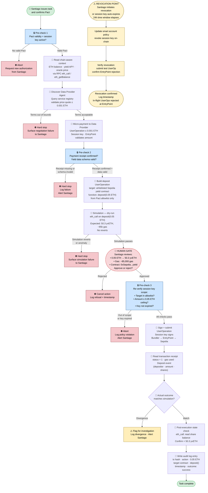

# Task — Wallet / Permission: Permission Strategy for Agent-Initiated On-Chain Actions
> Direction: Wallet / Permission / Safe Execution
> Aim: Permission Strategy for Agent-Initiated On-Chain Actions
> Scenario: Requester Agent executing a DeFi yield deposit on behalf of Santiago

---

## Section 1 — Execution Flow: Automated vs Human-Confirmed Steps

The flow below maps the Requester Agent's DeFi yield deposit task as described in `tasks/AIxWeb3_WORKFLOW.md` — from task receipt to final verification — with every step classified by who controls it and what mechanism enforces that control.

### Numbered Step List

**1.** 👤 **Human-Initiated Task** — Santiago issues the natural-language intent ("deposit 0.05 ETH into a yield protocol") and confirms a Cobo Pact defining the authorization boundaries for this task. No agent action can precede this confirmation. Mechanism: Pact confirmation UI requires explicit approval before a session key is issued.

**2.** 🔒 **Permission Pre-Check — Pact Validity** — The Requester Agent verifies that a valid Pact exists and is active (not expired, not revoked). If no valid Pact is found, execution aborts and the agent surfaces a request for new authorization. Mechanism: session key `validateUserOp` at the smart account layer; agent-side guardrail checks Pact state before proceeding.

**3.** 🤖 **Chain-Aware Context Read** — The agent reads live on-chain state via RPC: Santiago's ETH balance, the yield protocol's current APY, the Sepolia contract address, and an oracle price for ETH/USD. No human input needed. Mechanism: read-only RPC calls (`eth_call`, `eth_getBalance`) — no signing.

**4.** 🤖 **Data Provider Agent Discovery and Negotiation** — The Requester Agent queries a service registry to locate a yield-data provider, evaluates the offered price quote and SLA terms against built-in guardrails, and confirms terms autonomously if within acceptable bounds. Mechanism: agent-side guardrail validates price quote ≤ 0.001 ETH and data schema matches expected format.

**5.** 🤖 **Micro-Payment to Data Provider Agent** — The Requester Agent signs and submits a UserOperation for a micro-payment (≤ 0.001 ETH) to the Data Provider Agent's address. Mechanism: session key scoped to micro-payment budget ceiling; `validateUserOp` enforces amount limit and target address at EntryPoint.

**6.** 🔒 **Permission Pre-Check — Payment Receipt and Data Validation** — The agent reads the on-chain payment receipt (tx status, emitted ERC event), confirms proof of payment, and schema-validates the delivered yield dataset before incorporating it into the reasoning context. Mechanism: code-level receipt check + schema validation guardrail; untrusted provider data is treated as a separate, lower-trust context layer.

**7.** 🤖 **Yield Deposit Transaction Construction** — The agent combines the validated yield data with the fresh chain-aware context and constructs a candidate `deposit(uint256 amount)` UserOperation targeting the whitelisted Sepolia yield contract. Mechanism: transaction builder uses the Pact's allowed contract address and function selector list — no free-form target selection.

**8.** 🤖 **Simulation (Dry-Run)** — The agent runs the candidate UserOperation via `eth_call` against the Sepolia yield contract. The simulation produces: expected shares received, estimated gas (≈ 85,000 gas units), and a preview of the deposit event. Mechanism: simulation API call; result is compared against expected bounds before proceeding.

**9.** 👤 **Human Confirmation Gate** — The agent surfaces the simulation result to Santiago: deposit amount (0.05 ETH), expected yield shares (50.3 yvETH), gas estimate, and the exact contract address. Santiago must explicitly approve. Mechanism: hard code gate — the agent cannot sign the intent UserOperation without receiving an explicit approval signal; this is enforced in code, not in the model prompt.

**10.** 🔒 **Permission Pre-Check — Session Key Scope Re-Verification** — Immediately before signing, the agent re-verifies that the target contract address and function selector (`deposit()`) are within the Pact's allowlist, the amount (0.05 ETH) is within the budget ceiling, and the session key has not expired. Mechanism: pre-signing guardrail in the agent execution layer; smart account `validateUserOp` is the cryptographic enforcement backstop.

**11.** 🤖 **UserOperation Signing and Submission** — The agent signs the UserOperation with the scoped session key and submits it via a Bundler to the EntryPoint contract on Sepolia. Mechanism: session key signing — agent never sees the root private key; EntryPoint validates the UserOp before execution.

**12.** 🤖 **Transaction Receipt Verification** — The agent reads the transaction receipt (status = 1, gas used, emitted `Deposit` event with `depositor`, `amount`, and `shares` fields). Mechanism: `eth_getTransactionReceipt` RPC call; agent checks receipt status and event parameters.

**13.** 🤖 **Post-Execution State Check** — The agent performs a final `eth_call` to the yield contract to read Santiago's updated share balance and confirms it matches the expected output from the simulation. Any divergence triggers a flag and alert. Mechanism: state re-verification guardrail; comparison against simulation baseline.

**14.** 🤖 **Immutable Audit Log Write** — The agent writes a structured log entry (tx hash, action, amount, target contract, function selector, timestamp, outcome) to the off-chain audit log and emits an on-chain event anchor via the smart account. Mechanism: log writer module executes unconditionally after successful receipt; on-chain event is permanent.

**15.** ⚠️ **Revocation Point** — At any point from Step 2 onward, Santiago can revoke the Pact by updating the smart account's session key policy. The session key is also time-bounded (24-hour window); at expiry it becomes invalid regardless of task state. Mechanism: smart account policy update — a subsequent `validateUserOp` call with the revoked session key returns invalid and EntryPoint rejects the UserOp.

---

### Mermaid Flowchart

**Legend:**
- Green nodes (A, P) — task entry and exit points
- Blue nodes (B, F, J) — permission pre-checks (automated, policy-enforced)
- Red node (I) — mandatory human confirmation gate
- Yellow nodes (REV1–REV4) — revocation path (user-initiated or auto-expiry)
- Pink R-nodes — abort and hard-stop branches

---

## Section 2 — Permission Strategy Design

### Pact Authorization Specification — Requester Agent: DeFi Yield Deposit

---

**Task Intent**

The Requester Agent is authorized to execute a single yield deposit of exactly 0.05 ETH into a whitelisted yield vault contract on Sepolia, including a preparatory micro-payment to a yield-data Data Provider Agent of up to 0.001 ETH, within a 24-hour window.

---

**Budget**

| Parameter | Value |
|---|---|
| Maximum spend per transaction (deposit) | 0.05 ETH |
| Maximum spend per transaction (micro-payment) | 0.001 ETH |
| Maximum total spend per session | 0.0515 ETH (0.05 ETH deposit + 0.001 ETH data fee + 0.0005 ETH gas buffer) |
| Token allowlist | ETH (native), yvETH (yield shares — receive-only) |
| ERC-20 approvals | Prohibited for this task (deposit uses native ETH; no ERC-20 approval required) |

---

**Callable Contracts**

| Category | Detail |
|---|---|
| Allowed contract — yield vault | `0x83b3...7fA2` (Sepolia Yearn-compatible vault, verified address) |
| Allowed contract — Data Provider Agent | `0xDP01...3c44` (registered Data Provider Agent address on Sepolia service registry) |
| Allowed function selectors | `deposit(uint256)` on yield vault; `transfer(address,uint256)` restricted to Data Provider Agent address only |
| Prohibited selectors | `approve(address,uint256)` to any address not on the allowlist; `withdraw()`, `withdrawAll()`, `transferFrom()`, any governance or admin function |
| Prohibited contracts | Any contract address not on the explicit allowlist above; EOAs (direct ETH transfer to unknown addresses is blocked) |

---

**Executable Actions (by risk tier)**

| Action | Risk tier | Authorization required |
|---|---|---|
| Read chain state via RPC (balance, APY, oracle price) | Low | Automated |
| Query on-chain service registry for Data Provider | Low | Automated |
| Negotiate terms with Data Provider Agent | Low–Medium | Automated (within price guardrail ≤ 0.001 ETH) |
| Sign micro-payment UserOperation ≤ 0.001 ETH to Data Provider | Medium | Automated (within session key budget ceiling) |
| Schema-validate received yield dataset | Low | Automated |
| Construct and simulate deposit UserOperation via `eth_call` | Low | Automated |
| Execute `deposit(0.05 ETH)` on yield vault | High | Human confirmation gate required |
| `approve(address,uint256)` to whitelisted address | High | Human confirmation gate required |
| `approve(address,uint256)` to unknown address | Critical | Blocked — rejected at session key `validateUserOp` |
| Any contract call outside the allowlist | Critical | Blocked — rejected at EntryPoint |
| Any spend above 0.05 ETH in a single UserOperation | Critical | Blocked — session key amount cap enforced on-chain |

---

**Human Confirmation Thresholds**

A human confirmation gate is triggered when any of the following conditions are met:

1. **Amount threshold:** Any single UserOperation with a native ETH value > 0.001 ETH (the micro-payment ceiling). The 0.05 ETH yield deposit always exceeds this threshold and is therefore always gated.
2. **Contract call type:** Any `deposit()`, `withdraw()`, or `approve()` call to any contract address, regardless of amount.
3. **Simulation anomaly:** Any dry-run simulation that results in a revert, gas estimate > 150,000 gas units, expected shares < 40 yvETH, or any unexpected emitted event type other than `Deposit`.
4. **Context staleness:** If the chain-aware context used to build the transaction was read more than 3 minutes before the signing attempt, the agent must re-read state and re-run simulation before showing the confirmation prompt.

The confirmation prompt must display: action type, exact ETH amount, target contract address and name, expected output (yield shares), estimated gas cost in ETH, simulation outcome summary, and the Pact budget remaining.

---

**Revocation Method**

Santiago revokes the Pact by calling `updateSessionKey(sessionKeyAddress, revoked=true)` on the smart account contract, or by using the Cobo wallet UI to terminate the active Pact. This is a single on-chain transaction that immediately updates the smart account's policy state.

Effect on in-flight transactions: any UserOperation already submitted to the Bundler but not yet processed by the EntryPoint will be rejected at `validateUserOp` — the EntryPoint reads the current policy state at execution time, not at submission time. There is no grace period. If a UserOperation has already been included in a block before the revocation transaction is confirmed, that transaction is final and cannot be reversed; the audit log records both the execution and the subsequent revocation.

The session key also auto-expires after 24 hours from issuance without requiring any manual revocation action.

---

**Logging**

Each log entry contains the following fields:

| Field | Value |
|---|---|
| `timestamp` | ISO-8601 UTC (e.g., `2026-05-31T14:32:11Z`) |
| `session_id` | Pact ID (unique per task authorization) |
| `action` | Human-readable action name (e.g., `micro_payment_to_data_provider`, `yield_deposit`) |
| `function_selector` | 4-byte hex selector (e.g., `0xb6b55f25` for `deposit(uint256)`) |
| `target_contract` | Checksummed address |
| `amount_eth` | Decimal value in ETH (e.g., `0.05`) |
| `tx_hash` | On-chain transaction hash (finalized after block inclusion) |
| `block_number` | Block height at inclusion |
| `gas_used` | Actual gas consumed |
| `outcome` | `success`, `reverted`, `rejected_by_policy`, or `divergence_flagged` |
| `simulation_hash` | Hash of the simulation result used for the confirmation prompt |
| `human_confirmed` | `true` or `false` |

Log storage: every log entry is written to an off-chain structured log file (`logs/agent-wallet-audit.jsonl`) and anchored on-chain by emitting a `AgentAction(sessionId, txHash, actionType)` event from the smart account. The on-chain event provides an immutable timestamp and content anchor; the off-chain file provides full detail for agent-side review. The off-chain log is append-only and never modified after writing.

---

**Failure Handling**

Failure modes are drawn from `tasks/AIxWeb3_WORKFLOW.md` Section 5:

| Failure mode | Handling action |
|---|---|
| **Negotiation integrity failure (Step 3):** Data Provider presents falsified capability schema or price above 0.001 ETH ceiling | Agent aborts negotiation, logs `negotiation_rejected` with offered terms, surfaces failure to Santiago. No payment is made. Santiago must manually select an alternate provider or abort the task. |
| **Payment exploit (Step 4):** Replay attack or compromised agent attempts a transaction above the micro-payment ceiling | Session key `validateUserOp` rejects any UserOperation with ETH value > 0.001 ETH to the Data Provider address. EntryPoint enforces this cryptographically — no agent-side logic can override it. Log entry written with `outcome: rejected_by_policy`. |
| **Prompt injection via received data (Step 6):** Yield dataset payload contains instruction-like content or malformed schema | Schema validation guardrail runs before the dataset enters the reasoning context. If the schema does not match the expected format (`{apy: float, tvl: uint256, contract: address}`), the payload is discarded, the Data Provider is flagged, and the task halts. Santiago is alerted. The agent does not retry with the same provider without explicit re-authorization. |
| **Irreversible intent execution failure (Step 8):** Simulation reverts, or actual outcome diverges from simulation | If simulation reverts: task halts, simulation output is surfaced to Santiago, no UserOperation is signed. If actual execution diverges from simulation after signing: the `divergence_flagged` log entry is written immediately, an alert is sent to Santiago, and no further agent actions are taken until Santiago reviews the divergence. |
| **MEV / frontrunning (Step 8b):** Submitted UserOperation is frontrun or sandwiched in the mempool | The Bundler submission uses Flashbots Protect (private mempool relay on Sepolia equivalent) to prevent frontrunning. The deposit UserOperation includes a minimum shares parameter (`minSharesOut = 48 yvETH`, representing 4% slippage tolerance) — if the transaction executes with fewer shares, it reverts on-chain and the agent logs `outcome: reverted` without retry. Santiago is alerted to reattempt with fresh price data. |

---

## Section 3 — Why ERC-4337, Safe, and Guard/Policy Mechanisms Matter

| Mechanism | Risk category addressed | What breaks without it |
|---|---|---|
| **ERC-4337 (smart account + EntryPoint + session keys)** | Unscoped authority; payment exploits | Without ERC-4337, the agent must hold a raw EOA private key with full account access. Any spend limit, contract allowlist, or time bound exists only as a prompt instruction — the model can ignore it, be manipulated past it, or hallucinate an out-of-scope transaction and sign it with no on-chain check. The blast radius of a compromised or hallucinating agent is the entire wallet. With ERC-4337, `validateUserOp` enforces session key scope cryptographically at the EntryPoint — no UserOperation outside the permitted scope can execute regardless of what the model outputs. |
| **Session keys (scoped temporary keys, time-bounded)** | Zombie permissions; unscoped authority | Without session keys, the only delegation mechanism is a full private key or an unlimited ERC-20 `approve()`. A full key cannot be scoped — it signs anything. An open approval cannot be time-bounded — it persists until explicitly revoked, and revoking it requires the user to remember to do so. Session keys encode scope (contract + function selector + amount cap) and expiry directly in the smart account's policy state, enforced at `validateUserOp`. At task completion the key auto-expires, leaving no residual attack surface. This implements the Cobo Pact model's "permission expires when the task ends" guarantee at the protocol layer. |
| **Guard / policy mechanisms (Safe Guards, on-chain policy rules)** | Shadow operations; prompt injection into permission specifications; irreversible execution | Without a guard or policy layer, agent wallet actions have no pre-execution intercept. A guard is a deterministic contract that runs before any transaction executes and can reject based on a checklist (target address, function selector, value, time). Without it, the only safeguards are agent-side checks — which can be bypassed by a compromised execution environment or an adversarially crafted prompt. With a guard, even if the agent's code is manipulated into constructing a bad transaction, the guard contract rejects it before it reaches the chain. The on-chain policy also provides an immutable, user-visible record of what the agent is permitted to do — closing the "shadow operation" risk where the agent acts without any visible permission boundary. |

---

*Built: 2026-05-31 | Agent: Sensei (Claude via Cowork) | Direction: Wallet / Permission / Safe Execution*
*Sources: `tasks/AIxWeb3_WORKFLOW.md`, `tasks/directions/04-wallet-permission.md`, `wiki/wallet-permission-safe-execution.md`, `wiki/erc-4337.md`, `wiki/session-key.md`, `wiki/cobo-pact.md`, `wiki/agent-wallet.md`*
